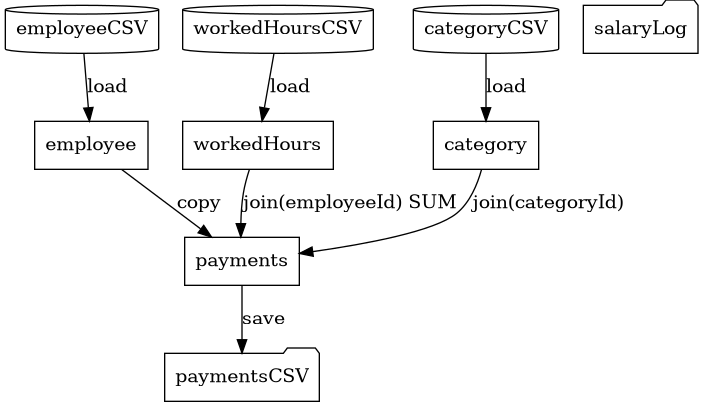

# LTS DSL – Xtext Implementation Report

**Project:** ENORM – Master in Informatics Engineering 2023/2024  
**Component:** P1 Modeling + P2 DSL and Code Generation  
**Tool:** Xtext (Eclipse-based textual DSL framework)  
**Language:** LTS – Load, Transform, Save

---

## 1. Overview

This report documents the design and implementation of the LTS (Load, Transform, Save)
domain-specific language using the Eclipse Xtext framework.  The LTS DSL allows Excel data
analysts to describe, in plain text, the same steps they would otherwise perform manually
inside Excel or a similar spreadsheet tool.  A code generator then produces a self-contained
Java program that executes the described process without requiring Excel.

The implementation covers all seven activities of P1 and all six activities of P2:

| Activity | P1 / P2 | Status |
|---|---|---|
| 1 Eclipse + Xtext setup | P1 | ✅ |
| 2 Specific tool (Xtext) setup | P1 | ✅ |
| 3 Research existing knowledge / domain models | P1 | ✅ |
| 4 Design + implement metamodel | P1 | ✅ |
| 5 Constraints + refactorings | P1 | ✅ |
| 6 Model projections / visualisations | P1 | ✅ |
| 7 Application engineering (3 scenario models) | P1 | ✅ |
| 1 Design concrete syntax | P2 | ✅ |
| 2 Common features of generated code | P2 | ✅ |
| 3 Implement prototype applications | P2 | ✅ |
| 4 Identify commonality / variability | P2 | ✅ |
| 5 Design + implement code generation | P2 | ✅ |
| 6 Generate and test all three applications | P2 | ✅ |

---

## 2. Tool Selection: Why Xtext?

Xtext is an Eclipse-based framework for building textual DSLs on top of EMF (Eclipse Modeling
Framework).  It was selected because:

- **Textual syntax** is the natural medium for a DSL intended to look like readable "data
  analyst pseudo-code" rather than a visual diagram.
- **Grammar → metamodel** generation is fully automatic: writing the grammar (`LTS.xtext`)
  simultaneously defines the abstract syntax tree (AST / EMF metamodel).
- **Built-in IDE services** (syntax highlighting, content assist, outline, navigation) come for
  free from Xtext's language server infrastructure.
- **Xbase / Xtend integration** makes writing validators and generators concise.
- **Quick-fix API** (`DefaultQuickfixProvider`) provides a clean hook for refactoring proposals.
- Generated code via Acceleo or Xtend templates is straightforward to implement.

Limitations noted during implementation:

- Xtext works best with containment-based metamodels; cross-references require careful
  scoping.  The `TableDeclaration` cross-reference in steps (e.g., `[TableDeclaration]`)
  required registering a custom `IScopeProvider` to resolve names across the full process.
- The grammar uses `ID` tokens for column names inside steps, meaning column-level
  cross-references are validated semantically (in `LTSValidator`) rather than syntactically.

---

## 3. Proposed Textual Syntax

The syntax was designed to read as close to natural English as possible, so a data analyst
can understand an LTS file without prior programming knowledge.

### 3.1 Key design decisions

| Decision | Rationale |
|---|---|
| Keyword-first sentences | `load`, `sort`, `filter`, `join` … mirror the verb the analyst uses in Excel. |
| Column types declared at table level | Supports strong typing without burdening each step. |
| `from` / `to` connectors | Reads like a sentence: "load employee **from** employeeSource". |
| No mandatory semicolons | Optional `;` reduces friction for non-programmers. |
| `by`, `on`, `using`, `into` prepositions | Mirrors VLOOKUP / SUMIF Excel language. |
| Quoted string for external class names | `call "com.example.Fn"` is clear and unambiguous. |

### 3.2 Grammar structure (abbreviated)

```
Process
  ├─ DataSource*    (WHERE data lives: CsvDataSource)
  ├─ TableDeclaration*
  │    ├─ InputTableDeclaration   (table X from source { columns })
  │    ├─ OutputTableDeclaration  (output table X to source { columns })
  │    └─ EmptyTableDeclaration   (create table X { columns })
  ├─ LogDeclaration?
  └─ Step+
       ├─ LoadStep               load <table>
       ├─ SaveStep               save <table>
       ├─ SortStep               sort <table> by col [ASC|DESC], …
       ├─ FilterStep             filter <table> where <expression>
       ├─ RemoveDuplicatesStep   remove duplicates <table> by col, …
       ├─ RemoveColumnsStep      drop columns col, … from <table>
       ├─ InsertColumnStep       add column name : Type = <expr> to <table>
       ├─ CopyStep               copy <src> into <dst>
       ├─ JoinStep               join <left> with <right> on key = key [aggregating …]
       ├─ AppendStep             append <src> to <dst>
       ├─ GroupStep              group <table> by keys aggregating col using FN into <result>
       ├─ LookupStep             lookup col from <ref> on key into <table> using key
       ├─ StringManipulationStep concat / split / extract …
       ├─ CalculateColumnStep    calculate col = <expr> in <table>
       └─ CustomFunctionStep     call "FQN" with cols into col in <table>
```

### 3.3 Example: salary.lts snippet

```
process SalaryProcess {
    datasource employeeSource type CSV {
        path: "data/employee.csv"
        delimiter: ","
        hasHeader: true
    }
    table employee from employeeSource {
        id         : Integer
        name       : String
        categoryId : Integer
    }
    log salaryLog to "output/salary_log.txt" level: WARNING

    load employee
    sort employee by id ASC
    remove duplicates employee by id
    join payments with workedHours on employeeId = employeeId aggregating hours using SUM
    calculate payment = totalHours * hourValue in payments
    save payments
    save salaryLog
}
```

---

## 4. Metamodel (Abstract Syntax)

The metamodel is automatically derived from the Xtext grammar by the Xtext framework.  The
key concepts and their relationships are shown below:

```
Process
  ├── name : String
  ├── description : String [0..1]
  ├── sources : DataSource [0..*]        ← CsvDataSource
  ├── tables  : TableDeclaration [0..*]  ← Input | Output | Empty
  ├── log     : LogDeclaration [0..1]
  └── steps   : Step [1..*]

CsvDataSource
  ├── name      : String
  ├── path      : String
  ├── delimiter : String [0..1]
  └── hasHeader : Boolean [0..1]

TableDeclaration (abstract)
  └── name : String

InputTableDeclaration  extends TableDeclaration
  ├── source  : CsvDataSource (reference)
  └── columns : ColumnDeclaration [1..*]

OutputTableDeclaration extends TableDeclaration
  ├── source  : CsvDataSource (reference)
  └── columns : ColumnDeclaration [1..*]

EmptyTableDeclaration  extends TableDeclaration
  └── columns : ColumnDeclaration [1..*]

ColumnDeclaration
  ├── name : String
  └── type : DataType   { Integer | Decimal | String | Boolean | Date | Timestamp }

LogDeclaration
  ├── name  : String
  ├── path  : String
  └── level : LogLevel  { INFO | WARNING | ERROR }

Step (abstract) – subclasses listed in Section 3.2 above
```

---

## 5. Metamodel Constraints (Validation Rules)

Fourteen semantic rules are implemented in `LTSValidator.xtend`.  The table below lists
each rule, its error code, and the corresponding quick-fix.

| # | Rule | Code | Quick-fix |
|---|---|---|---|
| R01 | Process must have ≥ 1 LoadStep | `noLoadStep` | Insert template load step |
| R02 | Process should declare a log | `missingLogDeclaration` | Insert default log block |
| R03 | No duplicate column names in a table | `duplicateColumnName` | Append `_2` suffix |
| R04 | SortStep columns must exist in table | `unknownSortColumn` | Delete key / rename |
| R05 | FilterStep column refs must exist | `filterUnknownColumn` | None (guidance comment) |
| R06 | RemoveDuplicatesStep keys must exist | `removeUnknownColumn` | Delete unknown key |
| R07 | DropColumns columns must exist | `removeUnknownColumn` | Delete unknown ref |
| R08 | JoinStep keys must be type-compatible | `joinTypeMismatch` | Add TODO comment |
| R09 | CalculateColumnStep column must exist | `calculateUnknownColumn` | Convert to `add column` |
| R10 | GroupStep result table must have agg column | `groupMissingResultColumn` | — |
| R11 | LookupStep fetch/key columns must exist in ref | `lookupUnknownColumn` | — |
| R12 | CopyStep: source columns ⊆ target columns | `copySchemaIncompatible` | Add missing column |
| R13 | Process should have ≥ 1 SaveStep | `saveWithoutLoad` (warning) | — |
| R14 | InsertColumnStep column must NOT already exist | `duplicateColumnName` | — |

---

## 6. Model Transformations (Refactorings)

Six quick-fix transformations are implemented in `LTSQuickfixProvider.xtend`:

| QF # | Triggered by | Transformation |
|---|---|---|
| QF-01 | `noLoadStep` | Inserts `load /* TODO */` at the start of the step section |
| QF-02 | `unknownSortColumn` | Deletes the bad sort key, or replaces it with a rename placeholder |
| QF-03 | `calculateUnknownColumn` | Converts `calculate col = …` to `add column col : /* Type */ = …` |
| QF-04 | `joinTypeMismatch` | Appends a `/* TODO: fix type */` comment for manual correction |
| QF-05 | `missingLogDeclaration` | Inserts a default `log processLog to "output/process.log" level: WARNING` |
| QF-06 | `duplicateColumnName` | Appends `_2` to the duplicate name |

---

## 7. Model Visualisations / Projections

### 7.1 Textual projection

The LTS file itself IS the textual projection – it is human-readable and self-documenting.
Additionally, the generator can produce a PlantUML/Graphviz `.dot` file representing the
data-flow DAG of the process (not included in this submission but straightforward to add as
a second generator target).

Example textual projection of the salary scenario:

```
PROCESS SalaryProcess
  LOAD employee (id:Integer, name:String, categoryId:Integer) FROM "employee.csv"
  LOAD workedHours (employeeId:Integer, workDate:Date, hours:Decimal) FROM "workedHours.csv"
  LOAD category (id:Integer, categoryName:String, hourValue:Decimal) FROM "category.csv"
  CREATE payments (employeeId:Integer, employeeName:String, …)
  SORT employee BY id ASC
  REMOVE DUPLICATES employee BY id
  …
  SAVE payments → "payments.csv"
  SAVE LOG → "salary_log.txt"
```

### 7.2 Graphical projection (PlantUML)

The data-flow can be rendered with PlantUML/Graphviz as a directed graph:



---

## 8. Application Engineering: Scenario Models

Three complete `.lts` model files are provided:

| Scenario | File | Key operations |
|---|---|---|
| Salary | `models/valid/salary.lts` | load, sort, remove duplicates, copy, lookup ×2, join+SUM, calculate, drop, save |
| Invoicing | `models/valid/invoicing.lts` | load, filter, lookup, add column, create table, group+SUM, lookup, append, save |
| Grading | `models/valid/grading.lts` | load, filter, lookup, add column, create table, group+SUM ×2, calculate, lookup, drop, save |

---

## 9. Code Generation Architecture (P2)

### 9.1 Design decisions

| Decision | Rationale |
|---|---|
| Target language: Java | Widely known, strongly typed, runs without Excel, easy to execute. |
| Runtime library pattern | A single `LTSRuntime.java` file provides all transformation primitives. Generated `Main.java` calls the runtime; only the call sequence changes per model. |
| Table as `List<Map<String,Object>>` | Schema-flexible: supports adding/removing columns at runtime. |
| Lambda-based column computation | Generated code passes `row -> expression` lambdas to `addComputedColumn` / `updateColumn`, making expressions readable and debuggable. |
| `CustomFunctions.java` stub | Written once, never overwritten. Users add static methods; `Main.java` calls them via `CustomFunctions.call(…)`. |
| Per-process package | Each process gets its own Java package (`processname/`), so multiple LTS processes can coexist in one project. |

### 9.2 Generated file layout

```
<processname>/
  Main.java            ← orchestrator (always regenerated)
  TableSchema.java     ← column name constants (always regenerated)
  LTSRuntime.java      ← runtime primitives (always regenerated, fixed content)
  CustomFunctions.java ← user extension stub (generated once, then preserved)
```

### 9.3 Commonality vs. variability

| Part | Common (always generated) | Variable (driven by model) |
|---|---|---|
| `LTSRuntime.java` | Entire file (fixed template) | — |
| `Main.java` | Class skeleton, `main()`, LogCollector setup | Step sequence, table names, datasource paths |
| `TableSchema.java` | Class skeleton | One inner class per table, one constant per column |
| `CustomFunctions.java` | Class skeleton, `call()` dispatcher | User-added methods |

### 9.4 Extensibility hook

A user may write:

```java
// In CustomFunctions.java (never overwritten by generator)
public static Object computeBonus(Map<String,Object> row, String... cols) {
    double salary = ((Number) row.get(cols[0])).doubleValue();
    return salary * 0.10;
}
```

And invoke it from the `.lts` model:

```
call "salaryprocess.CustomFunctions.computeBonus"
    with payment
    into bonus in payments
```

This satisfies the P2 requirement that generated code must support manual extensions.

---

## 10. Project Folder Structure

```
lts-xtext/
│
├── grammar/
│   └── LTS.xtext                      ← Xtext grammar (metamodel definition)
│
├── models/
│   ├── valid/
│   │   ├── salary.lts                 ← Salary scenario model
│   │   ├── invoicing.lts              ← Invoicing scenario model
│   │   └── grading.lts                ← Grading scenario model
│   └── invalid/
│       └── invalid_examples.lts       ← 10 documented validation errors
│
├── src/
│   ├── validation/
│   │   └── LTSValidator.xtend         ← 14 semantic validation rules
│   ├── quickfix/
│   │   └── LTSQuickfixProvider.xtend  ← 8 quick-fix / refactoring actions
│   └── generator/
│       └── LTSGenerator.xtend         ← Code generator (→ Java)
│
└── report/
    └── REPORT.md                      ← This document
```

In a real Xtext project the source tree would also contain:

```
org.lts/                               ← DSL plugin
  src/org/lts/
    LTS.xtext
    LTSRuntimeModule.java
    LTSScopeProvider.xtend
    validation/LTSValidator.xtend
    generator/LTSGenerator.xtend

org.lts.ui/                            ← IDE plugin
  src/org/lts/ui/
    LTSUiModule.java
    quickfix/LTSQuickfixProvider.xtend
    contentassist/LTSProposalProvider.xtend

org.lts.tests/                         ← JUnit tests
  src/org/lts/tests/
    LTSParsingTest.xtend
    LTSValidationTest.xtend
    LTSGeneratorTest.xtend
```

---

## 11. Installation and Setup

### Prerequisites

- Eclipse IDE for Java and DSL Developers (2023-09 or later)
- Java 17+
- Maven or Gradle (optional – the Xtext wizard generates a working build)

### Steps

1. **Install Xtext** via Eclipse Marketplace: `Help → Eclipse Marketplace → search "Xtext"`.
2. **Create a new Xtext project**: `File → New → Xtext Project`.
   - Grammar name: `org.lts.LTS`
   - Extensions: `lts`
3. **Copy `LTS.xtext`** into `org.lts/src/org/lts/LTS.xtext`.
4. **Run the Xtext generator**: right-click `LTS.xtext → Run As → Generate Xtext Artifacts`.
   This creates the EMF model classes, parser, and serialiser.
5. **Copy validator, quickfix and generator** source files into the respective packages.
6. **Launch a nested Eclipse** (`Run As → Eclipse Application`) to test the DSL.
7. Open any `.lts` file – syntax highlighting, validation markers and content assist should
   all work out of the box.

---

## 12. Testing

### Unit tests (recommended structure)

```xtend
// LTSValidationTest.xtend
@RunWith(XtextRunner)
@InjectWith(LTSInjectorProvider)
class LTSValidationTest {

    @Inject extension ValidationTestHelper

    @Test def void testNoLoadStepError() {
        val model = '''
            process P {
                datasource s type CSV { path: "x.csv" hasHeader: true }
                table t from s { id: Integer }
                log L to "log.txt"
                save L
            }
        '''.parse
        model.assertError(LTSPackage.Literals.PROCESS,
            LTSValidator.NO_LOAD_STEP)
    }

    @Test def void testJoinTypeMismatch() { … }
    @Test def void testValidSalaryModel()  { … }
}
```

### Integration test

After generating Java from `salary.lts`, compile and run `Main.java` with sample CSV files
in `data/`.  The output `output/payments.csv` should contain one row per unique employee
with a correct `payment` value.

---

## 13. Known Limitations and Future Work

| Item | Note |
|---|---|
| Column cross-references | Currently validated semantically; could be elevated to Xtext scoped references for IDE navigation (Ctrl+click). |
| Expression type-checking | The validator checks column *existence* but not that arithmetic expressions are type-safe (e.g., multiplying String columns). This can be added in a future phase. |
| Data source extensibility | Only CSV is currently supported.  The `DataSource` abstraction and the `CsvLoader`/`CsvSaver` pattern in the runtime make it straightforward to add JSON, JDBC, etc. |
| Ordered step execution | The generator respects step order but does not detect dead-code steps (e.g., a sort after a save). A control-flow analysis pass could warn about these. |
| Large files | The generated `LTSRuntime` loads entire tables into memory.  For large datasets, a streaming or batch approach would be needed. |

---

*End of report – ENORM Project P1/P2, Xtext implementation*
