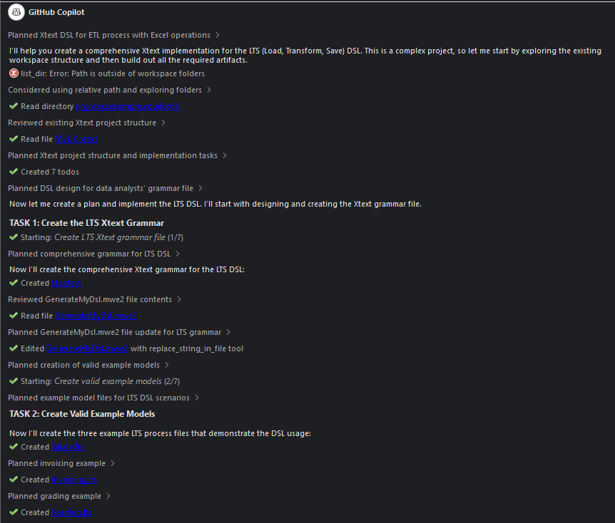

# GitHub Copilot Usage Record

## Workflow role

GitHub Copilot was used as an IDE-integrated assistant during the construction of an Xtext-style LTS workspace. Unlike Codex, ChatGPT, and Claude, it's not retained as a complete chat transcript. Its contribution is therefore documented through the produced workspace and inspection evidence.

## Interaction pattern

Copilot was used for local assistance while editing or constructing project artefacts, including grammar fragments, validator code, generator code, documentation files, examples, invalid examples, and project-structure material. The workflow was incremental and file-context dependent, rather than a single prompt-response generation process.

## Retained evidence

The retained evidence consists of:

- the final Eclipse/Xtext-style workspace;
- grammar artefacts;
- validation artefacts;
- generator artefacts;
- valid and invalid `.lts` examples;
- quick-fix scaffolding;
- generated documentation;
- validation scripts;
- manual inspection notes.

## Traceability limitation

A complete Copilot chat transcript could not be exported. As a result, the workflow cannot be reconstructed at the same level of conversational detail as the Codex, ChatGPT, or Claude workflows. The evaluation therefore relies on retained artefacts and inspection evidence rather than on a full interaction log.

## Interpretation

The Copilot artefact set should be interpreted as evidence of IDE-assisted local construction, not as evidence of an autonomous project-generation workflow. Its main value lies in code-completion and boilerplate support, while its limitations are assessed through the produced artefacts, especially placeholder generator behaviour, incomplete quick fixes, structural validation scripts, and documentation claims that exceed repository evidence.

