# EDOM Project, Part 1 - Team Report

In this folder you should add **all** artifacts developed for part 1 of the ENORM project, related to team/group work.

**Note:** If for some reason you need to bypass these guidelines please ask for directions with your teacher and **always** state the exceptions in your commits and issues in bitbucket.

Following there are examples of proposed sections for this part of the report (team part).

## Domain Knowledge Obtained from Analyzing the Applications

### Extract Transform Load

With the evolution of digital systems and the constant accumulation and valorization of information, it is increasingly becoming a company's most precious asset. There is therefore a need to handle it carefully and flexibly. Furthermore, given that information can come from various sources, it is essential to subject it to an Extract-Transform-Load (ETL) process in order to obtain the best results [1].

An ETL process involves extracting information from a source, such as a file or a database. Following this, the collected data undergoes manipulation, which may include tasks like removing rows, joining tables, calculating values, and incorporating new information from external sources. Ensuring the data conforms to the expected schema for storage is a crucial step. Ultimately, once the information has been processed and manipulated, it is stored in a designated location, serving strategic decision-making purposes. [2]

In the context of this project, the scope of the ETL process has been restricted due to its highly dynamic and unpredictable nature. Therefore, the focus centres on manipulating Excel files, and is referred to as Load, Transform and Save (LTS) operations. This process covers the steps of loading one or more files supported by Excel, followed by a series of operations such as: removing columns, filtering information, grouping and sorting data, manipulating values and performing join operations. Finally, as part of the expected flow, the operations are saved in the corresponding files. With the scope defined, the focus is to create a Domain Specification Language (DSL) capable of supporting LTS operations in order to facilitate the day-to-day operation of Excel experts, making operations more practical and more secure.

### METAMODEL

A **metamodel** is a model that consists of statements about models. Hence, a metamodel is also a model but its universe of discourse is a set of models, namely those models that are of interest to the creator of the metamodel. In the context of information systems, a metamodel contains statements about the constructs used in models about information systems. [3]

The statements in a metamodel can define the constructs or can express true and desired properties of the constructs. **Like models are abstractions of some reality, metamodels are abstractions of models**. The continuation of the abstraction leads to meta metamodels (eg. Ecore), being models of metamodels containing statements about metamodels. [3]

**Metamodeling** is the activity of designing metamodels (and metametamodels). Metamodeling is applied to design new modeling languages and to extend existing modeling languages. [3]

In the 1980s, the use of metamodels became so widespread that an ISO standard, the Information Resource Dictionary Standard was defined. In the late 1990s, the Object Management Group (OMG) consolidated and standardized the terminology of metamodels. They distinguished the levels M0 (information), M1 (model), M2 (metamodel), and M3 (metametamodel). [3]

|       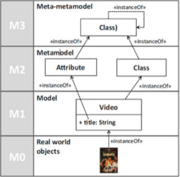       |
| :-------------------------------------------: |
| *Figure X - Modeling Levels according to OMG* |

#### Why use metamodels?

Metamodels extend the capabilities of the languages and allow the adaptation to specific modeling domains. Metamodels **are mainly used** to facilitate conceptual modeling, to define constructs of the conceptual modeling languages, to specify constraints on the use of constructs, and to encode the similarities of different models (and metamodels). [3]

Metamodels can be used for:
- Defining new languages;
- Defining new properties or features of existing information (metadata).

### ECORE

The model used to represent models in EMF is called Ecore. **Ecore** is itself an EMF model, and thus is its own metamodel. We could say that makes it a meta-metamodel (M3). People often get confused when talking about meta-metamodels (metamodels in general, for that matter), but the concept is actually quite simple (as shown before). [5] Ecore is a powerful tool for designing model-driven architectures (MDA) [4].

> Why UML isn't "the" EMF model? Why does EMF need its own model? 

The answer is quite simply that Ecore is a small and simplified subset of full UML. Full UML supports much more ambitious modeling than the core support in EMF. UML, for example, allows us to model the behavior of an application, as well as its class structure. [5]

### Eclipse Modeling Framework

The Eclipse Modeling Framework (EMF) is a modeling framework that brings together three key technologies: Java, XML, and UML. Its primary goal is to merge the concepts of modeling and programming, rather than enforcing a strict separation between high-level modeling and low-level implementation, integrating them seamlessly into a cohesive workflow. In essence, EMF serves as both a framework and a code generation tool. It allows users to define models in Java, XML, or UML, and then generates corresponding implementation classes and representations in other formats. (source: Eclipse Modeling Framework 2nd Edition)

Within EMF, there are three primary components (source: https://eclipse.dev/modeling/emf/):

- **EMF** - This core framework includes Ecore, a metamodel serving as the foundation for defining Domain-Specific Languages (DSLs). It supports abstract syntax trees and offers default XMI serialization for persistence.
- **EMF.Edit** - The EMF.Edit includes generic reusable classes for building editors for EMF models.
- **EMF.Codegen** - The EMF.Codegen provides three levels of code generation: Model - This level generates Java interfaces and implementation classes for all the classes in the model. It also includes a factory and package implementation class; Adapters - At this level, EMF.Codegen creates implementation classes that adapt the model classes for editing and display purposes; Editor - The Editor level produces a structured editor that can be customized. It serves as a starting point that adheres to the recommended style for EMF editors.

In EMF, defining DSLs involves capturing the language structure, known as abstract syntax. This structure serves as a metamodel, providing the foundation for constructing another model. Abstract syntax, as a metamodel, is accompanied by concrete syntax, which can be either in text or diagram form. Textual concrete syntax allows users to interact with instance models similar to text-based programming languages. Meanwhile, graphical concrete syntax enables users to work with instance models through diagrams. (source: Eclipse Modeling Project)

## Design of the Metamodel

Now, the different metamodel attempts to represent each case will be presented.

### Salary 

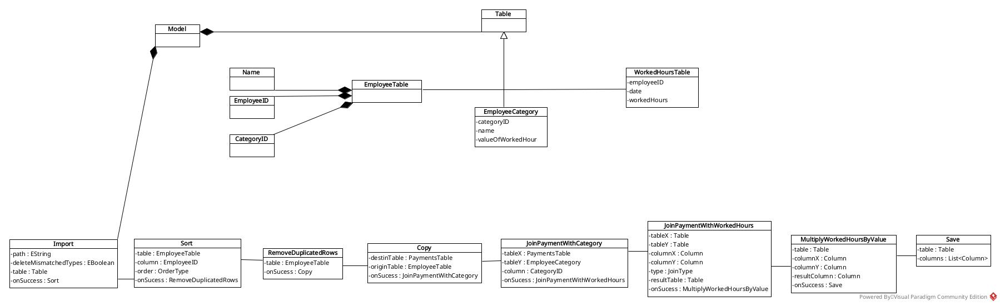

### Invoices

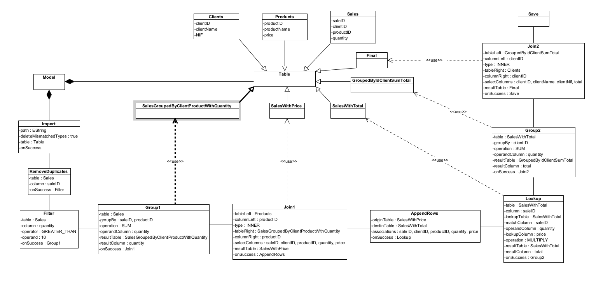

### Grades 

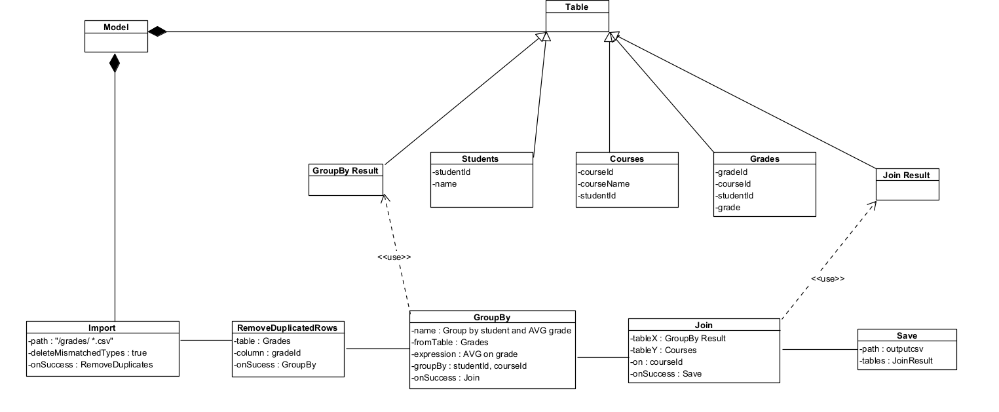

In the image bellow, is represented the final metamodel.

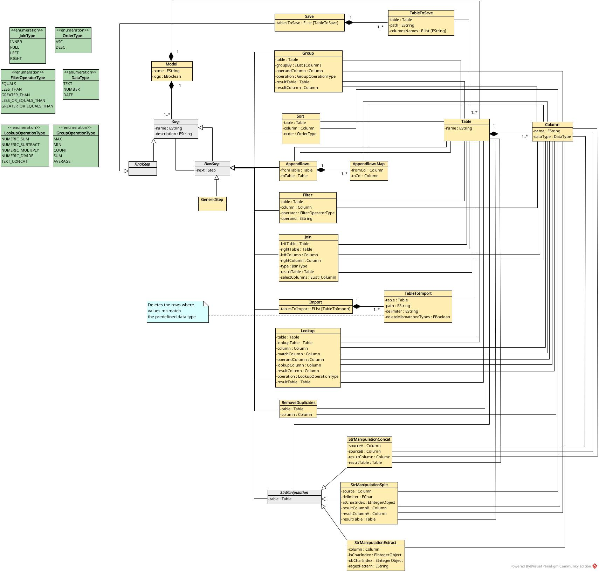

## Constraints and Refactoring

Considering the objective and the good practices of validating a model extensively and early to increase the confidence on its ability to generate correct code, it's crucial to acknowledge that the metamodel definition alone may not encompass all necessary restrictions. Hence, semantic validations are necessary to ensure model correctness. Moreover, to enhance user experience, implementing refactoring that correct or guide users toward the correct model formation is a beneficial strategy.

In this section we'll detail all the constraints and associated refactoring (quick fixes) that were defined in order to protect the model of malformed instantiations.

### Model level validations

***The model cannot have cycles***

```
func(model : Model):
    flag = false
    for each step in model.steps:
        if step is FlowStep:
            nextStep = step.getNext
            if nextStep is Save:
                flag = true

    return flag
```


***The model cannot have steps that are not being used***

```
func(model : Model):
    modelValid = true
    for each step in model.steps:
        if Step is not referenced:
            modelValid = false

    return modelValid
```

`Refactoring:` When a table is not being used in any step, a transformation to remove it is suggested. 

***The model must have only one import, and only one save***

```
func(model : Model):
    importCount = 0
    saveCount = 0
    for each step in model.next:
        if Step is Import:
            importCount = importCount + 1
        if Step is Save:
            saveCount = saveCount + 1

    return importCount == 1 and saveCount == 1
```

`Refactoring:` When there is more than one import/save step, a transformation to remove it is suggested.

`Refactoring:` When there is no import/save step, a transformation to add it is suggested.

***The model's step must have all different names***

```
func(model : Model):
    setStepNames = Set()
    for each step in model.steps:
        setStepNames.add(step.name)
    
    return size(setStepNames) == size(model.steps)
```

***The model's step must have all different names***

```
func(model : Model):
    setTableNames = Set()
    for each table in model.tables:
        setTableNames.add(table.name)
    
    return size(setTableNames) == size(model.tables)
```

<br>

### Table level validations

***The model's step must have all different names***

```
function func(table):
    setColumns = Set()
    for each column in table.columns:
        setColumns.add(column)
    
    return size(setColumns) == size(table.columns)

```

<br>

### Flow step validations

***One step cannot have the next step pointing to itself***

```
func(flowStep : FlowStep):
    return flowStep.next == flowStep
```

<br>

### Import step level validation

***One table can only be imported one time***

```
func(importStep : Import):
    setTablesToImport = Set()
    for each tableToImport in importStep.tablesToImport:
        setTablesToImport.add(tableToImport)
    
    return size(setTablesToImport) == size(importStep.tablesToImport)
```

`Refactoring:` When the same table is imported more than once, a transformation to remove the extras is suggested.

<br>

### Tables to import step level validation

***The path must cannot be blank***

```
func(tableToImport : TableToImport):
    return size(trim(tableToImport.path)) > 0
```

***The delimiter must cannot be a empty string***

```
func(tableToImport : TableToImport):
    return size(trim(tableToImport.delimiter)) > 0
```

<br>

### Save step level validation

***One table can only be saved one time***

```
func(saveStep : Save):
    setTablesToSave = Set()
    for each tablesToSave in saveStep.tablesToSave:
        setTablesToSave.add(tablesToSave)
    
    return size(setTablesToSave) == size(saveStep.tablesToSave)
```

`Refactoring:` When the same table is saved more than once, a transformation to remove the extras is suggested.

<br>

### Table to save step level validation

***The row headers must be a valid string and match all columns***

```
func(tableToSave : TableToSave):
    rowHeadersValid = true
    for each rowHeader in tableToSave.rowHeaders:
        valid = size(trim(rowHeader)) > 0
    
    return size(tableToSave.rowHeaders) == size(tableToSave.resultTable.columns)
           and size(trim(tableToSave.path)) > 0
           and rowHeadersValid
```

<br>

### Sort step level validation

***The column to be sorted must belong to the base table***

```
func(sort : Sort):
    contains = false
    for each tableColumn in sort.table:
        if tableColumn == sort.column:
            contains = true
    
    return contains
```

<br>

### Remove duplicates step level validation

***The column to be removed must belong to the base table***

```
func(removeDuplicates : RemoveDuplicates):
    contains = false
    for each tableColumn in removeDuplicates.table:
        if tableColumn == removeDuplicates.column:
            contains = true
    
    return contains
```

<br>

### Filter step level validation

***The column to be filtered must belong to the base table***

```
func(filter : Filter):
    contains = false
    for each tableColumn in filter.table:
        if tableColumn == filter.column:
            contains = true
    
    return contains
```

`Refactoring:` When the operator type is invalid, a transformation to a valid type is suggested.

***The operand to be parsed, the column of reference and the operation must have all compatible types***

```
func(filter : Filter):
    flag = true

    if filter.column.dataType == DataType.TEXT and filter.operator != FilterOperatorType.EQUALS:
        flag = false

    elif filter.column.dataType == DataType.NUMBER:
        try:
            parseResult = Double.valueOf(filterStep.operand)
        except Exception as e:
             flag = false

    elif filter.column.dataType == DataType.DATE:
        try:
            parseResult = LocalDate.parse(filterStep.getOperand())
        except Exception as e:
            flag = false

    return flag
```

<br>

### AppendRows step level validation

***The destination table must be different of the origin table***

```
func(appendRows : AppendRows):
    return appendRows.originTable != appendRows.destinationTable
```

***The destination and origin columns of must belong to the respective tables***

```
func(appendRows : AppendRows):
    flag = true 

    for each association in appendRows.associations:
        if not appendRowsStep.originTable.columns.contains(association.originColumn)
           or not appendRowsStep.destinationTable.columns.contains(association. destinationColumn):
                flag = false
    
    return flag
```

<br>

### Association step level validation

***The origin column type must the same as the destination column***

```
func(association : Association):
    return association.originColumn.dataType == association.destinationColumn.dataType
```

<br>

### Join step level validation

***The left table must be different from the right table***

```
func(join : Join):
    return join.leftTable != join.rightTable
```

***The left column must belong to the left table***

```
func(join : Join):
    return join.leftTable.contains(join.leftColumn)
```

***The right column must belong to the right table***

```
func(join : Join):
    return join.rightTable.contains(join.rightColumn)
```

***The left column data type must be the same as the right column data type***

```
func(join : Join):
    return join.leftColumn.dataType == join.rightColumn.dataType
```

***The columns selected must belong to either left or right tables***

```
func(join : Join):
    flag = true

    for each column in join.columns:
        if not join.tableLeft.columns.contains(column) and not join.tableRight.columns.contains(column)
            flag = false

    return flag
```

***All three columns (left, right and result) must be different***

```
func(join : Join):
    return join.leftTable != join.rightTable and join.rightTable != join.resultTable
```

***For each selected column it must have a match of type and name against the result table***

```
func(join : Join):
    matchCounter = 0

    for each selectColumn in join.columns:
        for each resultColumn in join.resultTable:
            if selectColumn.name == selectColumn.name and selectColumn.dataType == selectColumn.dataType:
                matchCounter = matchCounter + 1

    return matchCounter == size(join.columns)
```

`Refactoring:` When a column is missing from the result table, a transformation to add it is suggested.

`Refactoring:` When the data type of a column in the resulting table differs from the required data type, a transformation to change the data type id suggested. 

<br>

### Group step level validation

***The table must be different from the result table***

```
func(group : Group):
    return group.table != group.resultTable
```

***The columns must belong to the table, and they must be different between them.***

```
func(group : Group):
    setGroupByColumn = Set()

    for each column in group.table.columns:
        setGroupByColumn.add(column)
    
    if size(setGroupByColumn) != size(group.table.columns):
        return false

    elif: 
        flag = true

        for each column in group.table.columns:
            if not group.table.columns.contains(column):
                flag = false

        return flag
```

***All group by columns must have a correspondent column on the result table by name and type.***

```
func(group : Group):
    matchCounter = 0
    
    for each groupByColumn in group.groupByColumns:
        for each resultColumn in group.resultTable.columns:
            if groupByColumn.name == resultColumn.name and groupByColumn.dataType == resultColumn.dataType:
                  matchCounter = matchCounter + 1

    return matchCounter = size(group.groupByColumns)
```

`Refactoring:` When a table on the result column is missing, a transformation to add it is suggested.

`Refactoring:` When the data type of a column in the resulting table differs from the required data type, a transformation to change the data type is suggested.

***The operand column must belong to the table.***

```
func(group : Group):
    return group.table.contains(group.operandColumn)
```

<br>

### Lookup step level validation

***The column and operand column must belong to different tables***

```
func(lookup : Lookup):
    return lookup.table.columns.contains(lookup.operandColumn)
           and lookup.table.columns.contains(lookup.column)
           and lookup.operandColumn != lookup.column
```


***The match column and lookup column must belong to lookup table***

```
func(lookup : Lookup):
    return lookup.lookupTable.columns.contains(lookup.matchColumn)
           and lookup.lookupTable.columns.contains(lookup.lookupColumn)
           and lookup.matchColumn != lookup.lookupColumn
```

***The types of operand column, lookup column, and result column must be the same***

```
func(lookup : Lookup):
    return lookup.operandColumn.dataType == lookup.matchColumn.dataType 
           and lookup.matchColumn.dataType == lookup.resultColumn.dataType
```

***The types of match column and column (base column) must be the same***

```
func(lookup : Lookup):
    flag = true

    if (lookup.operandColumn.dataType.equals(DataType.NUMBER) and lookup.operation.equals(LookupOperationType.TEXT_CONCAT))
        or (lookup.operandColumn.dataType.equals(DataType.TEXT) and !lookup.operation.equals(LookupOperationType.TEXT_CONCAT)):
        flag = false

    return flag
```

***The result table has all columns of the table, plus the result column. All names and data types must match***

```
func(lookup : Lookup):
    flag = true 

    for i from 0 to size(lookup.tables.columns) - 1:
        if lookup.resultTable.columns.get(i).name != lookup.lookup().columns.get(i).name
           or lookup.resultTable.columns.get(i).dataType != lookup.tables columns.get(i).dataType:
            flag = false

    lastIndex = size(lookup.resultTable.columns) - 1
    if lookup.resultTable.columns.get(lastIndex).name != lookup.resultTable.name
       or lookup.resultTable.columns.get(lastIndex).dataType != lookup.resultTable.dataType:
        flag = false

return flag
```

***The lookup can be either an operation inside of one single table, or it can lookup a column in another table. So if the goal is to do a inside operation, all the columns and tables must belong to the base table. In other hand, we need to guarantee that the result and lookup table are different***

```
func(lookup : Lookup):
    flag = true

    if lookup.table == lookupTable: 
        return lookup.column == lookup.matchColumn
               and lookup.operandColumn != lookup.lookupColumn
               and lookup.resultColumn != lookup.matchColumn
               and lookup.resultColumn != lookup.operandColumn
    
    elif:
        return lookup.resultTable != lookup.lookupTable
```

<br>

### String Concatenation step level validation

***The source A and source B must be in the table***

```
func(concat : Concat):
    return concat.table.columns.contains(concat.sourceA) and concat.table.columns.contains(concat.sourceB)
```


***The result column must be in the result table***

```
func(concat : Concat):
    return concat.resultTable.contains(resultColumn)
```

***All types of columns involved must be of type String***

```
func(concat : Concat):
    return concat.resultColumn.dataType == DataType.TEXT 
           and concat.sourceA.dataType == DataType.TEXT 
           and concat.sourceB.dataType == DataType.TEXT 
```

<br>

### String Extraction step level validation

***The column must belong to the table and must be Text***

```
func(extract : Extract):
    return extract.table.contains(column) and extract.column.dataType == DateType.TEXT
```

***This step supports pattern matching or index specification. So, if the goal is to use pattern matching the lower and upper bound must be set to -1, otherwise the pattern must be null***

```
func(extract : Extract):
    if extract.pattern != null:
        return extract.lowerBound == -1 and extract.upperBound == -1
    elif:
        return extract.pattern == null
```

***The indexes must be valid***

```
func(extract : Extract):
    return extract.lowerBound <= extract.upperBound 
           and extract.lowerBound > -1 
           and extract.upperBound > -1
```

<br>

### String Split step level validation

***The source must be of type text and must belong to the table***

```
func(split : Split):
    return split.source.dataType == TEXT and split.table.columns.contains(split.source)
```

***The result column A must be different from the result column B***

```
func(split : Split):
    return split.resultColumnA != split.resultColumnB
```

***The source must be of type text and must belong to the table***

```
func(split : Split):
    return split.resultTable.columns.contains(split.resultColumnA)
           and split.resultTable.columns.contains(split.resultColumnB)
           and split.resultColumnA.dataType == DataType.TEXT
           and split.resultColumnB.dataType == DataType.TEXT
```

***The split operation allows to use a delimiter, or a index value in order to split the string. Using the delimiter the char must be -1, and if the goal is to use the index, then the delimiter must be null and the index value must >= 0***

```
func(split : Split):
    if split.delimiter != null
        return split.charAt == -1 
    elif:
        return split.delimiter == null and split.charAt >= 0
```


## Metamodel Graphical Representation

### Table

**textual**

```
Employee:
    employeeID as NUMBER
    employeeName as TEXT
    categoryID as NUMBER
```

**graphical**

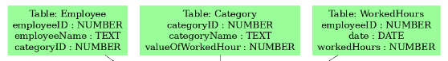

### Import

**textual**

```
IMPORT: 
      IMPORT FROM "./employees.csv" TO Employee WITH DELIMITER ";" AND DELETE_MISTMATCHED_TYPES AS false
      IMPORT FROM "./categories.csv" TO Category WITH DELIMITER ";" AND DELETE_MISTMATCHED_TYPES AS false
      IMPORT FROM "./workedhours.csv"" TO WorkedHours WITH DELIMITER ";" AND DELETE_MISTMATCHED_TYPES AS false
```

**graphical**

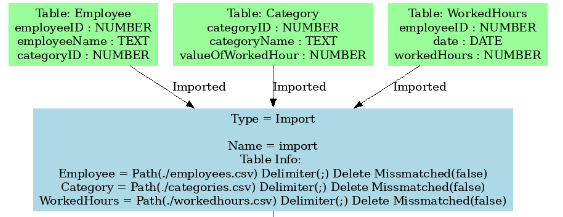

### Save

**textual**

```
SAVE: 
    SAVE PaymentsFinal(employeeID, employeeName, categoryID, categoryName, payment) TO "./result.csv"
```

**graphical**

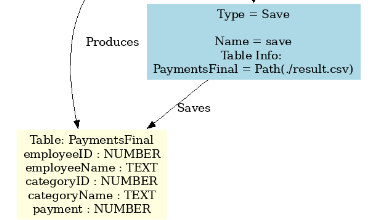

### Group

**textual**

```
GROUP WorkedHours BY (employeeID) AND PUT SUM(workedHours) INTO SumWorkedHours(totalWorkedHours)
```

**graphical**

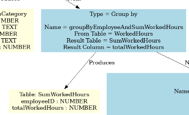

### Sort

**textual**

```
SORT Employee BY employeeID WITH ASC ORDER
```

**graphical**

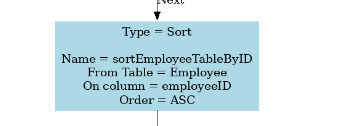

### AppendRows

**textual**

```
APPEND ROWS FROM Payments(employeeID, employeeName, categoryID, categoryName, payment) TO PaymentsFinal(employeeID, employeeName, categoryID, categoryName, payment)
```

**graphical**

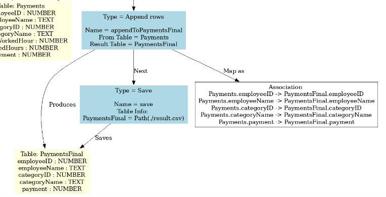

### Filter

**textual**

```
FILTER Sales WHERE quantity GREATER_THAN 10
```

**graphical**

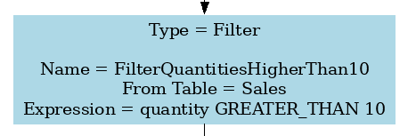

### Join

**textual**

```
INNER JOIN Employee(categoryID) WITH Category(categoryID) INTO EmployeeJoinCategory(employeeID, employeeName, categoryID, categoryName, valueOfWorkedHour)
```

**graphical**

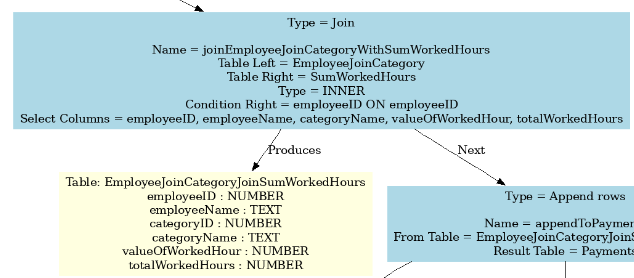

### Lookup

**textual**

```
LOOKUP FROM Payments(employeeID) TO Payments(employeeID) AND PUT NUMERIC_MULTIPLY(Payments(valueOfWorkedHour), Payments(workedHours)) INTO Payments(payment)
```

**graphical**

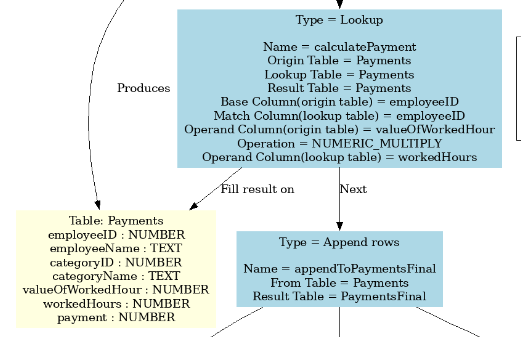

### RemoveDuplicates

**textual**

```
REMOVE DUPLICATES FROM Employee(employeeID)
```

**graphical**

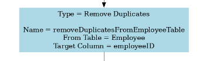

### StrManipulationConcat

**textual**

```
STR CONCAT Students(firstName, lastName) INTO Final(studentName)
```

**graphical**

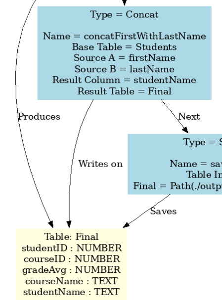

### StrManipulationSplit

**textual**

```
STR SPLIT Students(firstName) AT_FIRST_OCURRENCE OF ";" INTO Students(firstName, lastName)
```

**graphical**

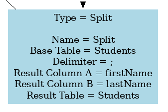

### StrManipulationExtract

**textual**

```
STR EXTRACT Courses(courseName) FROM 0 TO 5
```

**graphical**

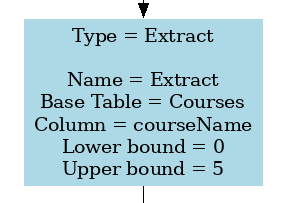

## Presentations of Models (instances)

Is now possible generate the instances for the cases cited before:

### Salary Model

#### Textual

```
Salary:
 tables:
  Employee:
   id_employee as NUMBER
   name_employee as TEXT
   id_category as NUMBER
  Category:
   id_category as NUMBER
   name_category as TEXT
   value_worked_hours as NUMBER
  WorkedHours:
   id_employee as NUMBER
   date as DATE
   worked_hours as NUMBER
  EmployeeJoinCategory:
   id_employee as NUMBER
   name_employee as TEXT
   id_category as NUMBER
   name_category as TEXT
   value_worked_hours as NUMBER
  SumWorkedHours:
   id_employee as NUMBER
   total_worked_hours as NUMBER
  EmployeeJoinCategoryJoinSumWorkedHoursTable:
   id_employee as NUMBER
   name_employee as TEXT
   id_category as NUMBER
   name_category as TEXT
   value_worked_hours as NUMBER
   total_worked_hours as NUMBER
  Payments:
   id_employee as NUMBER
   name_employee as TEXT
   id_category as NUMBER
   name_category as TEXT
   value_worked_hours as NUMBER
   total_worked_hours as NUMBER
   payment as NUMBER
  PaymentsFinal:
   id_employee as NUMBER
   name_employee as TEXT
   id_category as NUMBER
   name_category as TEXT
   payment as NUMBER
 steps
  IMPORT:
   IMPORT FROM "/employees.csv" TO Employee WITH DELIMITER "," AND DELETE_MISTMATCHED_TYPES AS true
   IMPORT FROM "/categories.csv" TO Category WITH DELIMITER "," AND DELETE_MISTMATCHED_TYPES AS false
   IMPORT FROM "/workedhours.csv" TO WorkedHours WITH DELIMITER "," AND DELETE_MISTMATCHED_TYPES AS false
  SORT Employee BY id_employee WITH ASC ORDER
  REMOVE DUPLICATES FROM Employee(id_employee)
  INNER JOIN Employee(id_employee) WITH Category(id_category) INTO EmployeeJoinCategory(id_employee, name_employee, id_category, name_category, value_worked_hours)
  GROUP WorkedHours BY (id_employee) AND PUT SUM(worked_hours) INTO SumWorkedHours(total_worked_hours)
  INNER JOIN EmployeeJoinCategory(id_employee) WITH SumWorkedHours(id_employee) INTO EmployeeJoinCategoryJoinSumWorkedHoursTable(id_employee, name_employee, name_category, value_worked_hours, total_worked_hours)
  APPEND ROWS FROM EmployeeJoinCategoryJoinSumWorkedHoursTable(id_employee, name_employee, id_category, name_category, value_worked_hours, total_worked_hours) TO Payments (id_employee, name_employee, id_category, name_category, value_worked_hours, total_worked_hours, payment)
  LOOKUP FROM Payments(id_employee) TO Payments(id_employee) AND PUT NUMERIC_MULTIPLY(Payments(value_worked_hours), Payments(total_worked_hours)) INTO Payments(payment)
  APPEND ROWS FROM Payments(id_employee, name_employee, id_category, name_category, value_worked_hours, total_worked_hours, payment) TO PaymentsFinal (id_employee, name_employee, id_category, name_category, payment)
  SAVE:
   SAVE PaymentsFinal(id_employee, name_employee, id_category, name_category, payment) TO "./output-salary.csv"
```

#### Graphically

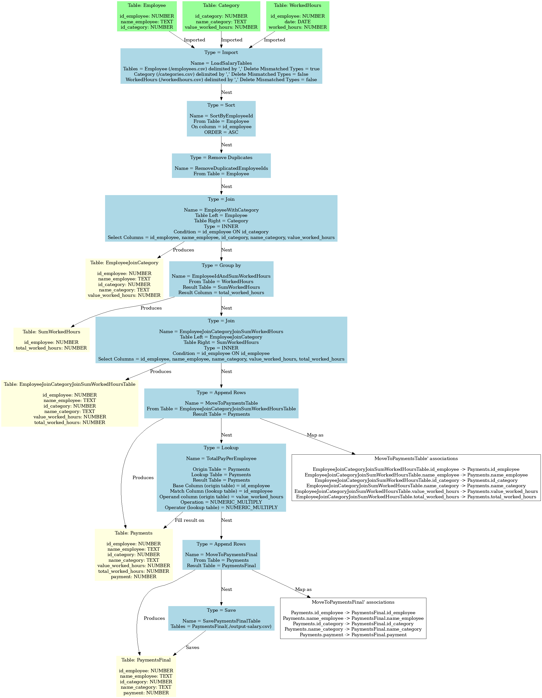

### Invoices Model

#### Textual

```
Invoicing:
 tables:
  Clients:
   id_client as NUMBER
   name_client as TEXT
   nif as TEXT
  Products:
   id_product as NUMBER
   name_product as TEXT
   price as NUMBER
  Sales:
   id_sale as NUMBER
   id_client as NUMBER
   id_product as NUMBER
   quantity as NUMBER
  SalesGroupedByClientProductWithQuantity:
   id_sale as NUMBER
   id_client as NUMBER
   id_product as NUMBER
   quantity as NUMBER
  SalesWithPrice:
   id_sale as NUMBER
   id_client as NUMBER
   id_product as NUMBER
   quantity as NUMBER
   price as NUMBER
  SalesWithTotal:
   id_sale as NUMBER
   id_client as NUMBER
   id_product as NUMBER
   quantity as NUMBER
   price as NUMBER
   total as NUMBER
  GroupedByIdClientSumTotal:
   id_client as NUMBER
   total as NUMBER
  Final:
   id_client as NUMBER
   name_client as TEXT
   nif as TEXT
   total as NUMBER
 steps
  IMPORT:
   IMPORT FROM "/clients.csv" TO Clients WITH DELIMITER "," AND DELETE_MISTMATCHED_TYPES AS false
   IMPORT FROM "/products.csv" TO Products WITH DELIMITER "," AND DELETE_MISTMATCHED_TYPES AS false
   IMPORT FROM "/sales.csv" TO Sales WITH DELIMITER "," AND DELETE_MISTMATCHED_TYPES AS false
  REMOVE DUPLICATES FROM Sales(id_sale)
  FILTER Sales WHERE quantity GREATER_THAN 10
  GROUP Sales BY (id_sale, id_product) AND PUT SUM(quantity) INTO SalesGroupedByClientProductWithQuantity(quantity)
  INNER JOIN Products(id_product) WITH SalesGroupedByClientProductWithQuantity(id_product) INTO SalesWithPrice(id_sale, id_client, id_product, quantity, price)
  APPEND ROWS FROM SalesWithPrice(id_sale, id_client, id_product, quantity, price) TO SalesWithTotal (id_sale, id_client, id_product, quantity, price, total)
  LOOKUP FROM SalesWithTotal(id_sale) TO SalesWithTotal(id_sale) AND PUT NUMERIC_MULTIPLY(SalesWithTotal(quantity), SalesWithTotal(price)) INTO SalesWithTotal(total)
  GROUP SalesWithTotal BY (id_client) AND PUT SUM(quantity) INTO GroupedByIdClientSumTotal(total)
  INNER JOIN GroupedByIdClientSumTotal(id_client) WITH Clients(id_client) INTO Final(id_client, name_client, nif, total)
  SAVE:
   SAVE Final(id_client, name_client, nif, total) TO "/.output-invoicing.csv"
```

#### Graphically

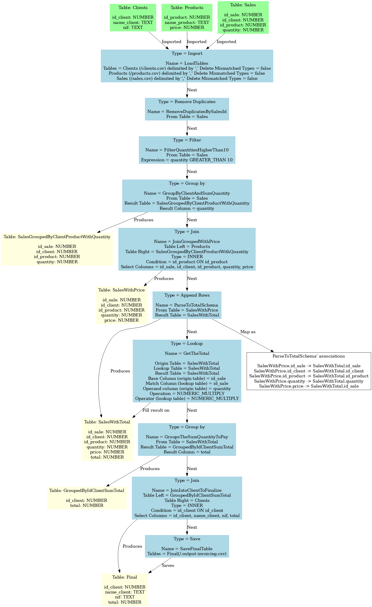

### Grading Model

#### Textual

```
Grading:
 tables:
  Students:
   id_student as NUMBER
   first_name as TEXT
   last_name as TEXT
  Courses:
   id_course as NUMBER
   name_course as TEXT
   id_student as NUMBER
  Grades:
   id_grade as NUMBER
   id_course as NUMBER
   id_student as NUMBER
   grade as NUMBER
  GradesAverage:
   id_student as NUMBER
   id_course as NUMBER
   avg_grade as NUMBER
  GradesAverageJoinCourses:
   id_student as NUMBER
   id_course as NUMBER
   avg_grade as NUMBER
   name_course as TEXT
  Final:
   id_student as NUMBER
   id_course as NUMBER
   avg_grade as NUMBER
   name_course as TEXT
   name_student as TEXT
 steps
  IMPORT:
   IMPORT FROM "./students.csv" TO Students WITH DELIMITER "," AND DELETE_MISTMATCHED_TYPES AS true
   IMPORT FROM "./courses.csv" TO Courses WITH DELIMITER "," AND DELETE_MISTMATCHED_TYPES AS true
   IMPORT FROM "./grades.csv" TO Grades WITH DELIMITER "," AND DELETE_MISTMATCHED_TYPES AS true
  REMOVE DUPLICATES FROM Grades(id_grade)
  GROUP Grades BY (id_student) AND PUT AVERAGE(id_grade) INTO GradesAverage(avg_grade)
  INNER JOIN GradesAverage(id_course) WITH Courses(id_course) INTO GradesAverageJoinCourses(id_student, id_course, avg_grade, name_course)
  APPEND ROWS FROM GradesAverageJoinCourses(id_student, id_course, avg_grade, name_course) TO Final (id_student, id_course, avg_grade, name_course, name_student)
  STR CONCAT Students(first_name, last_name) INTO Final(name_student»)
  SAVE:
   SAVE Final(id_student, id_course, avg_grade, name_course, name_student) TO "./output-grading.csv"

```

#### Graphically

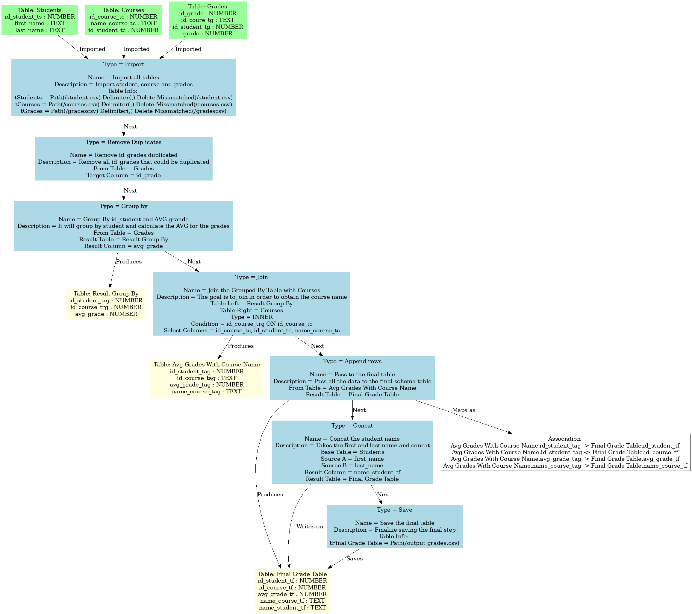

## References

[1] "A domain specific language for scripting ETL process," Proceedings of 2017 the 7th International Workshop on Computer Science and Engineering, Jan. 2017, doi: [10.18178/wcse.2017.06.041](https://doi.org/10.18178/wcse.2017.06.041).

[2] Fontaine, F. Duquenne, and C. U. De Liège - ULiège > Dép D’électric Électron Et Informat > Représentation Et Ingénierie Des Données Debruyne, “Master thesis : Creation of a domain specific language for an Extract-Transform-Load system,” MatheO - Master Thesis Online, Jun. 26, 2022. [Link](https://matheo.uliege.be/handle/2268.2/14583)

[3] Jeusfeld, M. A. (2009). Metamodel. In Springer eBooks (pp. 1727–1730). [DOI: 10.1007/978-0-387-39940-9_898](https://doi.org/10.1007/978-0-387-39940-9_898)

[4] Gascueña, J. M., Navarro, E., & Fernández-Caballero, A. (2012). Model-driven engineering techniques for the development of multi-agent systems. Engineering Applications of Artificial Intelligence, 25(1), 159–173. [DOI: 10.1016/j.engappai.2011.08.008](https://doi.org/10.1016/j.engappai.2011.08.008)

[5] Budinsky, F., & Merks, E. (2009). EMF: Eclipse Modeling Framework. Addison-Wesley Professional. [Mendeley link](https://www.mendeley.com/catalogue/f7e5967d-74ad-3ff5-926f-dfcb7125c063/)
