# EDOM Project, Part 1, Tool 1

In this folder you should add **all** artifacts developed for part 1 of the ENORM Project, related to tool 1.

You should also include in this file the report for this part of the project (only for tool 1).

**Note:** If for some reason you need to bypass these guidelines please ask for directions with your teacher and **always** state the exceptions in your commits and issues in bitbucket.

Following there are examples of proposed sections for the report.

## Description of the Tool

Meta Programming System (MPS) is a tool developed by JetBrains, designed to facilitate the creation of Domain-Specific Languages (DSLs) within a meta-modeling environment. MPS enables the development of structured languages that adhere to its own meta-metamodel.
A key feature of MPS is its use of a projectional editor. In traditional parser-based approaches, users input character sequences representing programs into text editors. A parser then examines the program for syntactic correctness and generates an Abstract Syntax Tree (AST) from the character sequence. Projectional editors, on the other hand, reverse this process. As users edit the program, the AST is directly modified. This approach allows MPS to represent programs using an AST without the need to define grammars or construct parsers for the languages being developed [[1]](#ref1). 

## How to Setup and Install

To install MPS, simply download and install the [JetBrains ToolBox](https://www.jetbrains.com/toolbox-app/). Once installed, open the Toolbox and locate MPS within the available software. You can then proceed to install MPS directly from the Toolbox interface, as shown in the following image:


## Implementation of the Metamodel


In MPS, the implementation of a metamodel involves defining a collection of nodes that collectively form an Abstract Syntax Tree (AST). These nodes, referred to as concepts, encapsulate the structure and behavior of elements within the model. Each concept can have a parent node (except for the root), child nodes, properties, and references to other nodes [[1]](#ref1). 

In MPS terminology, a coherent set of concepts along with additional features such as editors, intentions, type systems, constraints, etc., constitutes a language. Within MPS, concepts are declared within a language module, under a model named "structure" [[1]](#ref1). 

Fundamentally, when instantiating our metamodel, we create nodes that serve as instances of the concepts we've defined. This instantiation process allows us to build and manipulate models according to the specifications laid out in our metamodel. Furthermore, MPS supports concept hierarchy, enabling concepts to extend one another. When a concept extends another, it inherits all the children, properties, and references of its parent concept [[1]](#ref1).

The following image regularly showcases the AST structure; the full metamodel, detailed version is present [here](https://bitbucket.org/mei-isep/enorm-23-24-team-m1a-03/src/master/part1/readme.md). 

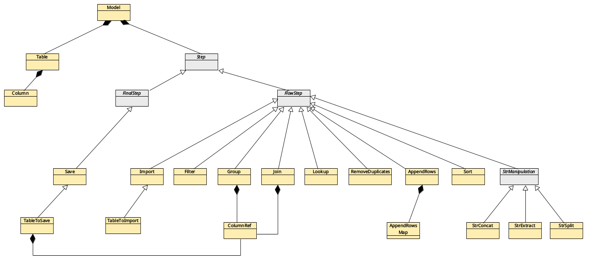

The following code snippet illustrates the declaration of a concept in MPS, focusing on the Join operation akin to SQL join functionality. Initially, it is declared that this concept cannot serve as the root, as only the Model concept holds that privilege. A brief description is provided to guide users in understanding the purpose of the language concept. Subsequently, the type property is defined to specify the type of join operation to be executed, such as INNER, OUTER, LEFT, etc. The concept further defines its structure by allowing 1 to n children of type ColumnRef, each representing a selected column from the join. Additionally, references to the columns and tables involved in the join are established.

```java
concept Join extends FlowStep
             implements <none>

instance can be root: false
alias: <no alias>
short description: Joins to tables based on a specific column and stores the output in a result table

properties:
type: JoinType

children:
selectColumns : ColumnRef[1..n]

references:
leftTable   : Table[1]
leftColumn  : Column[1]
rightTable  : Table[1]
rightColumn : Column[1]
resultTable : Table[1]
```

## Implementation of Constraints and Refactorings

#### Constraints

Metamodel contraints are important when defining the language structure is not enough to cover all the unwanted paths. Metamodel constraints can be declared in MPS in simultaneous ways, such as by recurring to the MPS aspects of Constraint and Typesystem. 

Given that MPS operates as a projectional editor, the process of writing code involves direct manipulation of the Abstract Syntax Tree (AST), rather than conventional free text input. In MPS, code creation resembles filling out a form, where each input corresponds to a specific element in the AST. For instance, when utilizing the BaseLanguage, akin to Java, attempting to access a property or method of an object mandates that the property or method must be a valid element of that object within the AST [[1]](#ref1).

Since MPS always ensures syntactic correctness, we can use the constraint aspect to define a precise scope of possibilities for a given input within the AST.

For instance, consider the declaration of the Filter concept, designed to filter data from a table based on a specific column.

```java
concept Filter extends FlowStep
               implements <none>

instance can be root: false
alias: <no alias>
short description: Filters table rows based on a condition applied to a column

properties:
operator: FilterOperatorType
operand: string

children:
<< ... >>

references:
table   : Table[1]
column  : Column[1]
```

Upon closer examination of the declaration, it becomes apparent that there's currently no restriction preventing a user from referencing a column from a table other than the referenced table and vice versa. The following snippet shows the declaration of a constraint to prevent this issue.

```java
concepts constraints Filter {
    can be child <none>

    can be parent <none>

    can be ancestor <none>

    instance icon <none>

    <<property constraints>>

    link{column}
        referent set handler <none>
        scope (referenceNode, contextNode, containmentLink, position, linkTarget)->Scope {
            Scope defaultScope = visible nodes [ Column ];
            sequence<node<>> tableColumns = referenceNode.table.columns;

            return ListScope.forNamedElements(defaultScope.getAvailableElements(null).where({it => tableColumns.contains(it); }));
        }

    default scope <no default scope>

    additional methods

    << ... >>
}
```

While constraints offer a means to narrow the range of inputs, they alone may not suffice to address all potential limitations within our language. Consider the definition of the "TableToImport" concept, a child of the "Import" concept. As its name suggests, this concept pertains to information regarding a table slated for importation.

```java
concept TableToImport extends BaseConcept
               implements <none>

instance can be root: false
alias: <no alias>
short description: Refers to a table to be imported

properties:
path:                 : string 
deleteMismatchedTypes : boolean
delimiter             : string

children:
<< ... >>

references:
table   : Table[1]
```

In the above concept declaration, the "path" property pertains to the location of the table we wish to import, referring to the disk location. Additionally, the "delimiter" property signifies the character or string used to separate each column within the table, such as the semicolon ";" commonly used in CSV formats.

To make sure the inputs are reliable, we need to validate them properly. This can be achieved through the declaration of validation rules within the MPS environment, specifically by defining CheckingRules within the typesystem model. In this case a rule would serve to verify that the provided path is not blank and that the delimiter is not an empty string. Once these rules are in place, error and warning messages can pop up in the MPS editor if users don't meet these criteria.

The following snippet shows the declaration of a checking rule for the previously described scenario.

```java
checking  rule ChecksImportNode {
    applicable for concept = TableToImport as tableToImport
    overrides <none>
    do not apply on the fly false

    do {
        if (tableToImport.path == null || tableToImport.path.isBlank()) { 
            error "path is empty" -> tableToImport; 
        }

        if (tableToImport.delimiter == null || tableToImport.delimiter.isEmpty) { 
            error "delimiter is empty" -> tableToImport; 
        }
    }

    additional methods

    << ... >>
}
```

#### Refactorings

Model refactoring can help fix issues identified by model constraints. In Model-Driven Engineering, transformations are essential. They help create better versions of models by fixing errors. We mainly deal with model-to-model transformations here, where the source and target models are of the same type. The target model is just an improved version compared to the original, addressing any errors or warnings from the checking rules.

MPS provides a mechanism for associating a model transformation with each error or warning declaration within a checking rule. To enact this, you activate the inspector mode by clicking on the bottom-right corner of the MPS window and subsequently selecting the error that requires mapping to a refactoring. Subsequently, you can utilize a aspect of the MPS ecosystem known as "quick fix", which is created within the typesystem model. This facet enables the declaration of code responsible for executing the actual model transformation (refactoring).

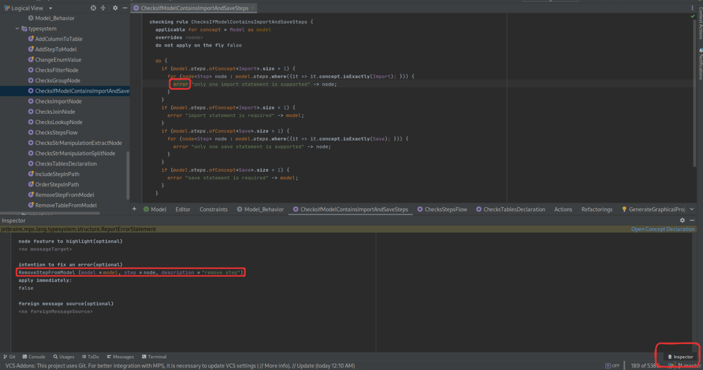

Here's the code snippet for a quick fix used for refactoring, which is being referenced in the inspector image above. This quick fix aims to assist users by automatically adding an import statement whenever the checking rule detects its absence.

```java
quick fix RemoveStepFromModel

arguments:
node<>  model
node<Step>  step
string  description

fields:
<< ... >>

description(node)->string { 
  description; 
}

execute(node)->void { 
  try { 
    node<Model> n = (node<Model>) model; 
    n.steps.remove(step); 
  } catch (Exception e) { 
    <no statements> 
  } 
}

additional methods

<< ... >>
```

## Implementation of the Visualizations

A projection/visualization serves as a read-only and non-editable representation of a model. The objective was to create two types of projections: textual and graphical. To enable the generation of model instance projections in MPS, a combination of two aspects was utilized: behaviors and intentions.

A behavior is an aspect of MPS language that enables the definition of common operations or methods, facilitating the reuse of functionality. These methods are implemented using BaseLanguage, which is MPS's implementation of Java [[1]](#ref1). An intention, as its name suggests, can be attached to a concept. When a user hovers the cursor over a concept instance, a light bulb will appear. Clicking on this light bulb will prompt a list of intentions defined for that concept to be displayed.

By combining these two concepts, we can declare an intention for the model concept. This intention can execute a behavior that contains methods capable of iterating through the model instance nodes and generating output projections to a file.

The following image showcases the intentions created for the language.

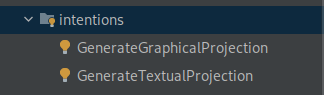

The snippet below presents the code for the 'GenerateTextualProjection' intention, which, as the name implies, is responsible for generating the textual projection. This intention invokes the 'textualProjection()' behaviour method from the Model concept.

```java
intention GenerateTextualProjection for concept Model {
    error  intention : false
    available in child nodes : false

    description(node, editorContext)->string {
        "generates textual projection for model"
    }

    <isApplicable = true>

    execute(node, editorContext)->void {
        node.textualProjection();
    }

    fields

    << ... >>

    additional methods

    << ... >>
}
```

Below is a snippet from the model behavior aspect, illustrating the entry point for generating the textual projection. The public method 'textualProjection' initiates the process, followed by an example method demonstrating how an Import concept is handled to transform it into the textual projection. In the original file, there is a similar method for each concept, responsible for its transformation into the desired output.

```java
concept behaviour Model {
    constructor {
        <no statements>

        public void textualProjection() {
            try {
                string homeDir = System.getProperty("user.home");
                FileWriter w = new  FileWriter(homeDir + "/textual_projection.txt"); 
                PrintWriter writer = new  PrintWriter(w); 
 
                writer.println("etl:"); 
                traverseTables("  ", writer); 
                traverseSteps("  ", writer);
                
                writer.close();
            } catch(Exception e) {
                e.printStackTrace();
            }
        }
    }

    .... other methods

    private void importStep() {
        writer.println(indentation + "IMPORT: "); 
        for (node<TableToImport> tableToImportNode : stepNode.tablesToImport) { 
            writer.println(indentation + "  IMPORT FROM \"" + tableToImportNode.path + "\" TO " + tableToImportNode.table.name + " WITH DELIMITER \"" + tableToImportNode.delimiter + "\" AND DELETE_MISTMATCHED_TYPES AS " + tableToImportNode.deleteMismatchedTypes); 
        }
    }
}
```

## Implementation of Models (instances)

In MPS, model instances are referred to as Solutions. Solutions represent programs written in one or more languages. In this scenario, we will focus on a specific type of solution known as the sandbox solution. These solutions are useful during the process of language design to interactively evolve languages by playing with the code [[1]](#ref1). The following snippets depict the three solutions for each of the proposed cases.

#### Salary

```
model Salary { 
  logs : true 
   
  tables : 
    table Employee { 
       
      columns : 
        column employeeID { 
          data type : NUMBER 
           
        } 
        column employeeName { 
          data type : TEXT 
           
        } 
        column categoryID { 
          data type : NUMBER 
           
        } 
    } 
    table Category { 
       
      columns : 
        column categoryID { 
          data type : NUMBER 
           
        } 
        column categoryName { 
          data type : TEXT 
           
        } 
        column valueOfWorkedHour { 
          data type : NUMBER 
           
        } 
    } 
    table WorkedHours { 
       
      columns : 
        column employeeID { 
          data type : NUMBER 
           
        } 
        column date { 
          data type : DATE 
           
        } 
        column workedHours { 
          data type : NUMBER 
           
        } 
    } 
    table EmployeeJoinCategory { 
       
      columns : 
        column employeeID { 
          data type : NUMBER 
           
        } 
        column employeeName { 
          data type : TEXT 
           
        } 
        column categoryID { 
          data type : NUMBER 
           
        } 
        column categoryName { 
          data type : TEXT 
           
        } 
        column valueOfWorkedHour { 
          data type : NUMBER 
           
        } 
    } 
    table SumWorkedHours { 
       
      columns : 
        column employeeID { 
          data type : NUMBER 
           
        } 
        column totalWorkedHours { 
          data type : NUMBER 
           
        } 
    } 
    table EmployeeJoinCategoryJoinSumWorkedHours { 
       
      columns : 
        column employeeID { 
          data type : NUMBER 
           
        } 
        column employeeName { 
          data type : TEXT 
           
        } 
        column categoryID { 
          data type : NUMBER 
           
        } 
        column categoryName { 
          data type : TEXT 
           
        } 
        column valueOfWorkedHour { 
          data type : NUMBER 
           
        } 
        column totalWorkedHours { 
          data type : NUMBER 
           
        } 
    } 
    table Payments { 
       
      columns : 
        column employeeID { 
          data type : NUMBER 
           
        } 
        column employeeName { 
          data type : TEXT 
           
        } 
        column categoryID { 
          data type : NUMBER 
           
        } 
        column categoryName { 
          data type : TEXT 
           
        } 
        column valueOfWorkedHour { 
          data type : NUMBER 
           
        } 
        column workedHours { 
          data type : NUMBER 
           
        } 
        column payment { 
          data type : NUMBER 
           
        } 
    } 
    table PaymentsFinal { 
       
      columns : 
        column employeeID { 
          data type : NUMBER 
           
        } 
        column employeeName { 
          data type : TEXT 
           
        } 
        column categoryID { 
          data type : NUMBER 
           
        } 
        column categoryName { 
          data type : TEXT 
           
        } 
        column payment { 
          data type : NUMBER 
           
        } 
    } 
  steps : 
    import import next : sortEmployeeTableByID { 
       
      tables to import : 
        table to import table : Employee { 
          path : ./employee.csv 
          delete mismatched types : true 
          delimiter : ; 
           
        } 
        table to import table : Category { 
          path : ./employee_category.csv 
          delete mismatched types : true 
          delimiter : ; 
           
        } 
        table to import table : WorkedHours { 
          path : ./worked_hours.csv 
          delete mismatched types : true 
          delimiter : ; 
           
        } 
    } 
    sort sortEmployeeTableByID table : Employee column : employeeID next : removeDuplicatesFromEmployeeTable { 
      order : ASC 
       
    } 
    remove duplicates removeDuplicatesFromEmployeeTable table : Employee column : employeeID next : joinEmployeeWithCategory 
    join joinEmployeeWithCategory left table : Employee left column : categoryID right table : Category right column : categoryID result table : EmployeeJoinCategory next : groupByEmployeeAndSumWorkedHours { 
      type : INNER 
       
      select columns : 
        column ref column : employeeID 
        column ref column : employeeName 
        column ref column : categoryID 
        column ref column : categoryName 
        column ref column : valueOfWorkedHour 
    } 
    group groupByEmployeeAndSumWorkedHours table : WorkedHours operand column : workedHours result table : SumWorkedHours result column : totalWorkedHours next : joinEmployeeJoinCategoryWithSumWorkedHours { 
      operation : SUM 
       
      group by : 
        column ref column : employeeID 
    } 
    join joinEmployeeJoinCategoryWithSumWorkedHours left table : EmployeeJoinCategory left column : employeeID right table : SumWorkedHours right column : employeeID result table : EmployeeJoinCategoryJoinSumWorkedHours next : appendToPayments { 
      type : INNER 
       
      select columns : 
        column ref column : employeeID 
        column ref column : employeeName 
        column ref column : categoryName 
        column ref column : valueOfWorkedHour 
        column ref column : totalWorkedHours 
    } 
    append rows appendToPayments from table : EmployeeJoinCategoryJoinSumWorkedHours to table : Payments next : calculatePayment { 
       
      mappings : 
        append rows map from col : employeeID to col : employeeID 
        append rows map from col : employeeName to col : employeeName 
        append rows map from col : categoryID to col : categoryID 
        append rows map from col : categoryName to col : categoryName 
        append rows map from col : valueOfWorkedHour to col : valueOfWorkedHour 
        append rows map from col : totalWorkedHours to col : workedHours 
    } 
    lookup calculatePayment table : Payments lookup table : Payments column : employeeID match column : employeeID operand column : valueOfWorkedHour lookup column : workedHours result table : Payments result column : payment next : appendToPaymentsFinal { 
      operation : NUMERIC_MULTIPLY 
       
    } 
    append rows appendToPaymentsFinal from table : Payments to table : PaymentsFinal next : save { 
       
      mappings : 
        append rows map from col : employeeID to col : employeeID 
        append rows map from col : employeeName to col : employeeName 
        append rows map from col : categoryID to col : categoryID 
        append rows map from col : categoryName to col : categoryName 
        append rows map from col : payment to col : payment 
    } 
    save save { 
       
      tables to save : 
        table to save table : PaymentsFinal { 
          path : ./result.csv 
           
          columns : 
            column ref column : employeeID 
            column ref column : employeeName 
            column ref column : categoryID 
            column ref column : categoryName 
            column ref column : payment 
        } 
    } 
}
```

#### Grading

```
model Grading { 
  logs : true 
   
  tables : 
    table Students { 
       
      columns : 
        column studentID { 
          data type : NUMBER 
           
        } 
        column firstName { 
          data type : TEXT 
           
        } 
        column lastName { 
          data type : TEXT 
           
        } 
    } 
    table Courses { 
       
      columns : 
        column courseID { 
          data type : NUMBER 
           
        } 
        column courseName { 
          data type : TEXT 
           
        } 
        column studentID { 
          data type : NUMBER 
           
        } 
    } 
    table Grades { 
       
      columns : 
        column gradeID { 
          data type : NUMBER 
           
        } 
        column courseID { 
          data type : NUMBER 
           
        } 
        column studentID { 
          data type : NUMBER 
           
        } 
        column grade { 
          data type : NUMBER 
           
        } 
    } 
    table GradesAverage { 
       
      columns : 
        column studentID { 
          data type : NUMBER 
           
        } 
        column courseID { 
          data type : NUMBER 
           
        } 
        column gradeAvg { 
          data type : NUMBER 
           
        } 
    } 
    table GradesAverageJoinCourses { 
       
      columns : 
        column studentID { 
          data type : NUMBER 
           
        } 
        column courseID { 
          data type : NUMBER 
           
        } 
        column gradeAvg { 
          data type : NUMBER 
           
        } 
        column courseName { 
          data type : TEXT 
           
        } 
    } 
    table Final { 
       
      columns : 
        column studentID { 
          data type : NUMBER 
           
        } 
        column courseID { 
          data type : NUMBER 
           
        } 
        column gradeAvg { 
          data type : NUMBER 
           
        } 
        column courseName { 
          data type : TEXT 
           
        } 
        column studentName { 
          data type : TEXT 
           
        } 
    } 
  steps : 
    import import next : removeDuplicates { 
       
      tables to import : 
        table to import table : Students { 
          path : ./students.csv 
          delete mismatched types : true 
          delimiter : ; 
           
        } 
        table to import table : Courses { 
          path : ./courses.csv 
          delete mismatched types : true 
          delimiter : ; 
           
        } 
        table to import table : Grades { 
          path : ./grades.csv" 
          delete mismatched types : true 
          delimiter : ; 
           
        } 
    } 
    remove duplicates removeDuplicates table : Grades column : gradeID next : groupStudentsToGetAVGNotes 
    group groupStudentsToGetAVGNotes table : Grades operand column : grade result table : GradesAverage result column : gradeAvg next : JoinGradesAverageWithCourses { 
      operation : AVG 
       
      group by : 
        column ref column : studentID 
    } 
    join JoinGradesAverageWithCourses left table : GradesAverage left column : courseID right table : Courses right column : courseID result table : GradesAverageJoinCourses next : appendToFinal { 
      type : INNER 
       
      select columns : 
        column ref column : studentID 
        column ref column : courseID 
        column ref column : gradeAvg 
        column ref column : courseName 
    } 
    append rows appendToFinal from table : GradesAverageJoinCourses to table : Final next : concatFirstWithLastName { 
       
      mappings : 
        append rows map from col : studentID to col : studentID 
        append rows map from col : courseID to col : courseID 
        append rows map from col : gradeAvg to col : gradeAvg 
        append rows map from col : courseName to col : courseName 
    } 
    str manipulation concat concatFirstWithLastName source A : firstName source B : lastName result table : Final result column : studentName table : Students next : saveFinal 
    save saveFinal { 
       
      tables to save : 
        table to save table : Final { 
          path : ./output-grading.csv 
           
          columns : 
            column ref column : studentID 
            column ref column : courseID 
            column ref column : gradeAvg 
            column ref column : courseName 
            column ref column : studentName 
        } 
    } 
}
```

#### Invoicing

```
model Invoicing { 
  logs : true 
   
  tables : 
    table Clients { 
       
      columns : 
        column clientID { 
          data type : NUMBER 
           
        } 
        column clientName { 
          data type : TEXT 
           
        } 
        column nif { 
          data type : TEXT 
           
        } 
    } 
    table Products { 
       
      columns : 
        column productID { 
          data type : NUMBER 
           
        } 
        column productName { 
          data type : TEXT 
           
        } 
        column price { 
          data type : NUMBER 
           
        } 
    } 
    table Sales { 
       
      columns : 
        column saleID { 
          data type : NUMBER 
           
        } 
        column clientID { 
          data type : NUMBER 
           
        } 
        column productID { 
          data type : NUMBER 
           
        } 
        column quantity { 
          data type : NUMBER 
           
        } 
    } 
    table SalesGroupedByClientProductWithQuantity { 
       
      columns : 
        column saleID { 
          data type : NUMBER 
           
        } 
        column clientID { 
          data type : NUMBER 
           
        } 
        column productID { 
          data type : NUMBER 
           
        } 
        column quantity { 
          data type : NUMBER 
           
        } 
    } 
    table SalesWithPrice { 
       
      columns : 
        column saleID { 
          data type : NUMBER 
           
        } 
        column clientID { 
          data type : NUMBER 
           
        } 
        column productID { 
          data type : NUMBER 
           
        } 
        column quantity { 
          data type : NUMBER 
           
        } 
        column price { 
          data type : NUMBER 
           
        } 
    } 
    table SalesWithTotal { 
       
      columns : 
        column saleID { 
          data type : NUMBER 
           
        } 
        column clientID { 
          data type : NUMBER 
           
        } 
        column productID { 
          data type : NUMBER 
           
        } 
        column quantity { 
          data type : NUMBER 
           
        } 
        column price { 
          data type : NUMBER 
           
        } 
        column total { 
          data type : NUMBER 
           
        } 
    } 
    table GroupedByIdClientSumTotal { 
       
      columns : 
        column clientID { 
          data type : NUMBER 
           
        } 
        column total { 
          data type : NUMBER 
           
        } 
    } 
    table Final { 
       
      columns : 
        column clientID { 
          data type : NUMBER 
           
        } 
        column clientName { 
          data type : TEXT 
           
        } 
        column nif { 
          data type : TEXT 
           
        } 
        column total { 
          data type : NUMBER 
           
        } 
    } 
  steps : 
    import import next : RemoveDuplicatesBySalesId { 
       
      tables to import : 
        table to import table : Clients { 
          path : ./clients.csv 
          delete mismatched types : false 
          delimiter : ; 
           
        } 
        table to import table : Products { 
          path : ./products.csv 
          delete mismatched types : false 
          delimiter : ; 
           
        } 
        table to import table : Sales { 
          path : ./sales.csv 
          delete mismatched types : false 
          delimiter : ; 
           
        } 
    } 
    remove duplicates RemoveDuplicatesBySalesId table : Sales column : saleID next : FilterQuantitiesHigherThan10 
    filter FilterQuantitiesHigherThan10 table : Sales column : quantity next : GroupByClientAndSumQuantity { 
      operator : GREATER_THAN 
      operand : 10 
       
    } 
    group GroupByClientAndSumQuantity table : Sales operand column : quantity result table : SalesGroupedByClientProductWithQuantity result column : quantity next : JoinGroupedWithPrice { 
      operation : SUM 
       
      group by : 
        column ref column : saleID 
        column ref column : productID 
    } 
    join JoinGroupedWithPrice left table : Products left column : productID right table : SalesGroupedByClientProductWithQuantity right column : productID result table : SalesWithPrice next : ParseToTotalSchema { 
      type : INNER 
       
      select columns : 
        column ref column : saleID 
        column ref column : clientID 
        column ref column : productID 
        column ref column : quantity 
    } 
    append rows ParseToTotalSchema from table : SalesWithPrice to table : SalesWithTotal next : GetTheTotal { 
       
      mappings : 
        append rows map from col : saleID to col : saleID 
        append rows map from col : clientID to col : clientID 
        append rows map from col : productID to col : productID 
        append rows map from col : quantity to col : quantity 
        append rows map from col : price to col : price 
    } 
    lookup GetTheTotal table : SalesWithTotal lookup table : SalesWithTotal column : saleID match column : saleID operand column : quantity lookup column : price result table : SalesWithTotal result column : total next : GroupsTheSumQuantityToPay { 
      operation : NUMERIC_MULTIPLY 
       
    } 
    group GroupsTheSumQuantityToPay table : SalesWithTotal operand column : quantity result table : GroupedByIdClientSumTotal result column : total next : JoinIntoClientToFinalize { 
      operation : SUM 
       
      group by : 
        column ref column : clientID 
    } 
    join JoinIntoClientToFinalize left table : GroupedByIdClientSumTotal left column : clientID right table : Clients right column : clientID result table : Final next : save { 
      type : INNER 
       
      select columns : 
        column ref column : clientID 
        column ref column : clientName 
        column ref column : nif 
        column ref column : total 
    } 
    save save { 
       
      tables to save : 
        table to save table : Final { 
          path : ./output-invoicing.csv 
           
          columns : 
            column ref column : clientID 
            column ref column : clientName 
            column ref column : nif 
            column ref column : total 
        } 
    } 
}
```

## Execution of Constraints and Refactorings

This topic will focus on showcasing how refactoring works. We'll select three examples from the list of all supported refactors when violations of the predefined rules occur.

#### Declared step that is not being used

When a step declaration exists without being targeted by any other step, it indicates that the step is not included in the execution path. The following image illustrates this scenario.

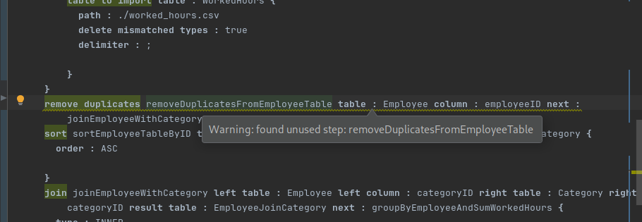

By clicking on the light bulb we will open the intentions menu. In this case we will have the option to remove the step or to include on the path.

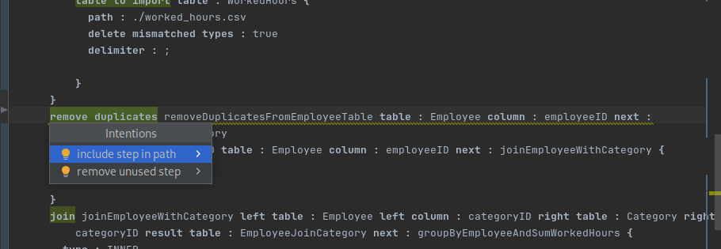

In this scenario, we will incorporate the unused step into the path by ensuring that the step preceding the save step (which is always the last) directs to this unused step. As a result, the unused step will then point to the save step, as depicted in the following image.

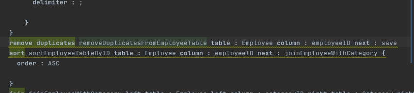

#### Out of order steps according to the flow

Following the logic of the previous refactoring, although the unused step is not initially on the step path, after the refactor, it and the other steps display a warning. This warning arises because the steps are visually out of order according to their sequence.

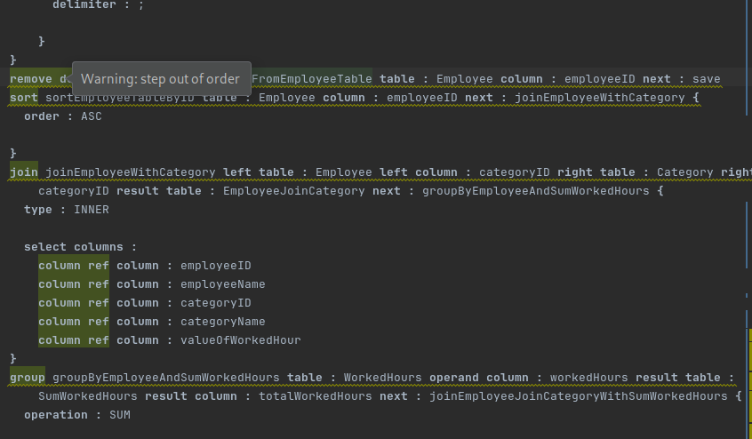


If we open the intentions menu, we'll find an option to rearrange the visual steps order.

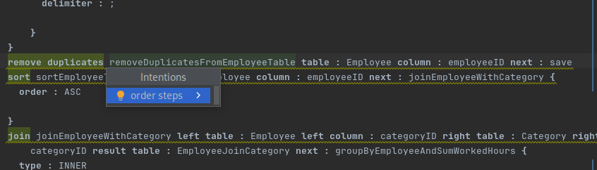

After executing the intention, the final result is the correct visual order of the steps according to the logical sequence.

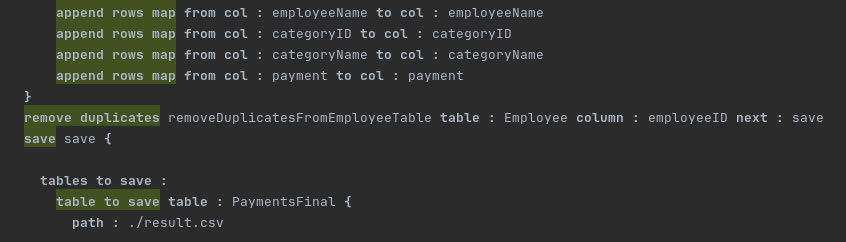

#### Missing import statement

One of the requirements for a model to be valid is the existence of an import step. This step is responsible for loading the data into the LTS process, and if it doesn't exist, the model is considered invalid.

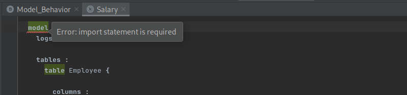

When encountering this error, opening the intentions menu reveals the option to add the import step to the model.

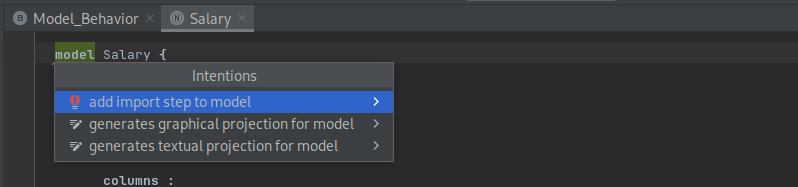

After executing the intention, the import step is added to the model, as shown in the following image.

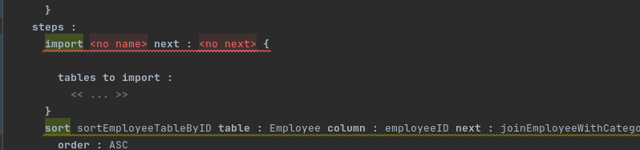

## Generation/Execution of Visualizations

To generate visualizations, simply click on the model and press ALT + ENTER. This will bring up the intentions menu. From there, select your desired intention, and the corresponding projection will appear in the root directory of the OS user.

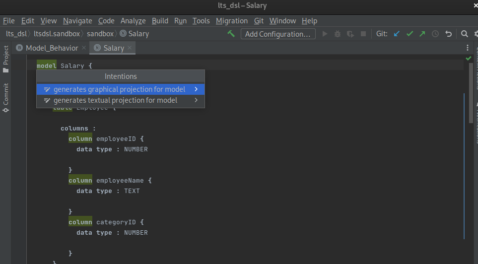

## References

<a name="ref1"></a>
[[1] Jetbrains Meta Programming System Documentation](https://www.jetbrains.com/help/mps/mps-user-s-guide.html)