# ENORM Project, Part 1, Tool 2

In this folder you should add **all** artifacts developed for part 1 of the ENORM Project, related to tool 2.

You should also include in this file the report for this part of the project (only for tool 2).

**Note:** If for some reason you need to bypass these guidelines please ask for directions with your teacher and **always** state the exceptions in your commits and issues in bitbucket.

Following there are examples of proposed sections for the report.

## Description of the Tool

**Eclipse Xtext** is a framework for development of programming languages and domain-specific languages. With Xtext we define our language using a powerful grammar language. As a result we get a full infrastructure, including parser, linker, typechecking, compiler as well as editing support for Eclipse, any editor that supports the Language Server Protocol and our favorite web browser. [1]

## How to Setup and Install

**Step 1: Access the Eclipse Marketplace**

1. Open Eclipse and go to "Help".
2. Then go to "Eclipse Marketplace...".

| 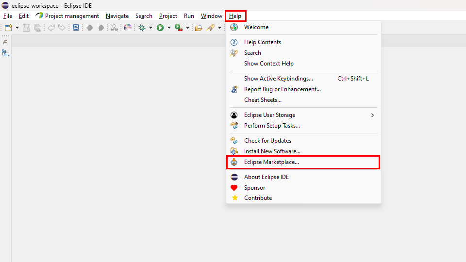 | 
|:--:| 
| *How to Setup and Install Xtext - Step 1* |

**Step 2: Install Xtext**

1. Search for Xtext.
2. Install the Plug-in.

| 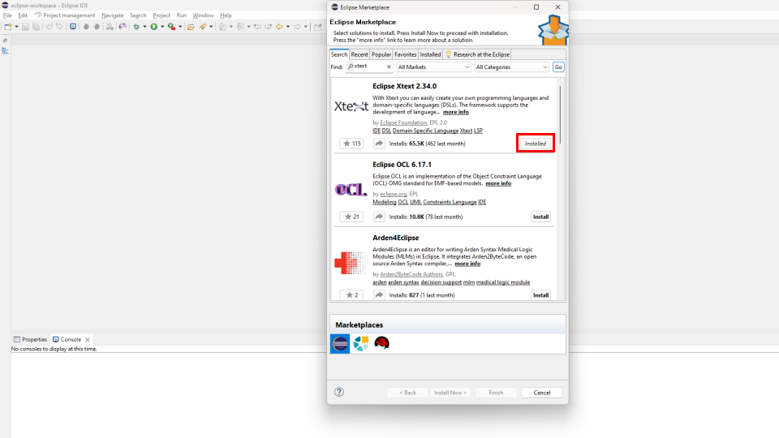 | 
|:--:| 
| *How to Setup and Install Xtext - Step 2* |

**Step 3: Create an Xtext project**

1. Click on "File" in Eclipse.
2. Click on "New".
3. Click on "Xtext Project" or "Xtext Project From Existing Ecore Models".
4. To generate the artifacts, simply right-click on the code and click on "Run As" -> "Generate Xtext Artifacts".

| 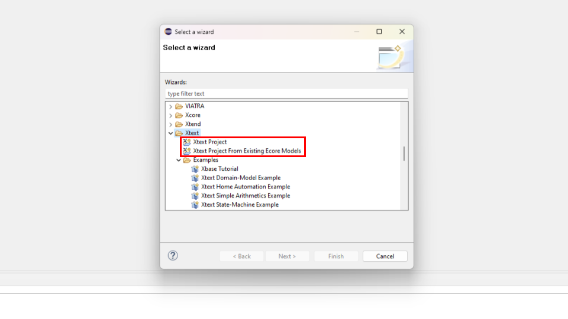 | 
|:--:| 
| *How to Setup and Install Xtext - Step 3* |

## Project directories organization

- `metamodel`: this folder contains the Ecore Modeling Project, including the metamodel.
- `models`: this folder contains the 3 models instances. Each one of the model instances have the .mydsl file, the graphical projection (.puml file) and the textual projection (.txt file).
- `report_images`: this folder contains all the current report images.
- `xtext`: this folder contains the Xtext Ecore Modeling Project, including the grammar,  validation rules, quick fixes and projections generation.

## Implementation of the Metamodel

Xtext **relies heavily on EMF internally**, but it can also be used as the serialization back-end of other EMF-based tools. In this section we introduce the basic concepts of the Eclipse Modeling Framework (EMF) in the context of Xtext. [2]

Xtext **uses Eclipse Modeling Framework (EMF) models** as the in-memory representation of any parsed text files. This in-memory object graph is called the Abstract Syntax Tree (AST). Depending on the community this concepts is also called Document Object Model (DOM), semantic model, or simply model. We use model and AST interchangeably. [2]

In EMF a model is made up of instances of EObjects which are connected. An EObject is an instance of an EClass. A set of EClasses can be contained in an EPackage, **which are both concepts of Ecore**. In Xtext, metamodels are either inferred from the grammar or predefined by the users. [2]

The language in which the metamodel is defined **is called Ecore**. In other words, the metamodel is the Ecore model of our language. Ecore is an essential part of EMF. Models instantiate the metamodel, and the metamodel instantiates Ecore. To put an end to this recursion, Ecore is defined in itself (an instance of itself). [2]

### Classifiers, features and relations

The metamodel defines the types of the semantic nodes as Ecore EClasses. EClasses are shown as boxes in the metamodel diagram, so in our example, `Model`, `Step`, `Table`, `Column`, and so on, are EClasses. An EClass can inherit from other EClasses like steps inherit from abstract class `Step`. Multiple inheritance is allowed in Ecore, **but of course cycles are forbidden**.

**EClasses can have EAttributes for their simple properties**. These are shown inside the EClasses nodes. The domain of values for an EAttribute is defined by its EDataType. Ecore ships with some predefined EDataTypes, **which essentially refer to Java primitive types** and other immutable classes like String. To make a distinction from the Java types, the EDataTypes are prefixed with an `E`.

| 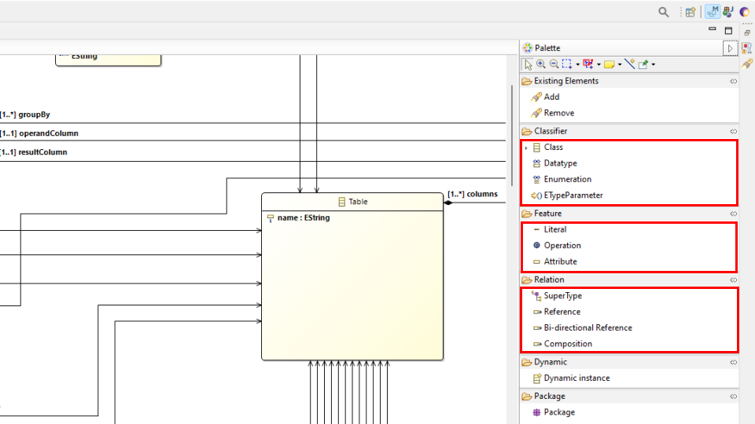 | 
|:--:| 
| *Classifiers, features and relations* |

In contrast to EAttributes, **EReferences point to other EClasses**. The containment flag (showed in the image below) indicates whether an EReference is a containment reference or a cross-reference. In the diagram, references are edges and containment references are marked with a diamond. At the model level, each element can have at most one container. On the other hand, cross-references refer to elements that can be contained anywhere else. [2]

| 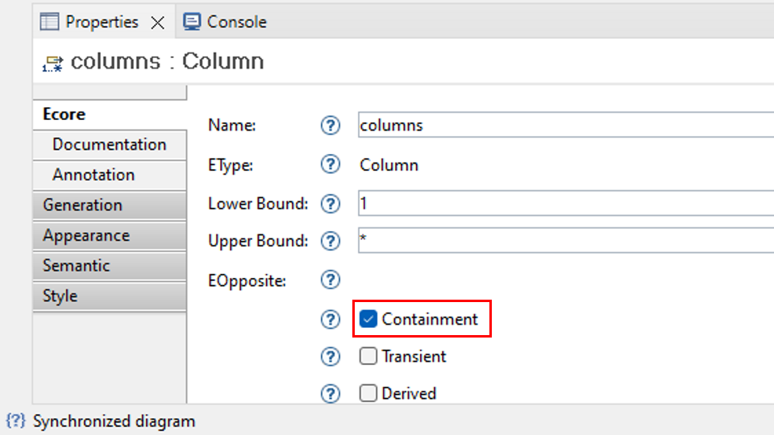 | 
|:--:| 
| *Containment flag* |

To develop the metamodel, the graphical view present in the `.aird` file was used (.aird -> Design -> Entities in a Class Diagram). This made it easier to develop the metamodel, since using the Sample Ecore Model Editor is much less intuitive. With that said, **the metamodel result** is presented as follows.

| 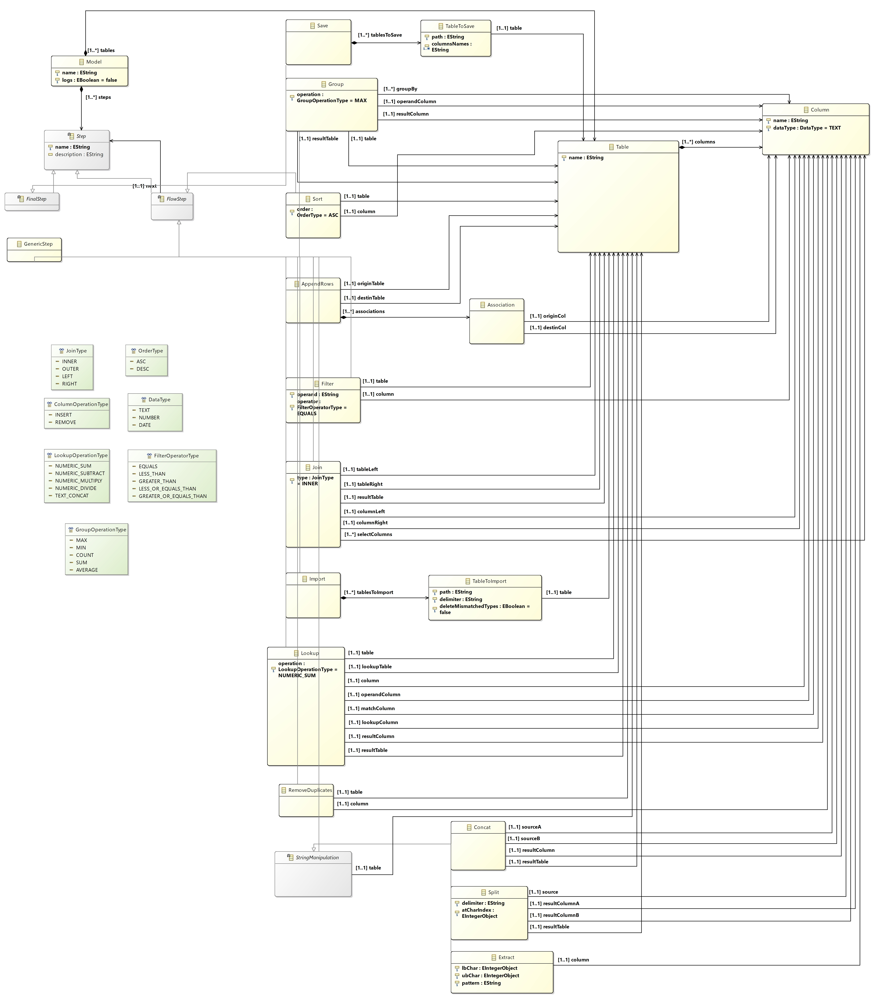 | 
|:--:| 
| *Metamodel* |

## Implementation of Constraints and Refactoring

In the world of modeling languages, a metamodel acts as a blueprint, defining the structure of the models it describes. However, the metamodel itself might not capture every single rule or limitation. **That's where constraints come in**. Constraints in metamodels are essentially rules that further specify what's allowed within a model that conforms to the metamodel. These constraints act like filters, ensuring that the models we create based on the metamodel adhere to specific conditions. [3] 

There are different ways to define constraints within a metamodel. A common approach is to use a special language like the Object Constraint Language (OCL). OCL allows us to express complex conditions based on the elements and their relationships within the metamodel. [4] 

**Model to model refactoring** refer to the automated process of converting a model conforming to one metamodel (source) into a new model compliant.

Refactoring act as an adapter, taking the structure and elements from the source model and translating them into a format compatible with the target metamodel.

In Xtext, we used **Custom Validations and Quick Fixes**.

### Custom Validations and Quick Fixes

Along the OCL, we can specify additional constraints specific for our Ecore model. The Xtext language generator provides two Java classes. The first is an abstract class generated to `src-gen/` validation folder which extends the library class `AbstractDeclarativeValidator`. This one just registers the EPackages for which this validator introduces constraints. 

```java
public abstract class AbstractMyDslValidator extends AbstractDeclarativeValidator {
	
	@Override
	protected List<EPackage> getEPackages() {
		List<EPackage> result = new ArrayList<EPackage>();
		result.add(EPackage.Registry.INSTANCE.getEPackage("http://www.example.org/excelltsmetamodel"));
		return result;
	}
}
```

The other class is a subclass of that abstract class and is generated to the `src/` validation folder in order to be edited by us. That is where we put the 'constraints' or custom validations in. To code the custom validations in more than on file, we used the `@ComposedChecks` annotation and divided the validations by different classes.

```java
@ComposedChecks(validators={
		MyDslValidatorModel.class, 
		MyDslValidatorFlowStep.class, 
		MyDslValidatorImport.class, 
		MyDslValidatorTableToImport.class, 
        ...
})
public class MyDslValidator extends AbstractMyDslValidator {
	// Add custom validations here
}
```

The purpose of the `AbstractDeclarativeValidator` is to allow the users to write custom validations in a declarative way - as the class name already suggests. That is instead of writing exhaustive if-else constructs or extending the generated EMF switch **we just have to add the `@Check` annotation to any method** and it will be invoked automatically when validation takes place. [5]

The Xtext also generates an `ui` folder that contains all the necessary classes to manipulate the User Interface (UI) of our DSL. Inside this folder, there's another folder that contains a class that extends the `DefaultQuickfixProvider`. 

This class allow us to create the quick fixes using the `@Fix` annotation. 

```java
public class MyDslQuickfixProvider extends DefaultQuickfixProvider {
	// Add Quick fixes here
}
```

### Creation of a Custom Validation

Here's an example of a custom validation that validate that the model has no unused tables.

```java
@Check
public void modelMustNotHaveUnusedTables(Model model) {
	Set<Table> referencedTables = new HashSet<>();
	TreeIterator<EObject> iterator = model.eAllContents();
	while (iterator.hasNext()) {
		// Code to get the referenced tables
	}

	for (int i = 0; i < model.getTables().size(); i++) {
		Table modelTable = model.getTables().get(i);
		if (!referencedTables.contains(modelTable)) {
			error(MODEL_MUST_NOT_HAVE_UNUSED_TABLES, 
					ExcelltsmetamodelPackage.Literals.MODEL__TABLES, 
					MODEL_MUST_NOT_HAVE_UNUSED_TABLES, 
					String.valueOf(i));
		}
	}
}
```

In the code snippet above, we define an error to be shown if there are any table that is not used. This `error` structure is the following:

`error(String message, EStructuralFeature feature, String code, String... issueData)`

- The **first** parameter is the message that will be shown when the custom validation fails.
- The **second** parameter is the feature to be marked when the error occurs to help the user find where is the problem.
- The **third** is a 'code' to be used in the Quick Fixes to add a refactoring to the model when the user wants to quick fix an issue.
- The **fourth** (optional) is used to pass data as a String to the quick fix. The data can be accessed with `issue.getData()[0]`. 

### Creation of a Quick fix

Here's an example of quick fix to resolve the problem of the presence of unused tables:

```java
@Fix(MyDslValidatorModel.MODEL_MUST_NOT_HAVE_UNUSED_TABLES)
public void fixUnusedTablesInModel(final Issue issue, IssueResolutionAcceptor acceptor) {
	acceptor.accept(issue, "Remove unused table.", "", "icon.png", new ISemanticModification() {
		@Override
		public void apply(EObject element, IModificationContext context) throws Exception {
			if (element instanceof Model) {
				Model model = (Model) element;
				EcoreUtil.delete(model.getTables().get(Integer.parseInt(issue.getData()[0])));
			}
		}
	});  
}
```

In the code snippet above, it's possible to see that we use the `code` `MODEL_MUST_NOT_HAVE_UNUSED_TABLES` passed as the error **third** parameter to reference the custom validation to the quick fix. 

When there is a table that is not used by any step, a quick fix appears and if the user clicks it, **the unused table is removed**.

## Implementation of the Visualizations

To make the graphical and textual visualizations, **xtend** was used.

**Xtend** is a statically-typed programming language which translates to comprehensible Java source code. Syntactically and semantically Xtend has its roots in the Java programming language but improves on many aspects such as Extension methods and Lambda Expressions. [7]

Of course, we can call Xtend methods from Java, too, in a completely transparent way. Furthermore, Xtend provides a modern Eclipse-based IDE closely integrated with the Eclipse Java Development Tools (JDT). [7]

### Graphical visualization

```scala
def generateGraphviz(Model model) '''
	@startuml
	digraph model {
		«prepareGraphvizData(model)»
	«FOR table : model.tables»
		«createTableGraphviz(table)»
	«ENDFOR»
	«FOR step : model.steps»
		«createStepGraphviz(step)»
	«ENDFOR»
	«connectSteps(model)»
	}
	@enduml
'''
```

The idea here was to first iterate through the tables to add them to the `.puml` file.

```scala
private def createTableGraphviz(Table table) '''
	"«table.name»" [shape=box, label="Table: «table.name»\n
	«FOR column : table.columns»
	«column.name»: «column.dataType»
	«ENDFOR»"]
'''
```

Next, the goal was to iterate through the steps and add them to the `.puml` file as well. 

```scala
private def createStepGraphviz(Step step) '''
	«IF step instanceof Sort»
		«val mySort = step as Sort»
		"«mySort.name»" [shape=box, label="Type = Sort\n
		Name = «mySort.name»
		Description = «mySort.description»
		From Table = «mySort.table.name»
		On column = «mySort.column.name»
		ORDER = «mySort.order»
		"]
	«ELSEIF step instanceof Filter»
	...
"]
'''
```

Finally, the steps were connected so that the links in the generated UML were visible.

```scala
private def connectSteps(Model model) '''
	«FOR step : model.steps»
		«IF step instanceof FlowStep»
			«val myFlowStep = step as FlowStep»
			"«myFlowStep.name»" -> "«myFlowStep.next.name»" [label="Next"]
		«ENDIF»
		«IF step instanceof Join»
		...
'''
```

### Textual visualization

```scala
def generateTextualProjection(Model model) '''
	«model.name»:
	«" "»tables:
	«FOR table : model.tables»
	«createTable(table)»
	«ENDFOR»
	«" "»steps
	«FOR step : model.steps»
		«createStepGraphviz(step)»
	«ENDFOR»
'''
```

For the textual visualization, the code organization was exactly the same. We iterate through the tables and add them to the `.txt` file.

```scala
private def createTable(Table table) '''
	«"  "»«table.name»:
	«FOR column : table.columns»
	«"   "»«column.name» as «column.dataType»
	«ENDFOR»
'''
```
Next, the goal was to iterate through the steps and add them to the `.txt` file.

```scala
private def createStepGraphviz(Step step) '''
	«IF step instanceof Sort»
		«val mySort = step as Sort»
		«"  "»SORT «mySort.table.name» BY «mySort.column.name» WITH «mySort.order» ORDER
	«ELSEIF step instanceof Filter»
	...
'''
```

## Implementation of Models (instances)

The models are presented in the `models` folder in the same level as the current report. 

[Case 1 - Salary](https://bitbucket.org/mei-isep/enorm-23-24-team-m1a-03/src/master/part1/tool2-xtext/models/salary/src/salary.mydsl)

[Case 2 - Invoicing](https://bitbucket.org/mei-isep/enorm-23-24-team-m1a-03/src/master/part1/tool2-xtext/models/invoicing/src/invoicing.mydsl)

[Case 3 - Grading](https://bitbucket.org/mei-isep/enorm-23-24-team-m1a-03/src/master/part1/tool2-xtext/models/grading/src/grading.mydsl)

The projections are inside `src-gen` folder.

[Case 1 - Salary](https://bitbucket.org/mei-isep/enorm-23-24-team-m1a-03/src/master/part1/tool2-xtext/models/salary/src-gen/)

[Case 2 - Invoicing](https://bitbucket.org/mei-isep/enorm-23-24-team-m1a-03/src/master/part1/tool2-xtext/models/invoicing/src-gen/)

[Case 3 - Grading](https://bitbucket.org/mei-isep/enorm-23-24-team-m1a-03/src/master/part1/tool2-xtext/models/grading/src-gen/)

## Execution of Constraints and Refactoring

### Example 1

In this example we define a table that is never used, so a quick fix appear:

| 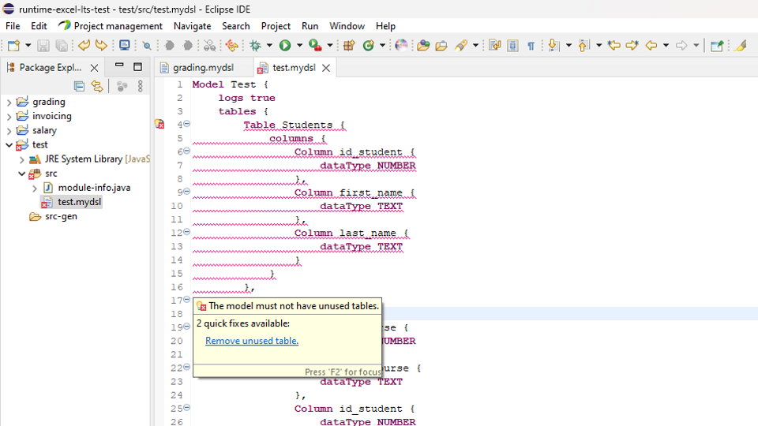 | 
|:--:| 
| *Error - example 1* |

If we click in the quick fix, the table is removed and the error is gone.

| 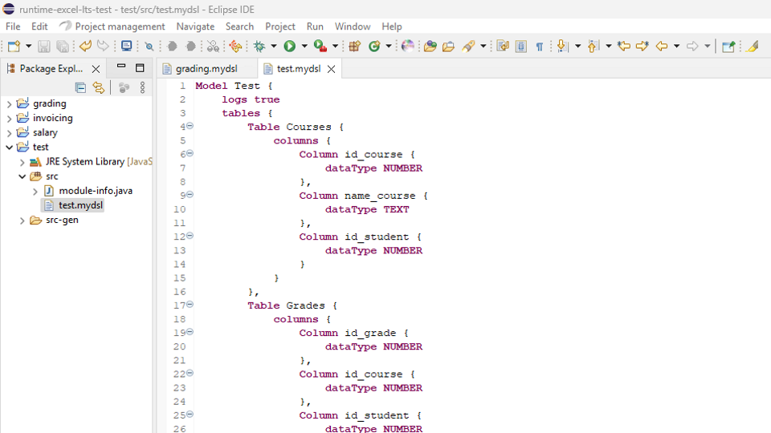 | 
|:--:| 
| *Quick Fix - example 1* |

### Example 2

In this example we define a filter operation that is impossible due to given data types.

| 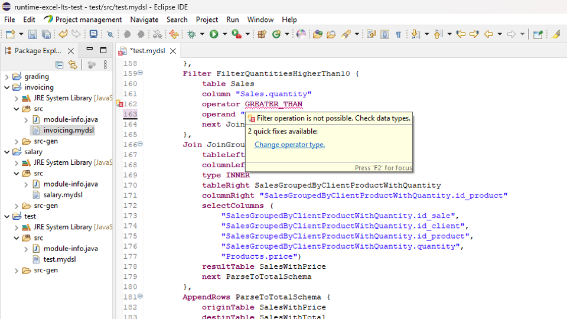 | 
|:--:| 
| *Error - example 2* |

If we click in the quick fix, the data type is changed to a valid one.

| 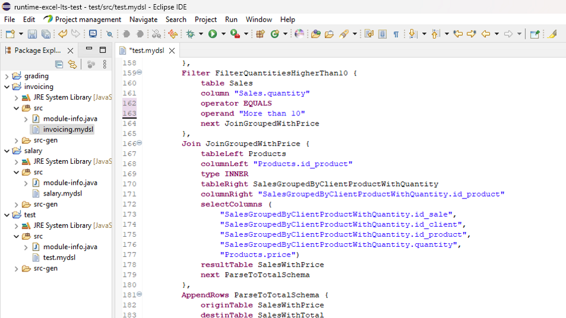 | 
|:--:| 
| *Quick Fix - example 2* |

### Example 3

In this example we do not define a mandatory Save step.

| 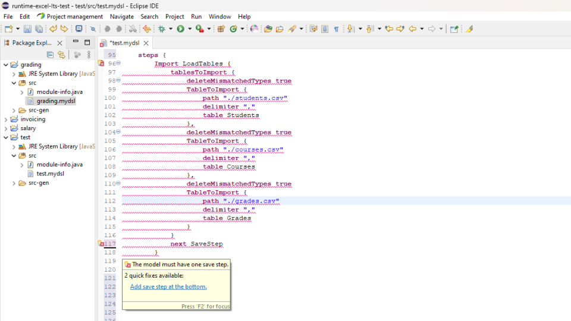 | 
|:--:| 
| *Error - example 3* |

If we click in the quick fix, the save step is added with default in the components names to ensure the user alters them.

| 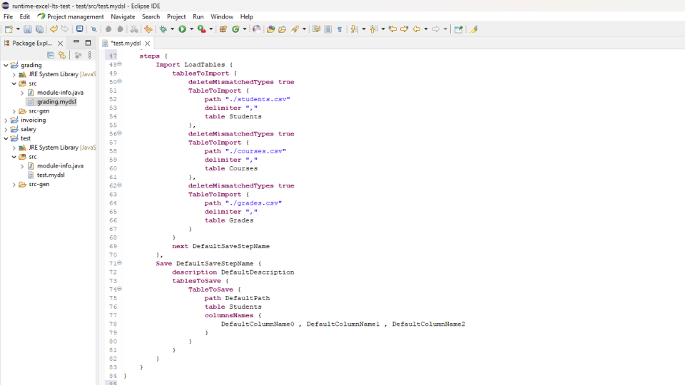 | 
|:--:| 
| *Quick Fix - example 3* |

## Generation/Execution of Visualizations

As soon as we generate the Xtext artifacts from the grammar, a code generator stub is put into the runtime project of our language. [6]

The `MyDslGenerator.xtend` file located in the package `org.example.mydsl.generator` is used to generate code for our models in the standalone scenario and in the interactive Eclipse environment. The strategy is to find all the desired components  within a resource and trigger code generation for each one.

The method `doGenerate` was used to generate both the graphical and the textual visualizations, passing the whole model to the methods.

```java
class MyDslGenerator extends AbstractGenerator {
	override void doGenerate(Resource resource, IFileSystemAccess2 fsa, IGeneratorContext context) {
	    val graphicGenerator = new GenerateGraphicProjection()
	    val textualGenerator = new GenerateTextualProjection()
	    for (model : resource.allContents.toIterable.filter(Model)) {
	        val graphvizOutput = graphicGenerator.generateGraphviz(model)
	        fsa.generateFile(model.name + ".puml", graphvizOutput)
	        val textualOutput = textualGenerator.generateTextualProjection(model)
	        fsa.generateFile(model.name + ".txt", textualOutput)
    	}
	}
}
```

With this approach, we do not need to generate the visualizations manually. Contrary, when we save the dsl file, the visualizations are generated automatically!

## References

[1] [https://eclipse.dev/Xtext/](https://eclipse.dev/Xtext/) <br>
[2] [https://eclipse.dev/Xtext/documentation/308_emf_integration.html](https://eclipse.dev/Xtext/documentation/308_emf_integration.html) <br>
[3] [https://arxiv.org/ftp/arxiv/papers/1409/1409.2359.pdf](https://arxiv.org/ftp/arxiv/papers/1409/1409.2359.pdf) <br>
[4] [https://link.springer.com/article/10.1007/s10270-020-00849-8#:~:text=Abstract,to%20conflicts%20among%20the%20constraints.](https://link.springer.com/article/10.1007/s10270-020-00849-8#:~:text=Abstract,to%20conflicts%20among%20the%20constraints.) <br>
[5] [https://eclipse.dev/Xtext/documentation/303_runtime_concepts.html](https://eclipse.dev/Xtext/documentation/303_runtime_concepts.html) <br>
[6] [https://eclipse.dev/Xtext/documentation/103_domainmodelnextsteps.html](https://eclipse.dev/Xtext/documentation/103_domainmodelnextsteps.html) <br>
[7] [https://eclipse.dev/Xtext/xtend/documentation/index.html](https://eclipse.dev/Xtext/xtend/documentation/index.html) <br>