# EDOM Project, Part 1, Tool 3

In this folder you should add **all** artifacts developed for part 1 of the ENORM Project, related to tool 3.

You should also include in this file the report for this part of the project (only for tool 3).

**Note:** If for some reason you need to bypass these guidelines please ask for directions with your teacher and **always** state the exceptions in your commits and issues in bitbucket.

Following there are examples of proposed sections for the report.

## Description of the Tool

Sirius is a tool built on top of the Eclipse Modeling technologies (EMT), bringing the ability to easily create graphical models taking advantage of the Eclipse Modeling Framework (EMF) and Graphical Modeling Project (GMP) technologies present in EMT.

With Sirius, it's possible to define the structure and behavior of the models using a combination of graphical and textual representations. This includes defining the types of elements and relationships within the model, as well as specifying constraints, validation rules, and behaviors.

The tool provides a set of components and APIs for defining the graphical representation of models, including customizable palettes, diagrams, and property views. It's also possible to create diagrams with drag-and-drop capabilities, define layout algorithms, and customize the appearance of elements and connections.

Overall, Sirius empowers users to create highly tailored modeling environments that align closely with their specific requirements and domain expertise, facilitating efficient and effective model-driven development.

## How to Setup and Install

Sirius offers some download options:

- **Ready-to-Use Package:** This option is facilitated by Obeo Designer, offering a comprehensive package containing all essential tools required for working with Sirius. Access the package [here](https://www.obeodesigner.com/en/download).

- **Cloud Solution:** Sirius also supports a Software-as-a-Service (SaaS) option, providing web-based access to the software without the need for desktop installations. Explore the cloud solution [here](https://eclipse.dev/sirius/sirius-web.html).

- **Eclipse Plugin:** Alternatively, users can integrate the Sirius plugin into their existing Eclipse modeling framework software for seamless incorporation of Sirius functionalities. *(This is the option that will be detailed)*


The option that will be detailed is the **Eclipse Plugin method**:

1. **Install Eclipse Modeling Tools:** To begin, is necessary to install the Eclipse Modeling Tools. [Eclipse website](https://www.eclipse.org/downloads/packages/release).

2. **Install Sirius Plugin:**
    - **Option 1:** It's possible to use the Drag to Install feature by accessing [this link](https://marketplace.eclipse.org/content/sirius).
    - **Option 2:** Other way is the manual install process via the Eclipse Marketplace. So, it's necessary to open Eclipse and navigate to the Help tab. Click on "Eclipse Marketplace", search for "Sirius", select the appropriate plugin, and follow the installation prompts.

3. **Restart Eclipse:** After installing the Sirius Plugin, it's recommended to restart Eclipse to ensure that the changes are applied.

4. **Setup Sirius:** Once Eclipse restarts, Sirius will be set up and ready to use within the Eclipse environment.


## Implementation of the Metamodel

Given that Sirius is built upon the EMF, it needs an instance of the metamodel's plugin in order to be possible to describe it as a Sirius Viewpoint Design. To achieve this, we must use the Ecore Tools and the EMF environment to built the metamodel. ["The Ecore Tools component provides a complete environment to create, edit and maintain Ecore models."]("https://wiki.eclipse.org/Ecore_Tools"). This component offers a comprehensive environment tailored for the creation, editing, and maintenance of Ecore models.

For this case, it was used predominantly the graphical editor, because it offers a more intuitive approach, allowing to visualize and construct the metamodel's structure more easily. Also, the Ecore Editor could be more difficult to see some improvements while doing the metamodel against the graphically way, because, in a personal opinion, it's more intuitive to check if exists references missing, or if some reference needs a middle node, etc.

So, in order to create the metamodel it was necessary to create a EMF project and use it in a Modeling View. 

For this, we need to work around with the Ecore metamodel, in order to produce our specific DSL metamodel. As is possible to see in the image bellow, we can create new Classes, Relationships, etc., on the Right part of the Editor, and for each Node/Relationship we can edit the properties on the Bottom part of the Editor.

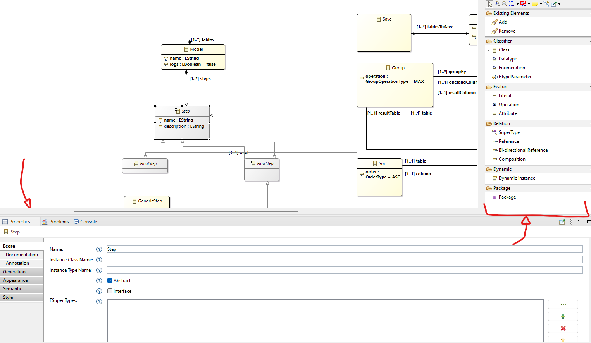


And, with that, it was possible to reach the final EMF model, like shown bellow:
 
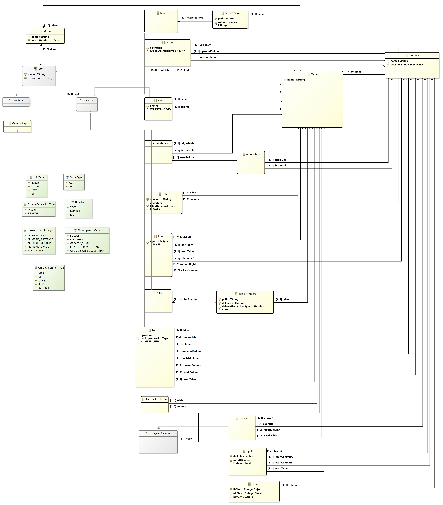

### Sirius representation

In Sirius, it's necessary to dictate how each component of the metamodel it will be represented, and for that, we use the `.odesign`.

Like is possible to see bellow, it was defined the carcteristic for each Node, where is detailed the Import. This node it was defined having a Container inside of a Container, in order to represent a Table to be imported. The labels define the details inside of the class.
 
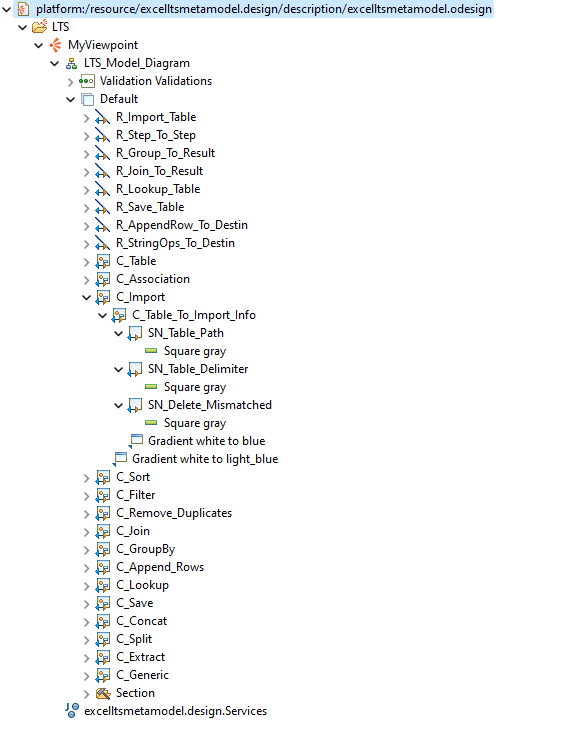

The result of the representation is like this:

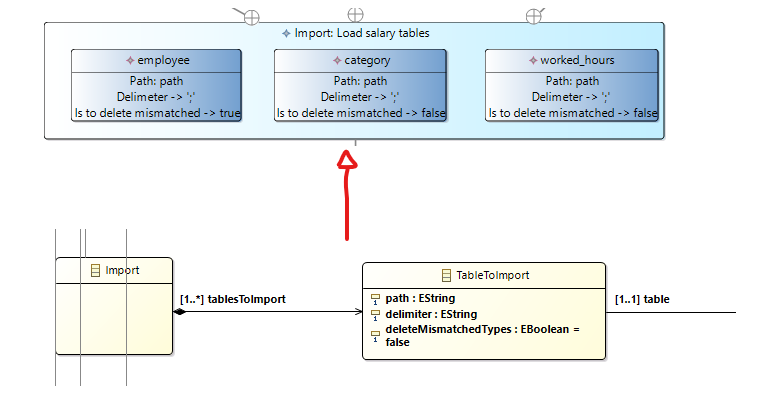

## Implementation of Constraints and Refactorings

In EMF we can use the invariant, that have the ability to add some conditional logic to the model. They can be written in [Object Constraint Language](https://projects.eclipse.org/projects/modeling.mdt.ocl).

### Validation Rules

However, although Sirius is also able to support metamodel invariants, since this is the basis for the Sirius project, there is a specific and more appropriate way of creating constraints using what is called [Validations Rules](https://eclipse.dev/sirius/doc/specifier/properties/Properties_View_Description.html#validation_rules). Within this functionality there are two types of subtypes: `Audits` and `Fixes`. The `Audits`, as the name suggests, will be used to carry out a check on a given component, connection, etc., and verify that it fulfils what was expected and, if so, flag up an error in the respective component. In addition, `Quick Fixes` are used to provide a fix for a given problem, doing a refactoring on the model.

As it's possible to see in the image below, a wide range of validations have been created. These validations take into account the most important cases that need to be validated.

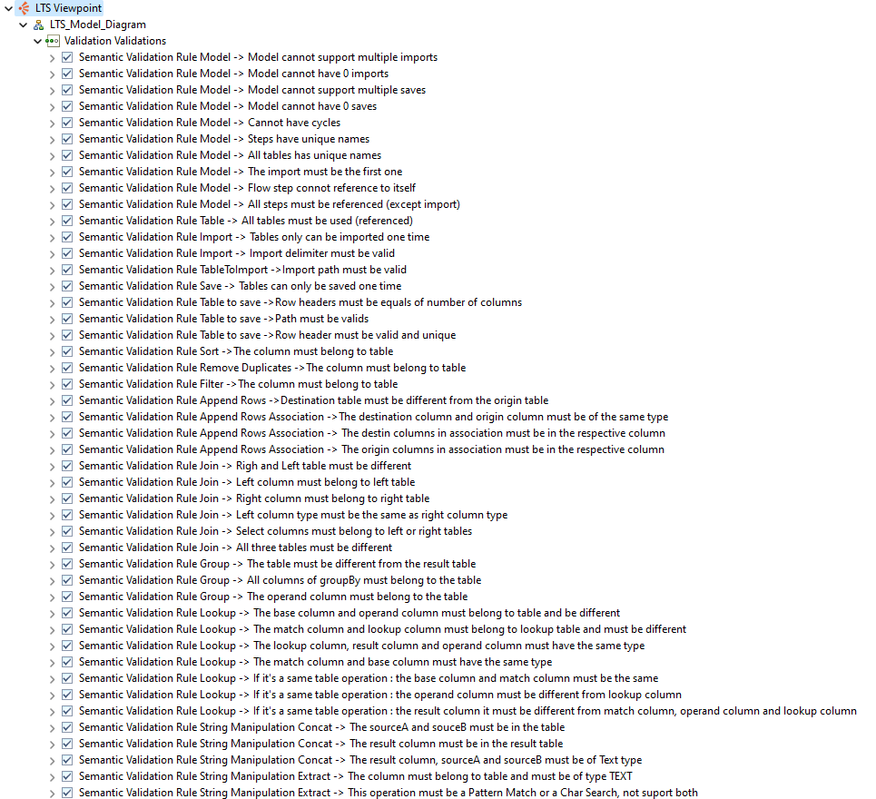

In the `Audits`, Sirius gives the possibility to create the verification using the following technologies:

- [Acceleo Query Language (AQL)](https://eclipse.dev/acceleo/documentation/aql.html): A query language specifically designed for model querying and manipulation. AQL enables users to express complex queries to extract information from models efficiently.
- [Acceleo 3](https://wiki.eclipse.org/Acceleo/User_Guide#The_Acceleo_language): It's an implementation of a Model to Text Transformation Language (MOFM2T) and it uses OCL in order to query input models. 
-  [Variable access expression](https://eclipse.dev/sirius/doc/specifier/general/Writing_Queries.html#general): It's a specialized interpreter which has the only the capacity to access to the value of a named variable.
-  [Feature access expression](https://eclipse.dev/sirius/doc/specifier/general/Writing_Queries.html#general): This interpreter can only do direct access to a named feature of the current element.
-  [Service calls expression](https://eclipse.dev/sirius/doc/specifier/general/Writing_Queries.html#general): This interpreter can be used to directly invoke a service method (i.e. a Java method that follows conventions for service methods ) on the current element.

#### Audits

For the `Audits` it was chosen the Acceleo 3, where is a capable and power tool.


So, now it will be detailed some aspects of implementation for some validations.

*Tables can only be saved one time*

In this case, we need to insure that we can only have tables being saved one time, in order to prevent overwrite or duplication of information, and because this is not possible to do in the metamodel, given that we need to allow a multiplicity of 1..* between the Save Step and the Tables, must be a semantic validation.

For that, as is possible to check in the code above, we tranform the TablesToSave into a Set, to guarantee that we save only the uniques, and after that we compare the size against the original list, and if the size is not the same it means there is a error. 

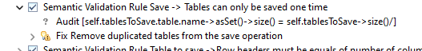

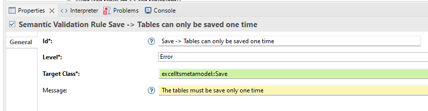


*Cannot have cycles*


To ensure that there are no cycles in the Steps, we can rely on the fact that the metamodel obligates to FlowSteps has a next. Taking this in mind, we can only check if the current Step is referenced by any other Step as its next Step, and with that, we can ensure that there are no cycles, because we went from the Begin until the End.

As shown below, the query makes sure that exists a Step Import and a Step, and if not, it simply returns true, because it's the responsibility of other validations to verify that an Import and an Save exists, and to avoid duplication of errors, in this case, we ignore that. But basically, what the query does is ensure that the Save has references to itself.

```
[if (self.eAllContents(excelltsmetamodel::Import)->size() = 1 and self.eAllContents(excelltsmetamodel::Save)->size() = 1) then self.steps->select(s | s.oclIsTypeOf(excelltsmetamodel::Save) and s.eInverse()->size() > 3)->size() = 1  else true endif /]
```


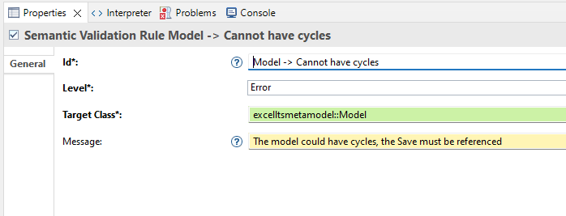


Note: In regular EMF models, `eInverse()` provides references to the parents of the class, and typically we would compare this count with 1 to ensure that a Save Step has a single reference. However, in Sirius, where references to parents are counted as the number of component interactions, the context is more complicated, as shown in the image bellow, using the Interpreter. Therefore, we assume that to guarantee that it has links, it must have more than 3 references, which are the 3 minimum links to be valid (LTS Model, Next Reference and Save Reference). However, the Sirius has the `.target`parameter that returns the specific value of the model, so we could also have done ```self.target.oclAsType(excelltsmetamodel::Save) . . .``` to get access to the Plugin Model and not Sirius model.


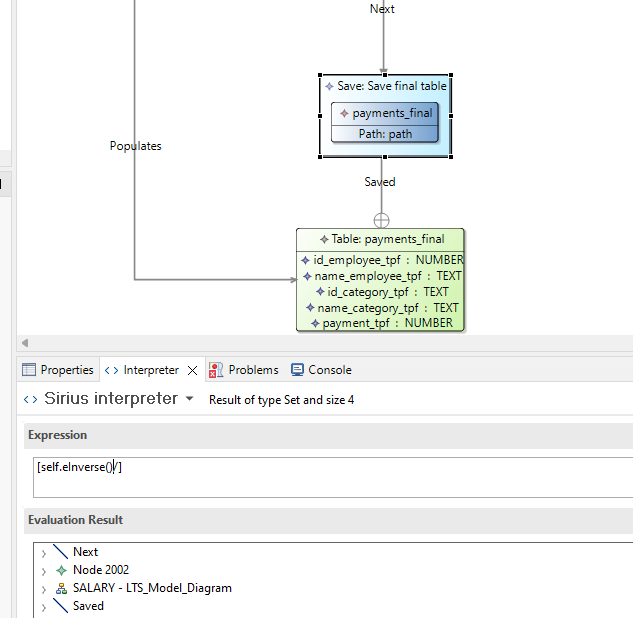


#### Quick Fixes

Now it will described the Quick Fixes, which are functionalities provided by Sirius to realize a refactoring in the same model to correct the error, or to minimize the error creating something default, for e.g.

For all the quick fixes, it was used the `Java Services`. Their functions are written in Java, and we can call them from the Sirius viewpoint. To achieve this goal, it was necessary to intervene with the metamodel API to create instances over the factories. It's also possible to do refactoring with the Acelleo, since it's an extension of OCL with the power to change the schema.

**Model cannot have more than one import**

In this scenario, the objective is to ensure that only one import exists, with the Quick Fix aimed at removing duplicate imports and retaining only the initial one.

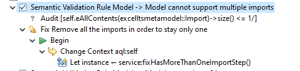

To accomplish this, the strategy involves traversing all Import transaction steps and storing all subsequent steps after the initial one. This approach is illustrated in the provided code snippet


```java
	/**
	 * Method responsible to delete imports steps, if exists more than one. Note: It
	 * remains the first one found on the list.
	 */
	public Model fixHasMoreThanOneImportStep(Model model) {
		List<Step> toRemove = new ArrayList<>();
		Integer count = 0;

		for (Step step : model.getSteps()) {
			if (step instanceof Import) {
				Import importStep = (Import) step;
				if (count > 0) {
					toRemove.add(importStep);
				}
				count++;
			}
		}
		model.getSteps().removeAll(toRemove);
		return model;
	}
```

*Model cannot have 0 imports*

For this case, the goal, as cited before, it's to guarantee that exists one Import. With this in mind, a practical Quick Fix is to create a default import where the user sees the default Step and knows better what to do.

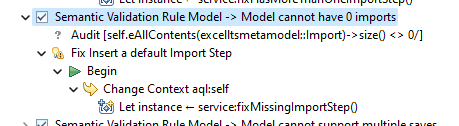

For this we create a default step where we put a default name and with this we can get the attention of the user because in case of missing it will create a new one.

```java
	/**
	 * Method responsible to insert a default Import method in the Model.
	 */
	public Model fixMissingImportStep(Model model) {
		Import nImport = ExcelltsmetamodelFactory.eINSTANCE.createImport();
		nImport.setName("[Generated] Import name");
		nImport.setDescription("[Generated] Import description");

		model.getSteps().add(nImport);

		return model;
	}
```

For sake of representation, it was shown only those.

## Implementation of the Visualizations

In order to implement the possibility to generate visualizations/projections in Sirius, we can use the Acceleo or Java Actions Calls. In this case, it was used the Java Actions Calls.

For that we need to Associate the Service we are working to the Model.

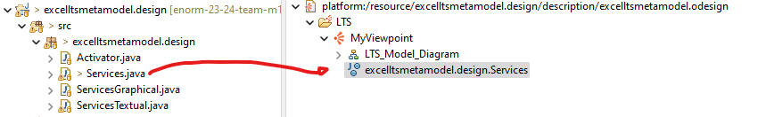

After that, we need to create a Model Popup in order to create a Model that the user can click while seeing the representation of the model.

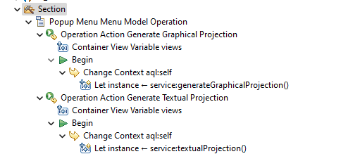

### Graphically Representation

In order to be able to represent a model graphically, it was first necessary to analyze the possibilities of doing it programmatically in Sirius and since it was chosen to use Java Actions Calls, one possible and chosen solution, it was to use [GraphViz](https://graphviz.org/doc/info/lang.html). Where the goal is to create a method that receives an instance of Model and writes the contents of GraphViz to a file, in order to future be read by a PlantUML service.

In order to maintain a better readability in the code, it was created a Method on the `Services.java` that receives the Model and it calls an other `ServicesGraphical`, that has all the logic in a static method.


```java
	/**
	 * Generates a graphically representation of Model.
	 * @param model Instance to be projected.
	 */
	public void generateGraphicalProjection(Model model) {
		ServicesGraphical.generateGraphicalProjectionAux(model);
	}
```

So, the logic is as follows: the goal is to build a String, which initially starts with the basic annotations of a PlantUML graph and registers the directory to be registered, which will be on the user's Home page. As it's possible to see:


```java
public static Model generateGraphicalProjectionAux(Model model) {

		PrintWriter writer = null;
		FileWriter w;

		try {
			String homeDir = System.getProperty("user.dir");
			w = new FileWriter(homeDir + "/" + "graphical-" + model.getName() + ".puml");

			writer = new PrintWriter(w);

			String graphStr = "";
			graphStr += ("@startuml\n");
			graphStr += "digraph foo {\n";

			// has continuation ...
```

After, in order to provide better readability, the presence of different colors was taken into account so that it would be easy to distinguish between a Step or a Table, for example. To do this, we had to go through all the tables right from the start, separating the resulting tables from the imported ones and also the Steps to determine which colors they would have.

```java
	// has continuation ...

	Set<Table> resultTableList = new HashSet<Table>();

	for (Step s : model.getSteps()) {

		if (s instanceof Import) {
			graphStr += createTableColorSchemaGraphviz(
					((Import) s).getTablesToImport().stream().map(t -> t.getTable()).toList(), false);
		}
		if (s instanceof Join) {
			resultTableList.add(((Join) s).getResultTable());
		}
		if (s instanceof Group) {
			resultTableList.add(((Group) s).getResultTable());
		}
		if (s instanceof AppendRows) {
			resultTableList.add(((AppendRows) s).getDestinTable());
		}
		if (s instanceof Lookup) {
			resultTableList.add(((Lookup) s).getResultTable());
		}
		if (s instanceof Concat) {
			resultTableList.add(((Concat) s).getResultTable());
		}
		if (s instanceof Split) {
			resultTableList.add(((Split) s).getResultTable());
		}
	}

	graphStr += createTableColorSchemaGraphviz(new ArrayList<>(resultTableList), true);
	graphStr += createStepColorSchemaGraphviz(model.getSteps());

	// has continuation ...
```

As it's possible to see above, we went through all the possible node, adding to a List all the tables that exists. After having all that, we call a method that creates the "Color schema" for each type of representation (tables and steps).

In bellow, it's possible to observe the method that given a list of steps marks all of them in order to be of some type of color. This logic applies to tables too.

```java
	private static String createStepColorSchemaGraphviz(List<Step> steps) {
		StringBuilder node = new StringBuilder();

		node.append("\tsubgraph tier3 {\n");
		node.append("\t\tnode [color=\"lightblue\",style=\"filled\",group=\"tier2\"]\n");
		for (Step s : steps) {
			node.append("\t\t\"").append(s.getName()).append("\"\n");
		}
		node.append("\t}\n");
		return node.toString();
	}
```

After that, the logic is based on going through all the Steps and creating the code relating to their graphical representation, taking care in the case of Steps that generate a result table or column associations to create this logic. As it's possible to see in the code below, in the Split example. It creates the data for the "Split Rectangle" and then creates the "Table Rectangle" for the resulting table.

```java
				// has continuation ...

				} else if (step instanceof Split) {
					graphStr += "\t\"" + step.getName() + "\" ";
					Split parsedStep = (Split) step;
					boolean showChars = parsedStep.getNumOfChars() != -1;
					graphStr += "\t[ shape=box , label=\"Type = Split\\n\\n";
					graphStr += "Name = " + step.getName() + "\\n";
					graphStr += "Description = " + step.getDescription() + "\\n";
					graphStr += "Base Table = " + parsedStep.getTable().getName() + "\\n";
					if (showChars) {
						graphStr += "Num chars = " + parsedStep.getNumOfChars() + "\\n";
					} else {
						graphStr += "Delimiter = '" + parsedStep.getDelimiter() + "'\\n";
					}
					graphStr += "Result Column A = " + parsedStep.getResultColumnA().getName() + "\\n";
					graphStr += "Result Column B = " + parsedStep.getResultColumnB().getName() + "\\n";
					graphStr += "Result Table = " + parsedStep.getResultTable().getName() + "\\n";
					graphStr += ("\"]\n");

					if (!tablesCreated.contains(parsedStep.getResultTable())) {
						graphStr += createTableGraphviz(parsedStep.getResultTable());
						tablesCreated.add(parsedStep.getResultTable());
					}

				} else if (step instanceof Extract) {

					// has continuation ...
```

### Textual representation

For this type of representation we have more autonomy, because we can personalize the output as we want, where we are not dependent of some type of technology.

In Sirius, the logic remains the same as the graphically, where it was created a Service where it has all the logic and it was passed the instance of the Model. Like this:

```java
	protected static void textualProjectionAux(Model model) {

		PrintWriter writer = null;
		FileWriter w;
		try {
			String homeDir = System.getProperty("user.dir");
			w = new FileWriter(homeDir + "/" + "textual-" + model.getName() + ".txt");
			writer = new PrintWriter(w);
			writer.println("etl:");
			
			traverseTables("  ", writer, model.getTables());
			traverseSteps("  ", writer, model.getSteps());

			writer.close();
		} catch (Exception e) {
			e.printStackTrace();
		}
	}
```

What this does is traverse all the Steps and Tables, creating their respective representations. Similar to the graphical approach, it receives a list of tables and writes the representations. Unlike the graphical method, we don't accumulate the string in a variable here, instead, we write directly to the file


```java
	private static void traverseTables(String indentation, PrintWriter writer, List<Table> tables) {
		writer.println(indentation + "tables:");
		for (Table tableNode : tables) {
			table(tableNode, indentation + "  ", writer);
		}
	}

	private static void table(Table tableNode, String indentation, PrintWriter writer) {
		writer.println(indentation + tableNode.getName() + ":");
		for (Column columnNode : tableNode.getColumns()) {
			writer.println(indentation + "  " + columnNode.getName() + " as " + columnNode.getDataType().getName());
		}
	}
```

The steps are also iterated and created the representation. The code responsible to do the the `groupBy` is the following:

```java
	private static void groupBy(Group stepNode, String indentation, PrintWriter writer) {
		String content = indentation + "GROUP " + stepNode.getTable().getName() + " BY (";

		for (Column columnRefNode : stepNode.getGroupBy()) {
			content += columnRefNode.getName() + ", ";
		}
		content = content.substring(0, content.length() - 2) + ")" + " AND PUT " + stepNode.getOperation().getName()
				+ "(" + stepNode.getOperandColumn().getName() + ") INTO " + stepNode.getResultTable().getName() + "("
				+ stepNode.getResultColumn().getName() + ")";

		writer.println(content);
	}
```


## Implementation of Models (instances)

As Sirius is based on EMF, the model is created in the Model Editor with the plugin and only then is the representation of this model passed on to the graphical representation mentioned in the `.odesign` file.

### Salary Model

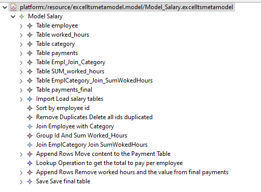

It has a representation as follows:


### Grades Model

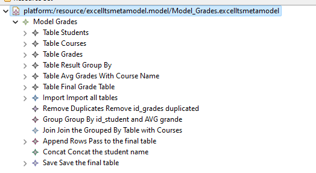

It has a representation as follows:


### Invoice Model

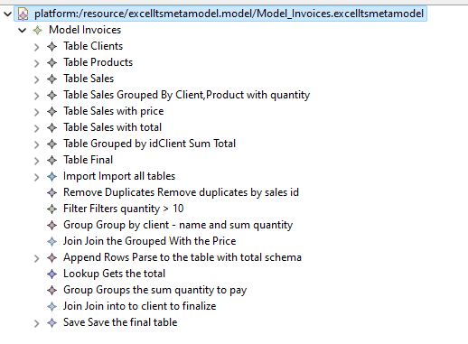

It has a representation as follows:


## Execution of Constraints and Refactorings

Now, it will be shown some execution of refactoring.

### Duplication of a import Step

As we have seen before, we limited the number of imports to 1, and for that reason it was created a Quick Fix in order to remove all steps and let it only one.

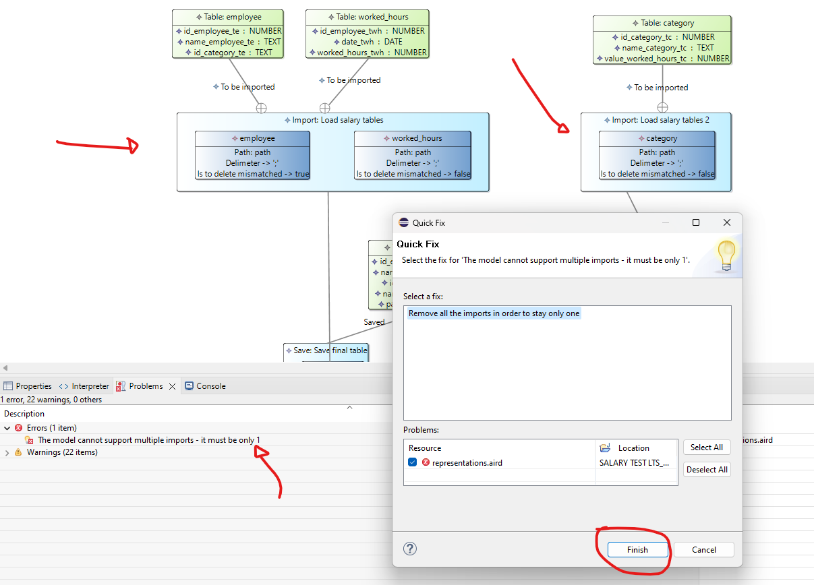

After we applied the Quick Fix we can get the result above.

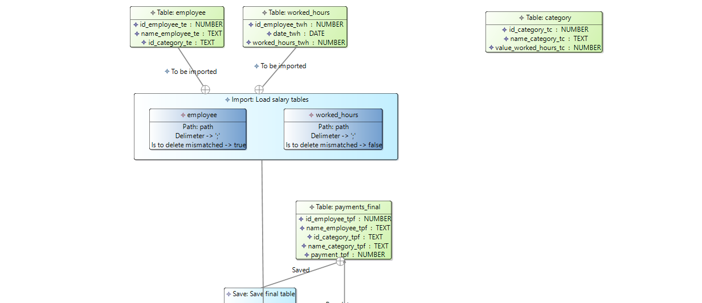

### Model cannot have 0 imports

There is a obligation to have, at least, one import.

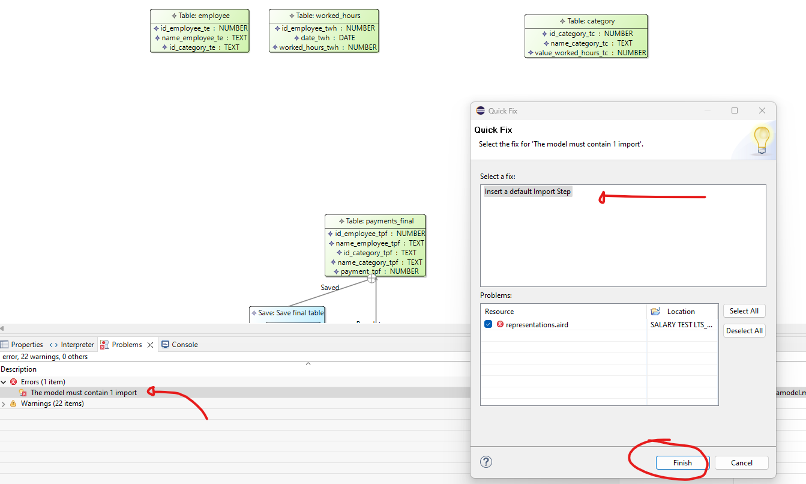

After the Quick Fixe we can see that we have a default Import Step.

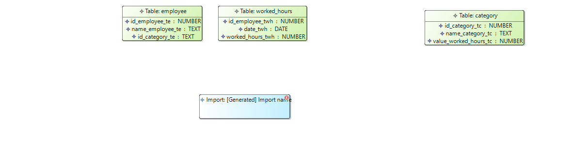

## Generation/Execution of Visualizations

In other to generate a Visualization the user must be on the representation and click on the right-click.

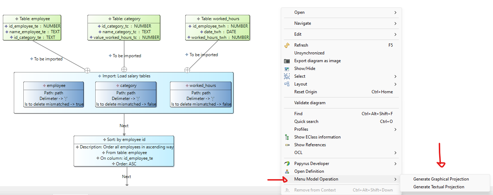

And that will reproduce the output on, my case in the folder of eclipse.

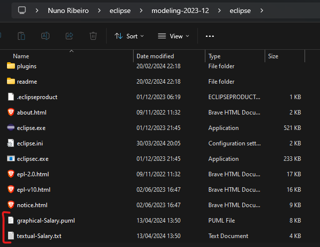