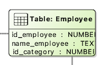
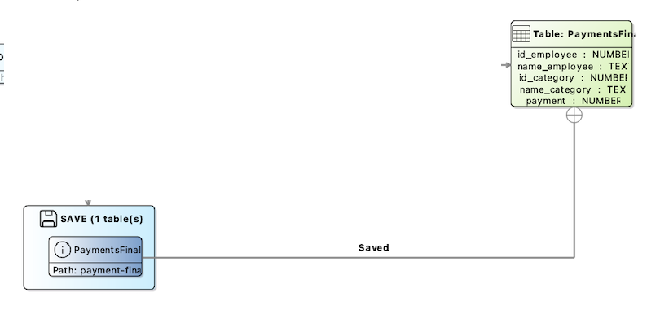
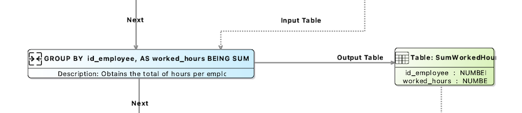
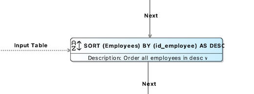
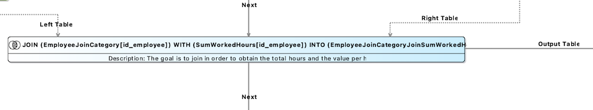
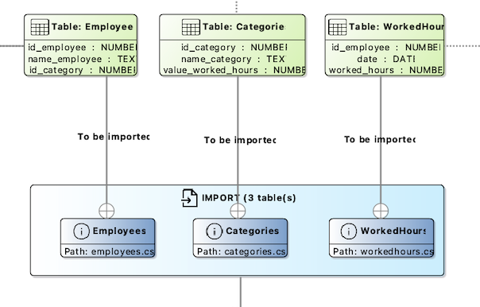
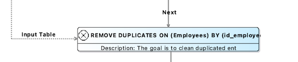
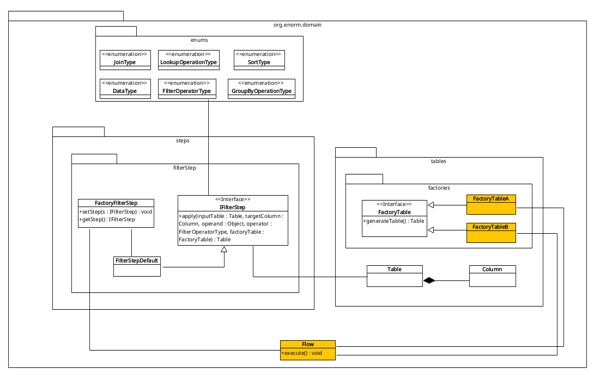
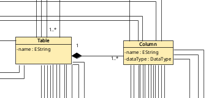
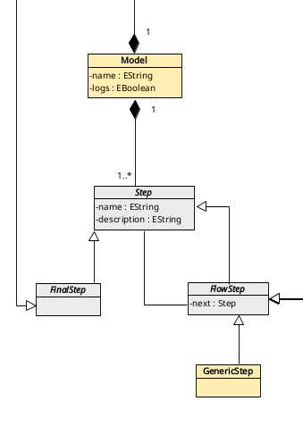

<h1>ENORM Project, Part 2 - Team Report</h1>

In this folder you should add **all** artifacts developed for part 2 of the ENORM project, related to team/group work.

**Note:** If for some reason you need to bypass these guidelines please ask for directions with your teacher and **always** state the exceptions in your commits and issues in bitbucket.

Following there are examples of proposed sections for this part of the report (team part).

<h1>Index</h1>

- [Design Concrete Syntax for the DSL](#design-concrete-syntax-for-the-dsl)
  - [Textual syntax for the DSL](#textual-syntax-for-the-dsl)
  - [Graphical syntax for the DSL](#graphical-syntax-for-the-dsl)
- [Specify Common Features for Applications of the Domain](#specify-common-features-for-applications-of-the-domain)
- [Identify Commonality and Variability in the Code](#identify-commonality-and-variability-in-the-code)
  - [Use of Generation Gap pattern](#use-of-generation-gap-pattern)
  - [Use of Factory Pattern](#use-of-factory-pattern)
- [Design and Implement Code Generation](#design-and-implement-code-generation)
- [Generate Applications](#generate-applications)


## Design Concrete Syntax for the DSL

When designing the concrete syntax for a DSL, **having a meticulously defined syntax is paramount**. This foundation is crucial for crafting a DSL that is both user-friendly and effective.

The syntax forms the backbone of any DSL, outlining the rules and structures that dictate how the language functions. This formalization ensures that every valid construct of the DSL is clearly specified, facilitating precise parsing and processing. A well-crafted syntax not only helps build a robust language infrastructure **but also significantly enhances the user experience in multiple ways**.

### Textual syntax for the DSL

With that in mind, we aimed to develop a syntax that closely resembles human language. There is a slight difference between our **Xtext** and **MPS** textual syntaxes, as Xtext requires specifying the table to which a column belongs and add `""` to the syntax. The result of our textual syntax **is demonstrated below**:

**Model**

```scala
Invoicing:
    logs: true
    tables: 
        <tables>       
    steps:
        <steps>
```

**Table**

```scala
Clients:
    <columns>
```

**Column**

```scala
id_product as NUMBER
name_product as TEXT
price as NUMBER
```

**Save Step**

```scala
SAVE "SaveFinalTable":
```

**Table to Save**

```scala
Final(id_client , name_client , nif, total) TO "output-invoicing"
```

**Group Step**

```scala
GROUP_BY "GroupsTheSumQuantityToPay" -> "JoinIntoClientToFinalize":
  ON SalesWithTotal(id_client) AND SUM total 
  INTO GroupedByIdClientSumTotal(total)
```

**Sort Step**

```scala
SORT "SortByEmployeeId" -> "RemoveDuplicatedEmployeeIds":
  ON Employees(id_employee) BY ORDER DESC
```

**Append Rows Step**

```scala
APPEND_ROWS "ParseToTotalSchema" -> "GetTheTotal":
  FROM SalesWithPrice TO SalesWithTotal
  MAPPING:
    <associations>
```

**Association**

```scala
id_client TO id_client
id_product TO id_product
quantity TO quantity
```

**Filter Step**

```scala
FILTER "FilterQuantitiesHigherThan1" -> "GroupByClientAndSumQuantity":
	ON Sales(quantity) WHERE VALUES ARE GREATER_THAN 1
```

**Join Step**

```scala
JOIN INNER "JoinGroupedWithPrice" -> "ParseToTotalSchema":
  ON Products(id_product) WITH SalesGroupedByClientProductWithQuantity(id_product)
  SELECTING id_product, price, id_client, quantity
  INTO SalesWithPrice
```

**Import Step**

```scala
IMPORT "Import" -> "RemoveDuplicatesBySalesId":
  <tables to import>
```

**Table to Import**

```scala
IMPORT FROM "/sales.csv" TO Sales WITH DELIMITER "," AND DELETE_MISMATCHED_TYPES AS false
```

**Lookup Step**

```scala
LOOKUP "GetTheTotal" -> "GroupsTheSumQuantityToPay":
  FROM SalesWithTotal(id_client) TO SalesWithTotal(id_client)
  AND PUT NUMERIC_MULTIPLY (quantity, price)
  INTO SalesWithTotal(total)	
```

**Remove Duplicates Step**

```scala
REMOVE_DUPLICATES "RemoveDuplicatesBySalesId" -> "FilterQuantitiesHigherThan1":
	ON Sales(id_sale)
```

### Graphical syntax for the DSL

**Table and column**



**Save Step and Table to Save**



**Group Step**



**Sort Step**


**Append Rows Step**



**Filter Step**


**Join Step**



**Import Step and Table to Import**



**Lookup Step**


**Remove Duplicates Step**



## Specify Common Features for Applications of the Domain

The following image illustrates the architecture of the code generated by the DSL, reflecting the LTS process declared 
using the DSL language. This design ensures that the generated code supports manual adaptations (extensibility), allowing 
users to add new features without being entirely dependent on the DSL mechanisms. The target language for the generated 
code is Java, as it is well known among team members and supports the required functionalities of the DSL. The factory 
pattern is extensively used, facilitating changes in the behavior of the generated code by simply creating a new implementation 
of a given interface and setting that implementation in the factory. The image below shows the adopted architecture, 
where the elements in orange change according to the domain. Although only the filter step is represented inside the 
`package org.enorm.domain.steps`, the other types of steps would function in a similar manner.



The enums for JoinType, LookupOperationType, SortType, DataType, FilterOperatorType, and GroupByOperationType generate 
common code across different domains. This consistency is crucial because operations like joins, lookups, sorting, and 
filtering have universal implementations that do not change regardless of the specific domain.

The steps package contains different steps such as filtering, joining, sorting, etc. These steps use a common interface 
(IFilterStep in the case of filtering) and a default implementation (FilterStepDefault). The factory (FactoryFilterStep) 
is responsible for managing the implementation of the step. The architecture allows for extensibility by enabling new 
implementations of these steps to be added without altering the existing codebase. This is achieved through the factory 
pattern, where a new implementation can be injected into the factory.

The tables package defines the structure of tables and columns. The FactoryTable interface, along with its implementations 
(FactoryTableA, FactoryTableB), illustrates how different table structures can be generated depending on the domain.
The elements in orange, such as FactoryTableA and FactoryTableB, represent domain-specific implementations. These are the 
parts of the code that vary according to the domain because each domain might have unique requirements for table structures.

The Flow class orchestrates the sequence of operations defined by the DSL. It ensures that each step is executed in the 
correct order with the appropriate inputs, as specified in the DSL model. 

## Identify Commonality and Variability in the Code

> [!NOTE]
> In this topic, our team decided to take a collaborative approach **by working together on a single prototype** rather than developing three separate ones. We divided the tasks among the team members to ensure that each member contribute to the prototype's development. Each student was responsible for implementing different components of the prototype, ensuring that all aspects were covered and the workload was evenly distributed.

### Use of Generation Gap pattern

We adopted the *generation gap pattern* to clearly distinguish between generated code and handwritten  code. The user can easily create a package outside the one that contains all the generated code, create his own `Main` and define which implementations he wants the `Flow` to use.

Also, in the generated package, we outlined the components that were identified to be static and variable dependent on the model.

**Static Code Components:**

- ***Main File***: file where we define which steps implementation we want to use.
- ***Default Implementation of Steps***: standard set of steps that can be extended or overridden. These steps serve as the base functionality required for executing the model process. Users can extend these default steps to customize behavior.
- ***Logger***: the logger includes a method for logging various levels of messages (`INFO`, `WARNING`, `ERROR`), aiding in debugging and monitoring system behavior.
- ***List and Enum Utilities***: these utility classes provide methods for parsing enums and reorder lists.
- ***Column***: the column class encapsulates attributes such as column name and data type.
- ***Table***: this class includes methods for managing columns and rows.
- ***Enums***: step enums, such as `DataType`, `FilterOperatorType`, `GroupByOperationType`, `JoinType`, `LookupOperationType` and `SortType`.

***Variable Code Components:***

- ***Factory Tables***: the factory tables include methods for instantiating table configurations, allowing for model-specific customization of table name and column names and data types.
- ***Flow Class***: the flow class is dynamically generated to match the step sequences and conditions outlined in the DSL model, ensuring the correct execution order and logic of processes.

To ensure the generated code is extensible, we utilized the factory pattern. This decision was driven by the need to allow users **to customize and extend the generated code easily**.

### Use of Factory Pattern

The factory pattern allows users to override default implementations **by providing their own custom step implementations**, offering crucial flexibility for adapting the generated code to specific requirements. 

By handling instantiation logic within factories, the `Flow` logic remains clean and focused on the process sequence, improving code maintainability.

```java
public class Main {
    public static void main(String[] args) {

        FactoryAppendRowsStep.setStep(new AppendRowsStepDefault());
        FactoryFilterStep.setStep(new FilterStepDefault());
        FactoryGroupByStep.setStep(new GroupByStepDefault());
        ...

        Flow.execute();
    }
}
```

If the user wants to code its own implementation of the `AppendRowsStep`, he just need to `set` his implementation in the `FactoryAppendRowsStep`. Next time the app runs, it will run with his specified implementation.

## Design and Implement Code Generation

As expected, the DSL was designed to ensure that metamodel aspects are reflected in the generated code. This means that
the characteristics of the generated code are defined when a model is created using the DSL. In this section, we will delve
into how this mapping is achieved, showcasing concrete examples of these mappings.

For instance, let's examine the generated code within the package `org.enorm.domain.tables.factories`. This code
is domain-dependent, meaning it varies based on the specific use case. For example, in an invoicing scenario, we may have
tables related to products, sales, and clients. In contrast, a salary management scenario would involve tables related to
workers, salary structures, and other relevant data. The tables required for these scenarios differ accordingly. Within
this package, Java code defines these tables.

For example, if our DSL defines a table like this:

```
Clients :            
    id_client as NUMBER
    name_client as TEXT
    nif as TEXT        
```

The generated code will look like this:

```java

public class FactoryClientsTable implements FactoryTable {

    public Table generateTable() {
        List<Column> columnList = new ArrayList<>();

        columnList.add(new Column("id_client", DataType.NUMBER));
        columnList.add(new Column("name_client", DataType.TEXT));
        columnList.add(new Column("nif", DataType.NUMBER));

        return new Table(columnList, "Clients");
    }
}
```

Mapping this to the metamodel, we handle the concept of tables, where each table comprises multiple columns. Here's how
this is represented at the metamodel level:



[click here to view the full version of the metamodel](https://github.com/Departamento-de-Engenharia-Informatica/enorm-23-24-team-m1a-03/blob/master/part1/images/metamodel.jpg)

Another example of variability is the LTS process. For instance, some scenarios may require a specific flow, such as
performing a sorting step, followed by a join, and then saving the tables. In other cases, the flow could be entirely
different. If we examine the `Flow` class within the package `org.enorm.domain`, we see that this class contains the
generated code that executes the sequence of operations. Each method responsible for an operation is called in the
correct order and with the inputs defined by the model created with the DSL.

The DSL supports a set of operations such as importing tables, joining, filtering data, etc. The generated code for handling 
these operations remains consistent (unless overridden by setting a different implementation in the factory) regardless of 
the domain, because a join operation, for instance, will always function as a join. What varies are the inputs to these 
functions and the sequence in which these operations are executed within the flow.

For example, if our DSL defines a flow of steps like this:

```
  IMPORT " import "  ->  " RemoveDuplicatesBySalesId ":                                                
    IMPORT FROM " /clients.csv " TO Clients WITH DELIMITER " , " AND DELETE_MISMATCHED_TYPES AS false  
    IMPORT FROM " /products.csv " TO Products WITH DELIMITER " ; " AND DELETE_MISMATCHED_TYPES AS false
    IMPORT FROM " /sales.csv " TO Sales WITH DELIMITER " , " AND DELETE_MISMATCHED_TYPES AS false      
                                                                                                       
  REMOVE_DUPLICATES " RemoveDuplicatesBySalesId "  ->  " FilterQuantitiesHigherThan10 ":               
    ON Sales ( id_sale )                                                                               
                                                                                                       
  FILTER " FilterQuantitiesHigherThan10 "  ->  " GroupByClientAndSumQuantity ":                        
    ON Sales ( quantity ) WHERE VALUES ARE GREATER_THAN 1                                                                                                                                                
```

The generated code will look like this:

```java
// Import
Table clientsTable = FactoryImportStep.getStep().apply(factoryClientsTable,
        initialInputPath + "/clients.csv", ",", false);
Table productsTable = FactoryImportStep.getStep().apply(factoryProductsTable,
        initialInputPath + "/products.csv", ";", false);
Table salesTable = FactoryImportStep.getStep().apply(factorySalesTable,
        initialInputPath + "/sales.csv", ",", false);

// Remove duplicates
salesTable = FactoryRemoveDuplicatesStep.getStep().apply(salesTable, salesTable.getColumnByName("id_sale"),
        factorySalesTable);

FactorySaveStep.getStep().apply(salesTable, "filter_FilterQuantitiesHigherThan1");

// Filter
salesTable = FactoryFilterStep.getStep().apply(salesTable, salesTable.getColumnByName("quantity"), 1,
        FilterOperatorType.GREATER_OR_EQUALS_THAN, factorySalesTable);

FactorySaveStep.getStep().apply(salesTable, "filter_FilterQuantitiesHigherThan1");
```

Mapping this to the metamodel, we manage the entire sequence of steps, where each step points to the next, making it 
possible to chain operations effectively:



[click here to view the full version of the metamodel](https://github.com/Departamento-de-Engenharia-Informatica/enorm-23-24-team-m1a-03/blob/master/part1/images/metamodel.jpg)

Other aspects of the metamodel, such as enums for types of join operations, data types, filtering types, etc., also 
generate common code across different domains.

## Generate Applications

In this final step, all the tools are capable of generating code for each of the given domain applications. To ensure that all code generations are correct, the strategy employed was to use the same input files for the three different types of generation produced by each tool and then analyze the output to ensure consistency among them.

However, even with identical output results, the generated code may differ in form. To address this, and to obtain code that is compatible regardless of the originating tool, a stable project was created beforehand. This project serves as the "standard" or guide for the code to be produced by each tool. The "standard" project implements the necessary concepts to support extensibility and flexibility, ensuring that the generated code is either identical or very similar across all tools. 

With this approach, the final result is source code that is very similar regardless of the tool used. This allows for the content generated by the three different languages to be mixed within one project, as all the code adheres to the previously defined design and architecture.

One issue encountered was with the package names, as each tool introduces unique details by design that make it difficult to maintain identical package names across all tools. Consequently, each tool uses a different package name. Nonetheless, the inner folder structure and the content are compatible. For instance, we can take the `Flow.java` file from one tool and the factories from another, and run the program with just a small adjustment to make the package names match.

Another aspect, in this final step, that we can observe with more clarity, is the extensibility that we can obtain from the generation gap, and a good example can be the spontaneously need to import and save tables to a json file, overriding the default csv implementation. To achieve this, it's necessary to follow the next steps:

1. Generate the source code by using one of the three tool.

2. Create the new json import class that implements the `IImportStep` interface. This class will contain the logic to convert a json file into a `Table` object.

3. Create the save step that implements the `ISaveStep` interface. This class will handle the logic for converting a `Table` object into a json file.

4. Update or create a new `Main.java`, modifying the factories that are being set, in order to use the new implementation.
