# EDOM Project, Part 2, Tool 1

In this folder you should add **all** artifacts developed for part 2 of the ENORM Project, related to tool 1.

You should also include in this file the report for this part of the project (only for tool 1).

**Note:** If for some reason you need to bypass these guidelines please ask for directions with your teacher and **always** state the exceptions in your commits and issues in bitbucket.

## Index

- [Concrete Syntax Design for the DSL](#concrete-syntax-design-for-the-dsl)
    - [Remove Duplicates Syntax](#remove-duplicates-syntax)
    - [Table Syntax](#table-syntax)
- [Implementation of Prototypes for the Applications of the Domain](#implementation-of-prototypes-for-the-applications-of-the-domain)
- [Code Generation](#code-generation)
- [Applications Generation](#applications-generation)
  - [Salary](#salary)
    - [Categories](#categories)
    - [Employees](#employees)
    - [Worked Hours](#worked-hours)
    - [DSL code](#dsl-code)
    - [Output](#output)
  - [Invoicing](#invoicing)
    - [Clients](#clients)
    - [Products](#products)
    - [Sales](#sales)
    - [DSL code](#dsl-code-1)
    - [Output](#output-1)
  - [Grading](#grading)
    - [Courses](#courses)
    - [Grades](#grades)
    - [Students](#students)
    - [DSL code](#dsl-code-2)
    - [Output](#output-2)

## Concrete Syntax Design for the DSL

A language editor is an aspect of MPS that provides a way for users to build models more conveniently without direct 
interaction with the AST (Abstract Syntax Tree), as this can become unintuitive and unproductive. The language editor 
abstracts the AST into a syntax that makes the user feel like they are writing a regular program. In reality, as the user 
declares the model, they are actually modifying the AST.

MPS provides a default concrete syntax, which is good but not ideal for our use case. We aim to provide domain experts 
with a syntax that is easy to follow, without the brackets and semicolons present in other languages. Essentially, for 
each concept of our DSL, it is possible to customize how the syntax will be presented. In MPS, an editor consists of cells, 
which can contain other cells, some text, or a UI component. Each editor is specified for its particular concept.

To describe an editor for a certain concept (i.e., which cells should appear in an editor for nodes of this concept), a 
language designer uses a dedicated language simply called the `editor language`. 

#### Remove Duplicates Syntax   

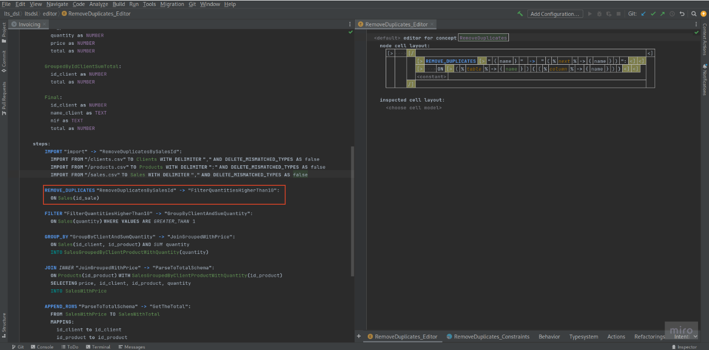

In this example, to achieve the result displayed on the left side of the screen, a horizontal layout `[>` is used initially. 
Inside this, an indent layout is placed to insert a tab before the next node, which is a vertical layout `[/`. This tab 
makes the "remove duplicates" step appear as part of the steps declaration. Multiple vertical cells are used, and these 
cells also employ horizontal layouts to achieve the desired result. By combining various types of cell layouts, it is 
possible to create diverse concrete syntaxes tailored to the needs of the DSL. This flexibility allows the DSL to be both 
powerful and user-friendly, enabling domain experts to work effectively without needing to understand the underlying AST.

#### Table Syntax

The table concept includes a list of child columns. The table editor uses a cell layout that starts with `(/`, meaning the 
child columns of the table will be arranged vertically. Each column has its own editor declaration, ensuring that each 
column is placed vertically with the syntax defined in the column concept editor.

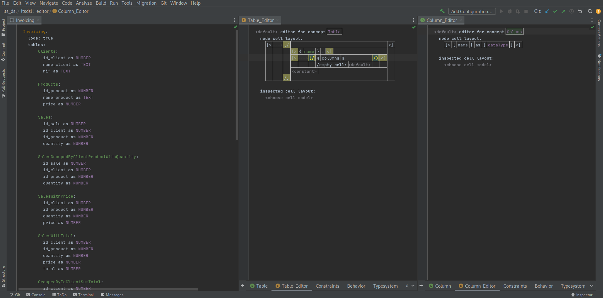

Styling the editor cells in MPS gives language designers a powerful tool to enhance the readability of code. By displaying 
keywords, constants, calls, and other language elements in different colors or fonts, developers can more easily understand 
the syntax. Each cell model has appearance settings that determine how the cell is presented. These settings include font 
color, font style, whether a cell is selectable, and more.

For instance, in the case of tables, it was decided to display them in green to make them easily recognizable within the 
DSL code. The image below demonstrates how to apply styling to a concept in MPS. By opening the inspector mode, designers 
can use the 'Style' block to apply the styles provided by MPS.

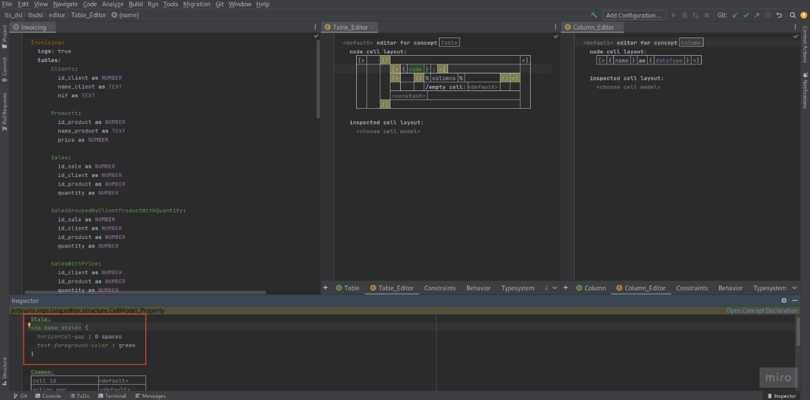

## Implementation of Prototypes for the Applications of the Domain

For this part of the project, we decided to adopt a collaborative approach where each student implemented different step 
behaviors. We began by discussing the best strategy for defining the generation gap, ensuring that our approach would be 
both effective and scalable. After thorough deliberation, we chose to implement the factory pattern for steps and for 
tables. This decision was made to enhance the project's extensibility, allowing users to easily add new steps according 
to their specific needs.

This involved designing and implementing these steps in a way that they seamlessly integrated with the overall system. 
This collaborative and modular approach not only facilitated efficient development but also ensured that the project 
remains adaptable for future enhancements.

The prototypes are presented in `part2\prototypes`. There are located the `gradingPrototype`, `invoicingPrototype` and 
`salaryPrototype`.

## Code Generation

In MPS, code generation typically follows a model-to-model transformation approach rather than a model-to-text transformation. 
This is because MPS includes its own implementation of Java, known as BaseLanguage. By using BaseLanguage as the target 
model, it is possible to apply a model-to-model transformation directly within MPS. Since BaseLanguage already includes a 
built-in model-to-text transformation, this entire process ultimately results in executable Java code.

The generator module encompasses critical components facilitating code generation, namely templates and mapping 
configurations. Templates serve as skeletal structures for generating code, providing a framework onto which macros can 
be applied to parameterize the generated code. These macros enable flexibility and customization in the output. Mapping 
configurations, on the other hand, establish the correlation between metamodel concepts and generator templates. This 
mapping ensures that the generated code aligns with the intended design and structure defined in the metamodel. Within 
templates, there exist two primary types which are the 'Root templates' that  transform input nodes into baseLanguage 
classes, laying the foundation for the generated code and 'Template Fragments' which  encapsulate the actual template 
code, providing a focused area where transformations occur. Any code outside these fragments serves as contextual 
information and is not utilized in the transformation process.

Before delving into concrete examples, it's essential to understand the various types of macros that can be utilized within 
code templates. These macros serve distinct purposes, enhancing the flexibility and functionality of the code generation 
process. Firstly, property macros are instrumental in computing property values within code templates. By incorporating 
property macros, developers can dynamically determine and assign values to specific properties. Secondly, reference macros 
play a crucial role in determining the target node of a reference within the code template. These macros facilitate the 
navigation and manipulation of references, ensuring that the generated code accurately reflects the relationships defined 
in the underlying model. Lastly, node macros provide a mechanism for controlling template filling during the code generation 
process. For instance, developers can define a Loop macro for a sequence of nodes, indicating that a line of code will be 
generated for each node in the sequence.

The image provided bellow illustrates a root template and a mapping configuration designed to generate a Factory for a 
specific table. On the right side of the screen, the mapping configuration associates the concept of a Table with the 
Factory root template. This linkage signifies that for every node of type Table in the DSL AST, a baseLanguage class based 
on the Factory root template will be generated. Each generated class will be parameterized with values corresponding to 
its respective node.

Notably, the template employs a loop over the columns of a table using the node macro. This construct ensures that for each 
column, a line of Java code responsible for adding that column to the table will be generated.

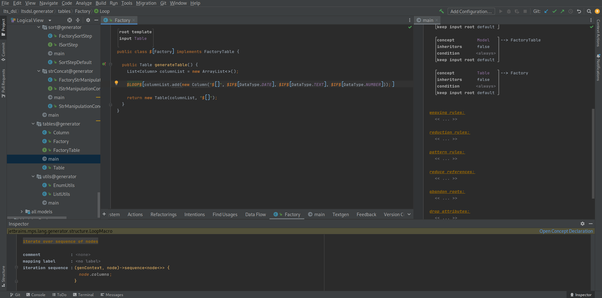

The image depicts the parameterization of the class name through the utilization of a property macro. This macro 
dynamically computes the name of the class by concatenating a set of variables, as demonstrated in the inspector menu.

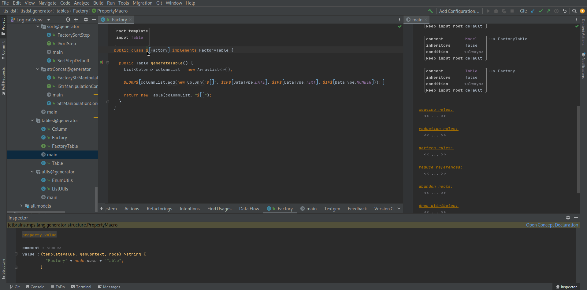

To generate the `Flow class`, a strategy of reducing each step to a baseLanguage representation was employed. Specifically, 
as illustrated on the right side of the image, a reduction rule was defined for each step. Each reduction rule maps a 
concept to a template fragment, facilitating the transformation process. On the left side of the screen, there is a root template for the flow, which takes the actual Model as input. This template 
iterates through the model steps, using the `$COPY_SRC` macro to replace the `System.out.println` statement with the 
respective template fragment declared in the mapping configuration. This approach allows each step in the flow to be 
systematically reduced to its corresponding baseLanguage representation, ensuring that the generated `Flow class` accurately 
reflects the defined model. 

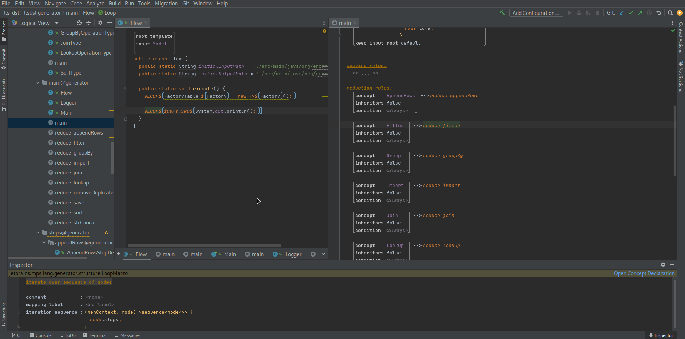

For example, if we examine the image bellow showing the template fragment that reduces the append rows step, we can see 
how the template generates the code to replace the System.out.println statement whenever the Loop macro iterates over an 
append rows step.

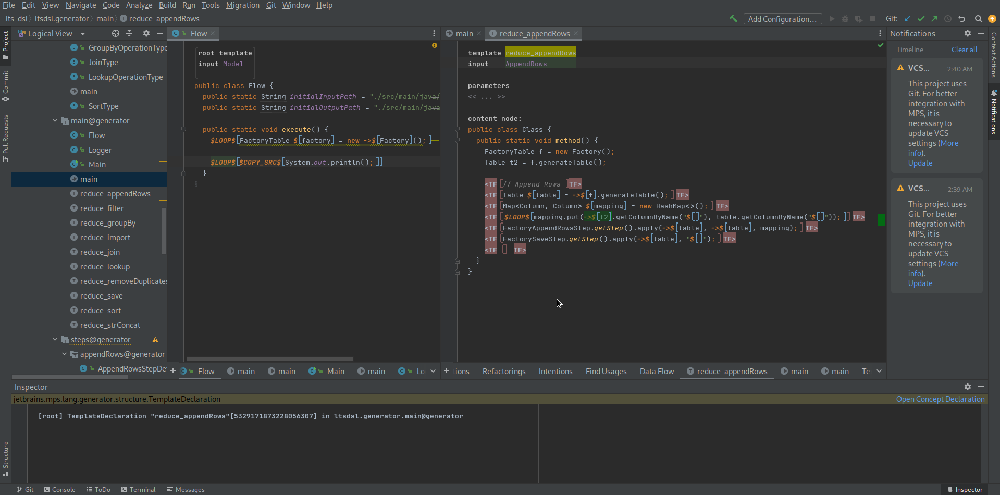

## Applications Generation

After defining the desired model in the DSL, generating the code is straightforward: simply rebuild the model, and the 
generated application will be located in the directory `./source-gen/program`. Below, we will present the inputs and 
outputs for each of the cases: salary, invoicing, and grading.

### Salary

#### Categories

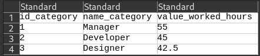

#### Employees

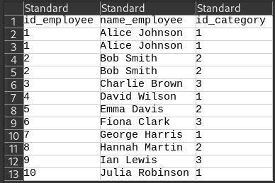

#### Worked Hours

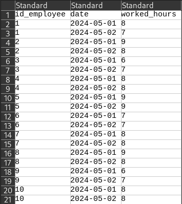

#### DSL code

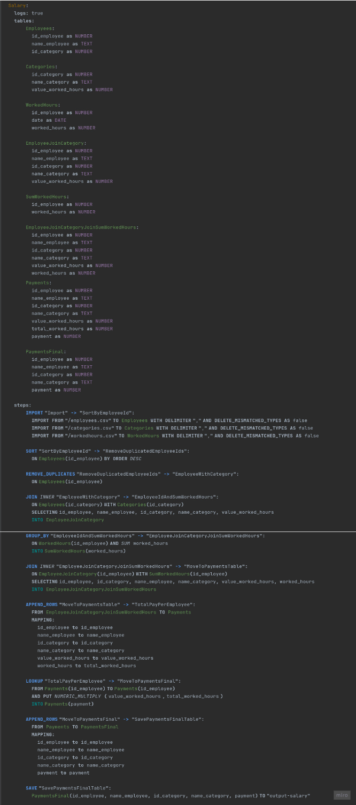

#### Output

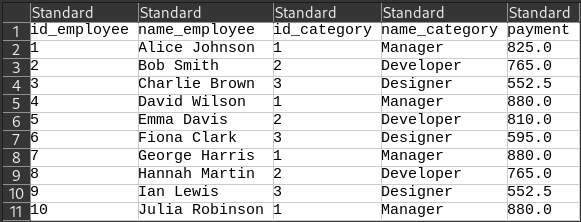

### Invoicing

#### Clients

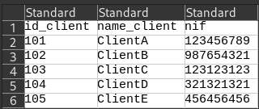

#### Products

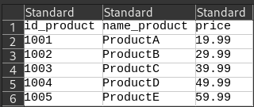

#### Sales

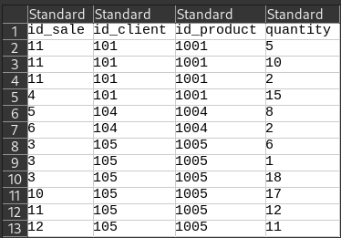

#### DSL code

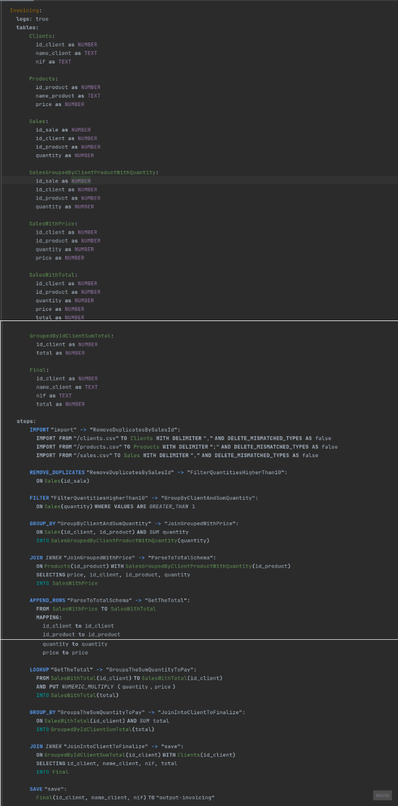

#### Output

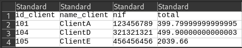

### Grading

#### Courses

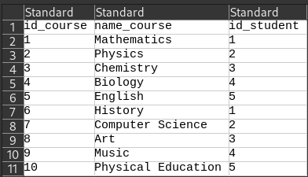

#### Grades

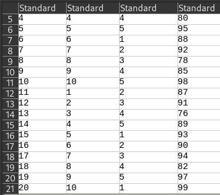

#### Students

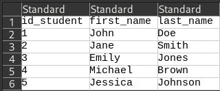

#### DSL code

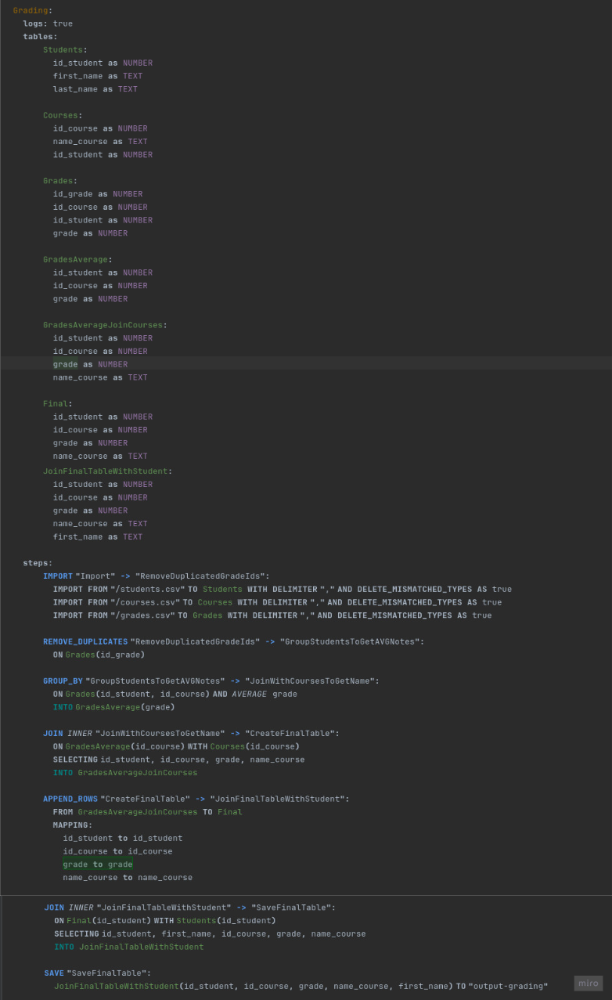

#### Output

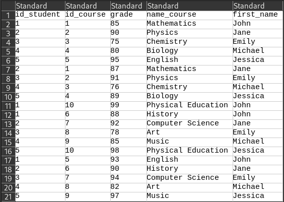

