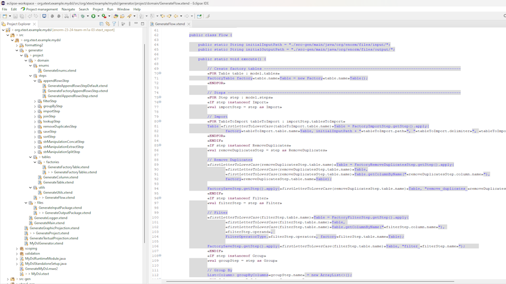
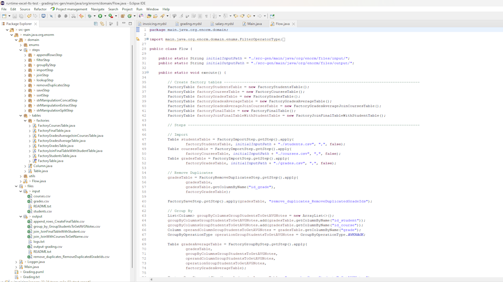
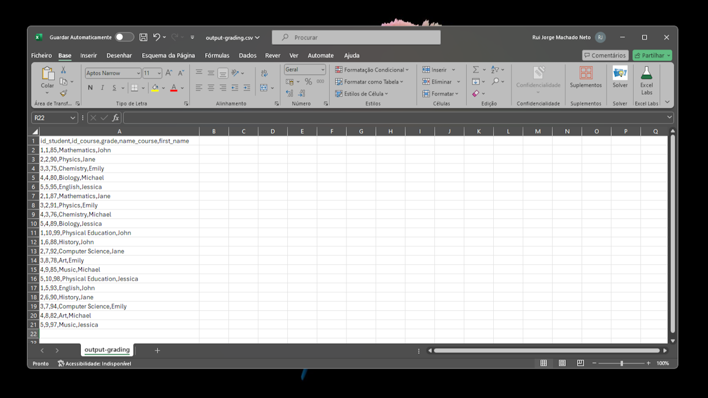
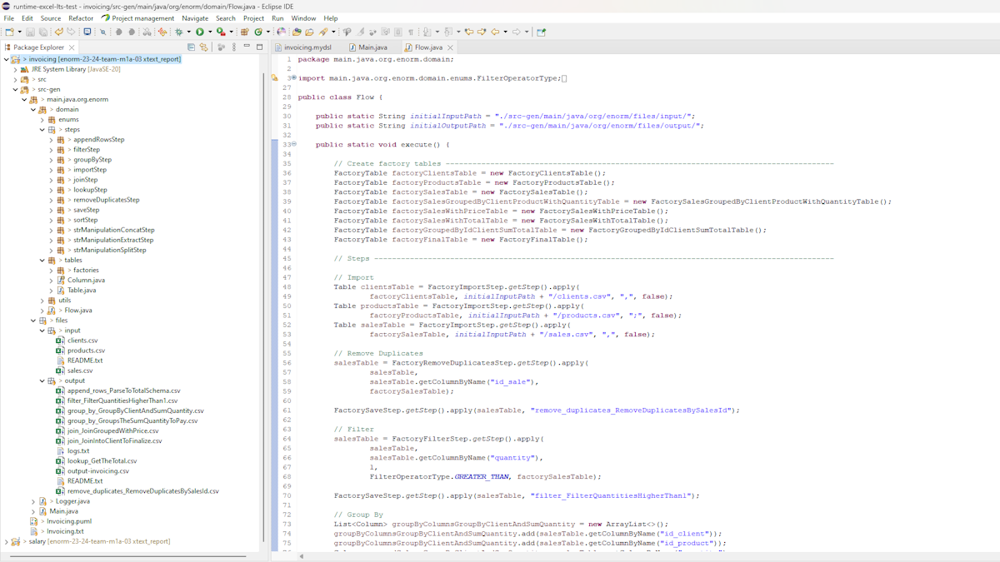
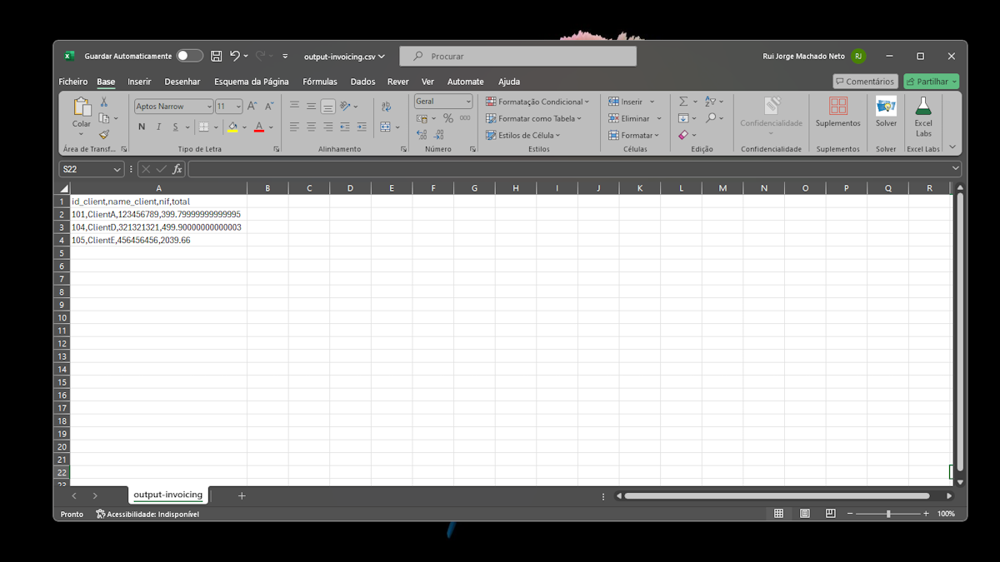
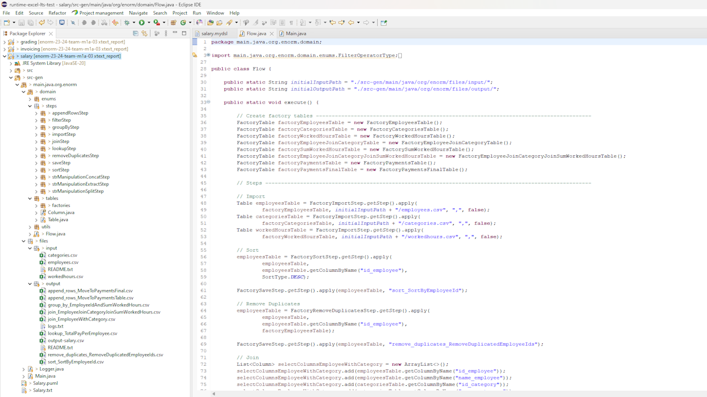
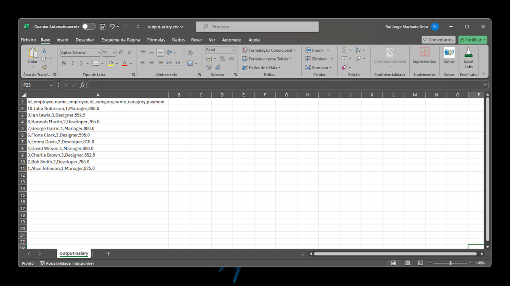

<h1>ENORM Project, Part 2, Tool 2</h1>

In this folder you should add **all** artifacts developed for part 2 of the ENORM Project, related to tool 2.

You should also include in this file the report for this part of the project (only for tool 2).

**Note:** If for some reason you need to bypass these guidelines please ask for directions with your teacher and **always** state the exceptions in your commits and issues in bitbucket.

<h1>Index</h1>

- [1. Project directories organization](#1-project-directories-organization)
- [2. Concrete Syntax Design for the DSL](#2-concrete-syntax-design-for-the-dsl)
	- [2.1. Concrete syntax importance](#21-concrete-syntax-importance)
	- [2.2. Parser Rules](#22-parser-rules)
- [3. Prototypes of Applications of the Domain Implementation](#3-prototypes-of-applications-of-the-domain-implementation)
- [4. Code Generation](#4-code-generation)
	- [4.1. Approach](#41-approach)
	- [4.2. Flow File generation](#42-flow-file-generation)
	- [4.3. Tables Factories generation](#43-tables-factories-generation)
	- [4.4. Generation Files Structure](#44-generation-files-structure)
- [5. Applications Generation](#5-applications-generation)
	- [5.1. Grading](#51-grading)
	- [5.2. Invoicing](#52-invoicing)
	- [5.3. Salary](#53-salary)
	- [5.4. Issues during tests](#54-issues-during-tests)

## 1. Project directories organization

- `metamodel`: this folder contains the Ecore Modeling Project, including the metamodel.
- `models`: this folder contains the 3 models instances. Each one of the model instances have the `.mydsl` file, the graphical projection (`.puml` file), the textual projection (`.txt` file) and the generated code inside `main.java.org.enorm` package.
- `report_images`: this folder contains all the current report images.
- `xtext`: this folder contains the Xtext Ecore Modeling Project, including the grammar, validation rules, quick fixes, projections generation and code generation.

## 2. Concrete Syntax Design for the DSL

### 2.1. Concrete syntax importance

The central when designing a concrete syntax for a DSL **is the careful definition of the grammar**, which is critical for creating a user-friendly and effective DSL.

The grammar is the foundation of any DSL, specifying the rules and structures that define how the language operates. In Xtext, the grammar is defined using a notation that is both expressive and concise. This formal definition ensures that all valid constructs of the DSL are clearly specified, allowing for precise parsing and processing. A well-defined grammar not only facilitates the creation of a robust language infrastructure, **but it also directly impacts the user experience in several ways**.

Xtext can automatically generate advanced editor features such as syntax highlighting and code completion. Code completion assists users in writing complex transformation logic by providing suggestions **and auto-completing partially written expressions**.

The grammar defines the syntax that users will write and read. Clear and logical syntax rules make the language easy to learn and use, **reducing the learning curve and increasing adoption**.

To change the Xtext concrete syntax, we simply accessed the `MyDsl.xtext` file (inside `org.xtext.example.mydsl\src\org\xtext\example\mydsl`) and modified it to create a more user-friendly way to write our DSL. The syntax for each model's parser rules **is shown below**.

### 2.2. Parser Rules

**Model**

```java
Model returns Model:
	name=EString
		'logs:' logs=EBooleanObject
		'tables:' tables+=Table (tables+=Table)*
		'steps:' steps+=Step (steps+=Step)*;
```

*Example of usage:*

```java
Invoicing
    logs: true
    tables: 
        <tables>       
    steps:
        <steps>
```

**Table**

```java
Table returns Table:
	name=EString':'
		columns+=Column (columns+=Column)*;
```

*Example of usage:*

```java
Clients:
    <columns>
```

**Column**

```java
Column returns Column:
	name=EString 'as' dataType=DataType;
```

*Example of usage:*

```java
id_product as NUMBER
name_product as TEXT
price as NUMBER
```

**Save Step**

```java
Save returns Save:
	'SAVE' name=EString ':'
		('description' description=EString)?
		tablesToSave+=TableToSave (tablesToSave+=TableToSave)*;
```

*Example of usage:*

```java
SAVE "SaveFinalTable":
```

**Table to Save**

```java
TableToSave returns TableToSave:
	table=[Table|EString] '(' columnsNames+=EString ("," columnsNames+=EString)* ')' 'TO' path=EString;
```

*Example of usage:*

```java
Final("id_client" , "name_client" , "nif", "total") TO "output-invoicing"
```

**Group Step**

```java
Group returns Group:
	'GROUP_BY' name=EString '->' next=[Step|EString] ':'
		('description' description=EString)?
		'ON' table=[Table|EString] '(' groupBy+=[Column|EString] ("," groupBy+=[Column|EString])* ')' 'AND' operation=GroupOperationType operandColumn=[Column|EString] 
		'INTO' resultTable=[Table|EString] '(' resultColumn=[Column|EString] ')';
```

*Example of usage:*

```java
GROUP_BY "GroupsTheSumQuantityToPay" -> "JoinIntoClientToFinalize":
  ON SalesWithTotal("SalesWithTotal.id_client") AND SUM "SalesWithTotal.total" 
  INTO GroupedByIdClientSumTotal("GroupedByIdClientSumTotal.total")
```

**Sort Step**

```java
Sort returns Sort:
  'SORT' name=EString '->' next=[Step|EString] ':'
    ('description' description=EString)?
    'ON' table=[Table|EString] '(' column=[Column|EString] ')' 'BY' 'ORDER' order=OrderType;
```

*Example of usage:*

```java
SORT "SortByEmployeeId" -> "RemoveDuplicatedEmployeeIds":
  ON Employees("Employees.id_employee") BY ORDER DESC
```

**Append Rows Step**

```java
AppendRows returns AppendRows:
	'APPEND_ROWS' name=EString '->' next=[Step|EString] ':'
		('description' description=EString)?
		'FROM' originTable=[Table|EString] 'TO' destinTable=[Table|EString]
		'MAPPING' ':'
			associations+=Association (associations+=Association)*;
```

*Example of usage:*

```java
APPEND_ROWS "ParseToTotalSchema" -> "GetTheTotal":
  FROM SalesWithPrice TO SalesWithTotal
  MAPPING:
    <associations>
```

**Association**

```java
originCol=[Column|EString] 'TO' destinCol=[Column|EString];
```

*Example of usage:*

```java
"SalesWithPrice.id_client" TO "SalesWithTotal.id_client"
"SalesWithPrice.id_product" TO "SalesWithTotal.id_product"
"SalesWithPrice.quantity" TO "SalesWithTotal.quantity"
"SalesWithPrice.price" TO "SalesWithTotal.price"
```

**Filter Step**

```java
Filter returns Filter:
	'FILTER' name=EString '->' next=[Step|EString] ':'
		('description' description=EString)?
		'ON' table=[Table|EString] '(' column=[Column|EString] ')' 'WHERE' 'VALUES' 'ARE' operator=FilterOperatorType operand=EString;
```

*Example of usage:*

```java
FILTER "FilterQuantitiesHigherThan1" -> "GroupByClientAndSumQuantity":
	ON Sales("Sales.quantity") WHERE VALUES ARE GREATER_THAN "1"
```

**Join Step**

```java
Join returns Join:
	'JOIN' type=JoinType name=EString '->' next=[Step|EString] ':'
		('description' description=EString)?
		'ON' tableLeft=[Table|EString] '(' columnLeft=[Column|EString] ')' 'WITH' tableRight=[Table|EString] '(' columnRight=[Column|EString] ')'
		'SELECTING' selectColumns+=[Column|EString] ( "," selectColumns+=[Column|EString])*
		'INTO' resultTable=[Table|EString];
```

*Example of usage:*

```java
JOIN INNER "JoinGroupedWithPrice" -> "ParseToTotalSchema":
  ON Products("Products.id_product") WITH SalesGroupedByClientProductWithQuantity("SalesGroupedByClientProductWithQuantity.id_product")
  SELECTING 
    "Products.id_product",
    "Products.price", 
    "SalesGroupedByClientProductWithQuantity.id_client", 
    "SalesGroupedByClientProductWithQuantity.quantity"
  INTO SalesWithPrice
```

**Import Step**

```java
Import returns Import:
	'IMPORT' name=EString '->' next=[Step|EString] ':'
		('description' description=EString)?
		tablesToImport+=TableToImport (tablesToImport+=TableToImport)*;
```

*Example of usage:*

```java
IMPORT "Import" -> "RemoveDuplicatesBySalesId":
  <tables to import>
```

**Table to Import**

```java
TableToImport returns TableToImport:
	'IMPORT' 'FROM' path=EString 'TO' table=[Table|EString] 'WITH' 'DELIMITER' delimiter=EString 'AND' 'DELETE_MISMATCHED_TYPES' 'AS' deleteMismatchedTypes=EBooleanObject;
```

*Example of usage:*

```java
IMPORT FROM "/sales.csv" TO Sales WITH DELIMITER "," AND DELETE_MISMATCHED_TYPES AS false
```

**Lookup Step**

```java
Lookup returns Lookup:
	'LOOKUP' name=EString '->' next=[Step|EString] ':'
		('description' description=EString)?
		'FROM' table=[Table|EString] '(' column=[Column|EString] ')' 'TO' lookupTable=[Table|EString] '(' matchColumn=[Column|EString] ')'
		'AND' 'PUT' operation=LookupOperationType '(' operandColumn=[Column|EString] ',' lookupColumn=[Column|EString] ')'
		'INTO' resultTable=[Table|EString] '(' resultColumn=[Column|EString] ')';
```

*Example of usage:*

```java
LOOKUP "GetTheTotal" -> "GroupsTheSumQuantityToPay":
  FROM SalesWithTotal("SalesWithTotal.id_client") TO SalesWithTotal("SalesWithTotal.id_client")
  AND PUT NUMERIC_MULTIPLY ("SalesWithTotal.quantity", "SalesWithTotal.price")
  INTO SalesWithTotal("SalesWithTotal.total")	
```

**Remove Duplicates Step**

```java
RemoveDuplicates returns RemoveDuplicates:
	'REMOVE_DUPLICATES' name=EString '->' next=[Step|EString] ':'
		('description' description=EString)?
		'ON' table=[Table|EString] '(' column=[Column|EString] ')';
```

*Example of usage:*

```java
REMOVE_DUPLICATES "RemoveDuplicatesBySalesId" -> "FilterQuantitiesHigherThan1":
	ON Sales("Sales.id_sale")
```

When designing the grammar, we always aimed to humanize the syntax as much as possible. This approach ensures that the language is intuitive and accessible, **closely resembling natural language and familiar structures**. By prioritizing readability and ease of use, we aimed to create a DSL that users can is easy to learn and use.

> [!NOTE]
The concrete syntax definition in Xtext **is remarkably flexible**, eliminating the need for adaptations in the concrete syntax design to meet the tool's specific requirements.

## 3. Prototypes of Applications of the Domain Implementation

For this part of the project, we decided to adopt a collaborative approach where each student implemented different step
behaviors. We began by discussing the best strategy for defining the generation gap, ensuring that our approach would be
both effective and scalable. After thorough deliberation, we chose to implement the factory pattern for steps and for
tables. This decision was made to enhance the project's extensibility, allowing users to easily add new steps according
to their specific needs.

This involved designing and implementing these steps in a way that they seamlessly integrated with the overall system.
This collaborative and modular approach not only facilitated efficient development but also ensured that the project
remains adaptable for future enhancements.

The prototypes are presented in `part2\prototypes`. There are located the `gradingPrototype`, `invoicingPrototype` and
`salaryPrototype`.

## 4. Code Generation

### 4.1. Approach

To generate the code, first of all, we needed to locate the file `MyDsl.xtend` in the package `org.example.mydsl.generator`. This Xtend class **was responsible to generate code for our models** in the standalone scenario and in the interactive Eclipse environment.

Then, we filtered the contents of the resource down to the model. Therefore we needed to iterate a resource with all its deeply nested elements. This can be achieved with the method `getAllContents()` of our `Resource resource`. After that, we check if the content is an instance of `Model` and, if it is, we call `GenerateProject.generateProject(model, fsa)`.

This method is responsible for generating all the files needed for the generated code to work.

```java
class GenerateProject {
	static def void generateProject(Model model, IFileSystemAccess2 fsa) {
		//##### main/java/org/enorm
		GenerateMain.generateMain(model, fsa)
		GenerateLogger.generateLogger(model, fsa)
		//##### main/java/org/enorm/files
		GenerateInputPackage.generateInputPackage(model, fsa)
		GenerateOutputPackage.generateOutputPackage(model, fsa)
		//##### main/java/org/enorm/domain
		GenerateFlow.generateFlow(model, fsa)
    ...
  }
}
```

Inside each of this methods, is the actual code that will be generated. The most complex ones are the `GenerateFlow.generateFlow(model, fsa)` and the tables `Factory` generation. This classes **contains the dynamic part of the code generation**.

### 4.2. Flow File generation

We started by defining its package and file name. When we define a path (as follows), the file is automatically created inside it with the name we choose.

```java
class GenerateFlow {
	static def void generateFlow(Model model, IFileSystemAccess2 fsa) {
		val packagePath = "main/java/org/enorm/domain"
		val fileName = "Flow.java"
		val filePath = packagePath + "/" + fileName
    ...
  }
}
```

Afterwards, for the file structure, we define the input and output packages as follows:

```java
public static String initialInputPath = "./src-gen/main/java/org/enorm/files/input/";
public static String initialOutputPath = "./src-gen/main/java/org/enorm/files/output/";
```

Next, we crate the logic to generate de factory tables, where for each table, it instance the match factory:

```scala
«FOR Table table : model.tables»
FactoryTable factory«table.name»Table = new Factory«table.name»Table();
«ENDFOR»
```

Finally, **the steps**. To generate the steps, we iterate over the `model.steps` and verify of which instance are they. Based on their `instanceof`, we apply the logic. For example, if the step is an `instanceof` Group, we start by initializing a `groupStep` as `Group`.

Then, we instantiate a `List` of `Column` where we'll add the columns that we want to be add to the group by operation. After that, we define the `operation` and the `operand` column and call the `FactoryGroupByStep.getStep().apply`. This will return a `Table` that will be used in the next step.

The Group By Step generation **is shown below**:

```scala
«IF step instanceof Group»
«val groupStep = step as Group»

// Group By
List<Column> groupByColumns«groupStep.name» = new ArrayList<>();
«FOR Column groupByColumn: groupStep.groupBy»
groupByColumns«groupStep.name».add(«firstLetterToLowerCase(groupStep.table.name)»Table.getColumnByName("«groupByColumn.name»"));
«ENDFOR»
Column operandColumn«groupStep.name» = «firstLetterToLowerCase(groupStep.table.name)»Table.getColumnByName("«groupStep.operandColumn.name»");
GroupByOperationType operation«groupStep.name» = GroupByOperationType.«groupStep.operation»;

Table «firstLetterToLowerCase(groupStep.resultTable.name)»Table = FactoryGroupByStep.getStep().apply(
    «firstLetterToLowerCase(groupStep.table.name)»Table,
    groupByColumns«groupStep.name», 
    operandColumn«groupStep.name», 
    operation«groupStep.name», 
    factory«(groupStep.resultTable.name)»Table);
    
FactorySaveStep.getStep().apply(«firstLetterToLowerCase(groupStep.resultTable.name)»Table, "group_by_«groupStep.name»");		
«ENDIF»	
```

### 4.3. Tables Factories generation

To generate the necessary tables factories for the system to work, we need to iterate over the `model` tables and, for each one, generate the `Factory` file.

```java
for (Table table : model.tables) {
	val fileName = "Factory" + table.name + "Table.java"
	val filePath = packagePath + "/" + fileName

	val fileContent = '''
		package main.java.org.enorm.domain.tables.factories;
		...
		public class Factory«table.name»Table implements FactoryTable {
			public Table generateTable() {
				List<Column> columnList = new ArrayList<>();
				
				«FOR column: table.columns»
				columnList.add(new Column("«column.name»", DataType.«column.dataType»));
				«ENDFOR»
				
				return new Table(columnList, "«table.name»");
			}		
		}
	'''
	fsa.generateFile(filePath, fileContent)
}
```

### 4.4. Generation Files Structure

To facilitate the changes in the generation files, the packages were organized **according to the following structure**.



## 5. Applications Generation

In this section, we focus on the final stage of our project: **generating applications based on the domain-specific models we've developed**. We were capable of generating code for the three models. Thorough testing of the modeling and code generation for the specified scenarios it was essential to ensure robustness and accuracy.

### 5.1. Grading 

The grading application can be found in `src-gen` inside `part2\tool2-xtext\models\grading`.

**Generated code structure:**



**Grading result:**



### 5.2. Invoicing 

The grading application can be found in `src-gen` inside `part2\tool2-xtext\models\invoicing`.

**Generated code structure:**



**Invoicing result:**



### 5.3. Salary

The grading application can be found in `src-gen` inside `part2\tool2-xtext\models\salary`.

**Generated code structure:**



**Salary result:**



### 5.4. Issues during tests

During the testing phase, some issues appeared, but they were easy to fix due to the organization of the code generation. The clear structure and modular approach of the generation logic **allowed us to quickly identify and address the problems**. 

This organization facilitated efficient debugging and made it straightforward to apply corrections *without disrupting the overall system*. The modular design ensured that changes in one part of the code generation did not adversely affect other parts, highlighting the robustness and maintainability of our approach.