# EDOM Project, Part 2, Tool 3

In this folder you should add **all** artifacts developed for part 2 of the ENORM Project, related to tool 3.

You should also include in this file the report for this part of the project (only for tool 3).

**Note:** If for some reason you need to bypass these guidelines please ask for directions with your teacher and **always** state the exceptions in your commits and issues in bitbucket.

## Concrete Syntax 

Given that Sirius is a graphical DSL, it's important to have an editor capable of supporting a wide range of operations to enhance productivity and ease of use for the end user. Additionally, some extra information has been removed from the diagram compared to the graphical static representation of the Model done with Graphviz in the part 1 of this project. This is because, with Sirius, users can access the properties section to see all the necessary complementary information. This approach makes the diagram cleaner and increases reliability. Also, it was added a icon to each element to help the users to relate more quickly to the specific part of the editor and also to help reading the diagram.

Furthermore, a conditional design has been implemented, where the diagram graphically warns the user of incorrect operations. For example, an element might be highlighted in red with an accompanying error message.

To support the extensive functionality required for Sirius, a considerable number of creation elements were designed, as shown in the next image.

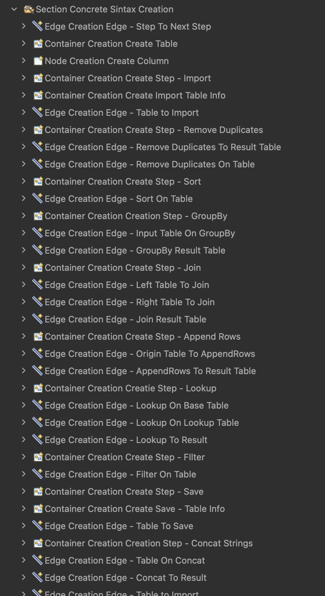

These elements are translated into the following editor palette:

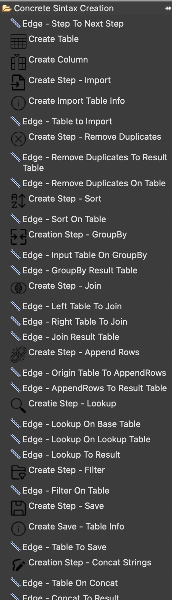

In the next sections, the concrete syntax will be demonstrated, including the conditional aspect for incomplete elements.

### Table

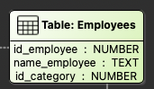


### Column

To create a column, the user needs to drag and drop the Column element inside a table.


### Import Step

The import step consists of the step's title and the number of tables to be imported. It displays the most important information related to each table, such as the path, while other details are accessible in the properties.

Arrows:

- The table imported
- The next step

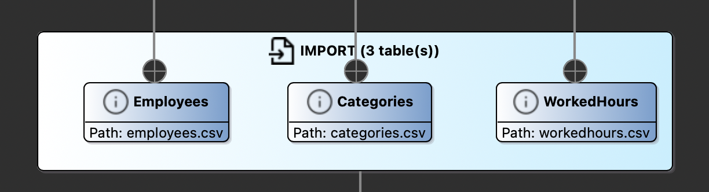

### Remove Duplicates Step

This step shows the target table and the column to be operated on.

Arrows:

- The target table
- The next step
- The previous step

Additionally, it includes a conditional aspect indicating when a table is missing.

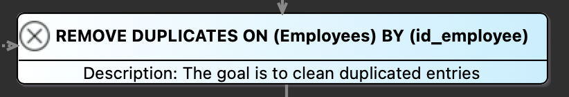


### Sort Step

This step describes the table and column to be sorted based on an order type.

Arrows:

- The target table
- The next step
- The previous step

It also warns the user of an incomplete sort step.

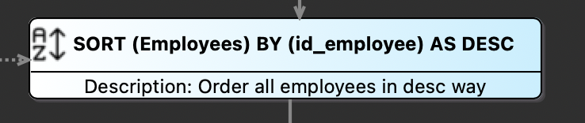

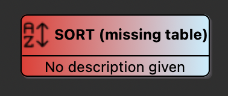

### Group By Step

This step has some information hidden in the properties, showing only crucial details like the target table, the group-by columns, and the result operation.

Arrows:

- The target table
- The next step
- The result table
- The previous step


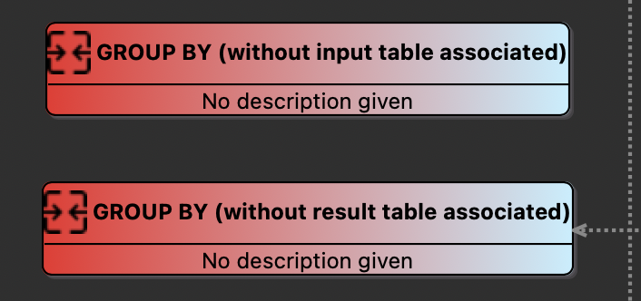

### Join Step

This step displays the two input tables, the match column information, and the join result.

Arrows:

- The left table
- The right table
- The next step
- The result table
- The previous step


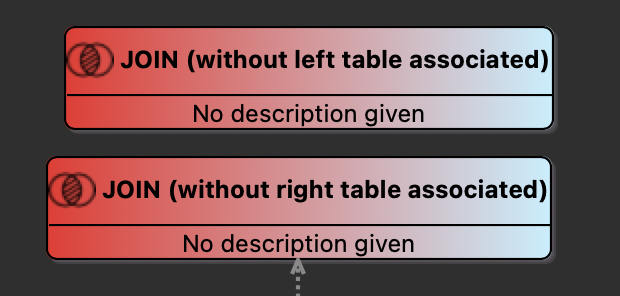

### Append Rows Step

This step shows the two tables, with association information available in the properties.

Arrows:

- The input table
- The result table
- The next step
- The previous step

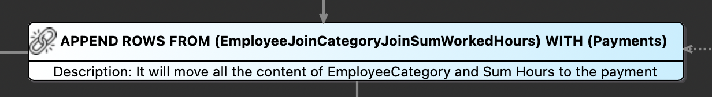

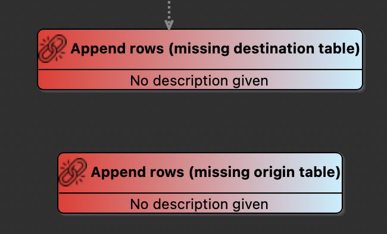

### Lookup Step

This step shows the tables involved in the operation.

Arrows:

- The lookup table
- The base table
- The match table
- The next step
- The result table
- The previous step


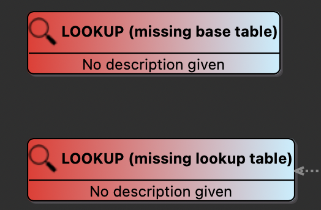

### Filter

This step shows the operation on the table/column.

Arrows:

- The target table
- The next step
- The result table
- The previous step

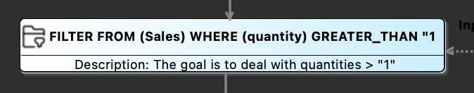

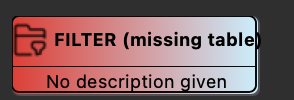

### Concat Step

For the concat step, the goal is to indicate the tables and the columns.

Arrows:

- The target table
- The next step
- The result table
- The previous step


### Save Step

Similar to the import step, this step indicates the tables to be saved.

Arrows:

- The tables to save
- The previous step

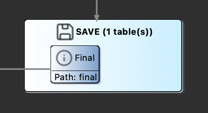


### Observations

In order to facilitate understanding a model created using this DSL, different colors were used for tables and steps. Additionally, the arrows support two types of lines: solid lines indicate the flow steps and output tables, while dotted lines indicate the input tables. This lines has a textual description of the operation.

It's possible to observe the details described above in the figure below.

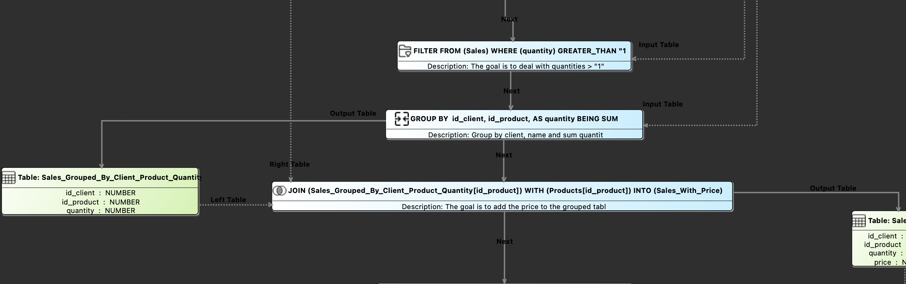

With this, it's easy to follow the flow. We can see where the output table comes from, what the previous and next steps are, and so on.

## Prototypes of Applications of the Domain Implementation

For this part of the project, we decided to adopt a collaborative approach **where each student implemented different step behaviors**. We began by discussing the best strategy for defining the generation gap, ensuring that our approach would be both effective and scalable. After thorough deliberation, we chose to implement the factory pattern for steps and for tables. This decision was made to enhance the project's extensibility, allowing users to easily add new steps according to their specific needs.

This involved designing and implementing these steps in a way that they seamlessly integrated with the overall system. This collaborative and modular approach not only facilitated efficient development **but also ensured that the project remains adaptable for future enhancements**.

The prototypes are presented in `part2\prototypes`. There are located the `gradingPrototype`, `invoicingPrototype` and `salaryPrototype`.

## Code Generation

For Sirius, the tool used was Acceleo, which required creating a new Acceleo project. Acceleo works with `.mtl` files that function as templates. Code generation occurs on a template annotated with `@main`.

A good approach is to create templates in other files, making use of private templates, for example, with the main template serving as the orchestrator for the other templates, creating some sort of hierarchy between the templates, in order to help maintain a clean and modular code structure. 

The folder structure of templates is structured like this:

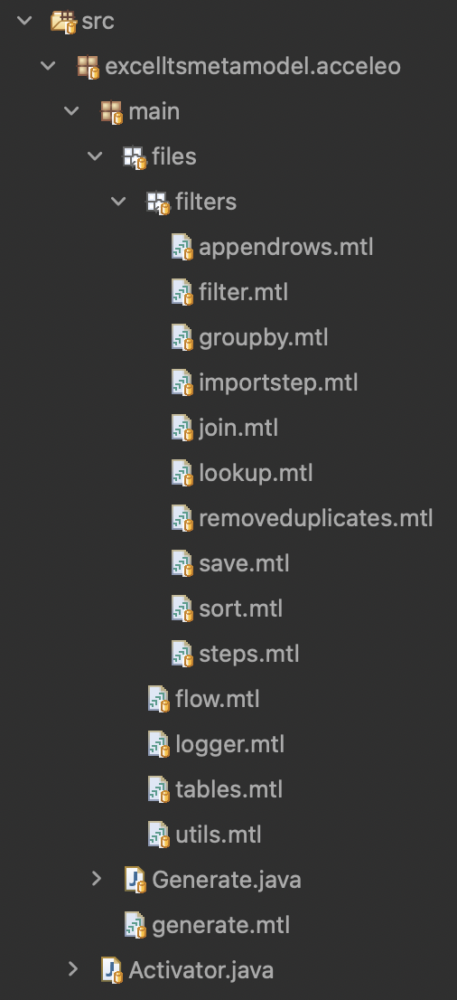

The entry point template is called generate.mtl, and all the auxiliary templates are organized into folders. The goal was to divide the files based on their scope. For example, a folder was created for steps, and within this folder, there is a template for each step. Similarly, separate templates were created for each topic, such as Table, Logger, and others.

The entry point template, `generate.mtl`, is composed of all the other necessary templates, and the first step is to call of necessary ones. Given that, the user needs to interact with a input and output files, we automatize this process and it's folders are created for this purpose. Since it's not possible to directly generate folders, a file is generated to create the required folder structure. Another objective of this template is to generate the Main class, which is responsible for setting all the default factories. 

```java
[comment encoding = UTF-8 /]
[module generate('http://www.example.org/excelltsmetamodel')]

[import excelltsmetamodel::acceleo::main::files::utils /] 
[import excelltsmetamodel::acceleo::main::files::tables /] 
[import excelltsmetamodel::acceleo::main::files::filters::steps /]
[import excelltsmetamodel::acceleo::main::files::flow /]
[import excelltsmetamodel::acceleo::main::files::logger /]


[template public generateElement(aModel : Model)]
[comment @main/]

[aModel.generateStaticEnumAndUtils(aModel)/]
[aModel.generateTableRelated(aModel)/]
[aModel.generateSteps(aModel)/]
[aModel.generateFlow(aModel)/]
[if (aModel.logs)]
[aModel.generateLogger(aModel)/]
[/if]

[file ('org/enorm/files/input/README', false, 'UTF-8')]
To create the folder
[/file]

[file ('org/enorm/files/output/README', false, 'UTF-8')]
To create the folder
[/file]

[file ('org/enorm/Main.java', false, 'UTF-8')]
package org.enorm;

import org.enorm.domain.Flow;
import org.enorm.domain.steps.appendRowsStep.*;
import org.enorm.domain.steps.filterStep.*;
import org.enorm.domain.steps.groupByStep.*;
import org.enorm.domain.steps.importStep.*;
import org.enorm.domain.steps.joinStep.*;
import org.enorm.domain.steps.lookupStep.*;
import org.enorm.domain.steps.removeDuplicatesStep.*;
import org.enorm.domain.steps.saveStep.*;
import org.enorm.domain.steps.sortStep.*;

public class Main {
    public static void main(String['[]'/] args) {
        FactoryAppendRowsStep.setStep(new AppendRowsStepDefault());
        FactoryFilterStep.setStep(new FilterStepDefault());
        FactoryGroupByStep.setStep(new GroupByStepDefault());
        FactoryImportStep.setStep(new ImportStepDefault());
        FactoryJoinStep.setStep(new JoinStepDefault());
        FactoryLookupStep.setStep(new LookupStepDefault());
        FactoryRemoveDuplicatesStep.setStep(new RemoveDuplicatesStepDefault());
        FactorySaveStep.setStep(new SaveStepDefault());
        FactorySortStep.setStep(new SortStepDefault());

        Flow.execute();
    }
}

[/file]
[/template]
```

In Sirius, a strategy was implemented to optimize compilation by selectively generating Logger code based on the user's preference indicated in the model. This logic, demonstrated below, ensures that Logger functionality is only generated if the user has indicated so in the model:

```java
[if (aModel.logs)]
[aModel.generateLogger(aModel)/]
[/if]
```

This approach is repeated to all the classes that calls the logger functionality. Nonetheless, it has a downside, because the user necessitates to regenerating all the code to enable logging, and for that reason, a static global boolean variable in the Logger class was created which the user can toggle logging on or off, creating some flexibility on both sides.

### Table factories class

The template generates a factory class for each table, where for each column in the table, an attribute is dynamically created. The [for] loop iterates through the columns to add them to the table's column list, ensuring all columns are included.

```java
[template private generateFactoriesTableAux(t : Table)]
[file ('org/enorm/domain/tables/factories/Factory' + t.name + '.java', false, 'UTF-8')]
package org.enorm.domain.tables.factories;

import org.enorm.domain.enums.*;
import org.enorm.domain.tables.*;

import java.util.ArrayList;
import java.util.List;

public class Factory[t.name/] implements FactoryTable {

    public Table generateTable() {
        List<Column> columnList = new ArrayList<>();

        [for (c : Column | t.columns)]
        columnList.add(new Column("[c.name/]", DataType.[c.dataType/]));
        [/for]

        return new Table(columnList, "[t.name/]");
    }

}

[/file]
[/template]
```

### Flow class

The majority of the classes generated are static where there isn't the necessity of dynamically information related to the model and for that reason the process is pretty straightforward. However, on the other hand, the `Flow.java` is the class that has all the logic of the steps, and for that reason it's necessary to dynamically create the file.

One strategy to produce a consistent code, it was to use the names given by the user instead of counter, for example, the steps, because we relay on the model validations that validates if the model is correct, which has the validations that guarantee that all steps are related to each other and all of them has unique names.

Now, we are being delving on the `Flow.java` generation give that it has the most dynamism of all classes. The first part starts by instantiate all the table factories, like is shown bellow.

```java
    // Create factory tables 
[for (t : Table | aModel.tables )]
    FactoryTable factory[t.name/] = new Factory[t.name/]();
[/for]
```

After generating the source code and implementing the necessary classes, the next step is to instantiate the variables needed for the steps. For instance, the Group By step requires three variables: one for storing the list of columns for the Group By operation, another for the operation itself, and a third for the target column of the operation. To avoid errors from creating variables with the same name when there are repeated steps, we check if the variables exist in the model and create them only if necessary at the begin of the file, as shown below. 

```java
// Instantiation of auxiliary variables
[if (aModel.steps->exists(s | s.oclIsTypeOf(excelltsmetamodel::Group)))]

    // Group By 
    List<Column> groupByColumns;
    Column operandColumn;
    GroupByOperationType operation;
[/if]

[if (aModel.steps->exists(s | s.oclIsTypeOf(excelltsmetamodel::AppendRows)))]
    // Append rows
    Map<Column, Column> mapping;
[/if]

[if (aModel.steps->exists(s | s.oclIsTypeOf(excelltsmetamodel::Join)))]
    // Join
    List<Column> selectColumns;
[/if]
```

This approach ensures that all necessary variables are instantiated only once and can be used reliably throughout the code.

The next part of the `Flow.java` file focuses on describing the real flow of the model. All the steps are wrapped inside a for loop that iterates over all the steps. The logic inside the loop checks the type of each step and processes it accordingly to create the necessary logic.

#### Import Step

This template checks for Import steps and generates code to apply the import logic for each table to be imported. It uses a nested for loop to handle multiple tables within each import step.

```java
[if (s.oclIsTypeOf(excelltsmetamodel::Import))]
    // Import ([s.description/])
    [for (table : excelltsmetamodel::TableToImport | s.oclAsType(excelltsmetamodel::Import).tablesToImport)]
    Table [table.table.name/] = FactoryImportStep.getStep().apply(factory[table.table.name/], initialInputPath + "/[table.path/]", "[table.delimiter/]", false);
    [/for]
[/if]
```

#### Remove Duplicates

This template identifies Remove Duplicates steps and generates code to remove duplicates from the specified table and column. It uses `let` to obtain information from the model class.

```java
[if (s.oclIsTypeOf(excelltsmetamodel::RemoveDuplicates))]
    // Remove duplicates ([s.description/])
    [let remove : excelltsmetamodel::RemoveDuplicates = s.oclAsType(excelltsmetamodel::RemoveDuplicates)]
    [remove.table.name/] = FactoryRemoveDuplicatesStep.getStep().apply([remove.table.name/], [remove.table.name/].getColumnByName("[remove.column.name/]"), factory[remove.table.name/]);
    [/let]
[/if]
```

#### Filter

This template processes Filter steps, generating code to apply a filter operation on the specified table, column, and operator. The `let` statement is used to capture step-specific data.

```java
[if (s.oclIsTypeOf(excelltsmetamodel::Filter))]
    // Filter ([s.description/])
    [let filter : excelltsmetamodel::Filter = s.oclAsType(excelltsmetamodel::Filter)]
    [filter.table.name/] = FactoryFilterStep.getStep().apply([filter.table.name/], [filter.table.name/].getColumnByName("[filter.column.name/]"), [filter.operand/],
            FilterOperatorType.[filter.operator/], factory[filter.table.name/]);
    [/let]
[/if]
```

#### Group By

This template handles Group By steps, generating code to perform a group by operation on specified columns and an operand column, producing a result table. It uses nested for loops to iterate over the columns involved in the group by operation.

```java
[if (s.oclIsTypeOf(excelltsmetamodel::Group))]
    // Group By ([s.description/])
    [let group : excelltsmetamodel::Group = s.oclAsType(excelltsmetamodel::Group)]
    groupByColumns = new ArrayList<>();
    [for (c : excelltsmetamodel::Column | group.groupBy)]
    groupByColumns.add([group.table.name/].getColumnByName("[c.name/]"));
    [/for]
    operandColumn = [group.table.name/].getColumnByName("[group.operandColumn.name/]");
    operation = GroupByOperationType.[group.operation/];
    Table [group.resultTable.name/] = FactoryGroupByStep.getStep().apply([group.table.name/],
            groupByColumns, operandColumn, operation, factory[group.resultTable.name/]);
    [/let]
[/if]
```

#### Join

This template identifies Join steps and generates code to join two tables based on specified columns and a join type, producing a result table. It uses a nested for loop to handle the selection of columns from both tables.

```java
[if (s.oclIsTypeOf(excelltsmetamodel::Join))]
    // Join ([s.description/])
    [let join : excelltsmetamodel::Join = s.oclAsType(excelltsmetamodel::Join)]
    selectColumns = new ArrayList<>();
    [for (c : excelltsmetamodel::Column | join.selectColumns)]
    [if (join.tableLeft.columns->exists(s | s.name = c.name))]
    selectColumns.add([join.tableLeft.name/].getColumnByName("[c.name/]"));
    [/if]
    [if (not join.tableLeft.columns->exists(s | s.name = c.name) and join.tableRight.columns->exists(s | s.name = c.name))]
    selectColumns.add([join.tableRight.name/].getColumnByName("[c.name/]"));
    [/if]
    [/for]
    Table [join.resultTable.name/] = FactoryJoinStep.getStep().apply([join.tableLeft.name/], [join.tableRight.name/],
            [join.tableLeft.name/].getColumnByName("[join.columnLeft.name/]"),
            [join.tableRight.name/].getColumnByName("[join.columnRight.name/]"),
            JoinType.[join.type/], factory[join.resultTable.name/], selectColumns);
    [/let]
[/if]
```

#### Append Rows

This template handles Append Rows steps, generating code to append rows from one table to another based on specified column mappings. It uses a `let` statement and a nested for loop to manage the column mappings.

```java
[if (s.oclIsTypeOf(excelltsmetamodel::AppendRows))]
    // Append Rows ([s.description/])
    [let append : excelltsmetamodel::AppendRows = s.oclAsType(excelltsmetamodel::AppendRows)]
    Table [append.destinTable.name/] = factory[append.destinTable.name/].generateTable();
    mapping = new HashMap<>();
    [for (a : excelltsmetamodel::Association | append.associations)]
    mapping.put([append.originTable.name/].getColumnByName("[a.originCol.name/]"), [append.originTable.name/].getColumnByName("[a.destinCol.name/]"));
    [/for]
    FactoryAppendRowsStep.getStep().apply([append.originTable.name/], [append.destinTable.name/], mapping);
    [/let]
[/if]
```

#### Lookup

This template processes Lookup steps, generating code to perform a lookup operation on specified columns and tables, producing a result table. The `let` statement is used to capture step-specific data, and multiple parameters are passed to the factory method.

```java
[if (s.oclIsTypeOf(excelltsmetamodel::Lookup))]
    // Lookup Rows ([s.description/])
    [let look : excelltsmetamodel::Lookup = s.oclAsType(excelltsmetamodel::Lookup)]
    [look.resultTable.name/] = FactoryLookupStep.getStep().apply([look.table.name/], [look.table.name/].getColumnByName("[look.column.name/]"),
            [look.lookupTable.name/], [look.lookupTable.name/].getColumnByName("[look.matchColumn.name/]"),
            [look.table.name/].getColumnByName("[look.operandColumn.name/]"), [look.lookupTable.name/].getColumnByName("[look.lookupColumn.name/]"),
            LookupOperationType.[look.operation/],
            "[look.resultColumn.name/]", factory[look.resultTable.name/]);
    [/let]
[/if]
```

#### Save

This template identifies Save steps and generates code to save specified tables to the provided paths. It uses a nested for loop to handle multiple tables within each save step.

```java
[if (s.oclIsTypeOf(excelltsmetamodel::Save))]
    // Save
    [let save : excelltsmetamodel::Save = s.oclAsType(excelltsmetamodel::Save)]
    [for (t : excelltsmetamodel::TableToSave | save.tablesToSave)]
    FactorySaveStep.getStep().apply([t.table.name/], "[t.path/]");
    [/for]
    [/let]
[/if]
```

By following this approach, the necessary steps are identified and processed within the for loop, ensuring that each step type is handled appropriately and the correct logic is generated for each step in the model.

The final template file is like the following:

```java
[comment encoding = UTF-8 /]
[module flow('http://www.example.org/excelltsmetamodel')]

[template public generateFlow(aModel : Model)]
[file ('org/enorm/domain/Flow.java', false, 'UTF-8')]

package org.enorm.domain;

import org.enorm.domain.enums.*;
import org.enorm.domain.steps.appendRowsStep.*;
import org.enorm.domain.steps.filterStep.*;
import org.enorm.domain.steps.groupByStep.*;
import org.enorm.domain.steps.importStep.*;
import org.enorm.domain.steps.joinStep.*;
import org.enorm.domain.steps.lookupStep.*;
import org.enorm.domain.steps.removeDuplicatesStep.*;
import org.enorm.domain.steps.sortStep.*;
import org.enorm.domain.steps.saveStep.*;
import org.enorm.domain.tables.*;
import org.enorm.domain.tables.factories.*;

import java.util.ArrayList;
import java.util.HashMap;
import java.util.List;
import java.util.Map;

public class Flow {

    public static String initialInputPath = "./src-gen/org/enorm/files/input/";
    public static String initialOutputPath = "./src-gen/org/enorm/files/output/";

    public static void execute() {
		
		// Create factory tables 
	[for (t : Table | aModel.tables )]
		FactoryTable factory[t.name/] = new Factory[t.name/]();
	[/for]

        // Steps 
		
		// Instantiation of auxiliary variables
     	[if (aModel.steps->exists(s | s.oclIsTypeOf(excelltsmetamodel::Group)))]
        // Group By 
        List<Column> groupByColumns;
        Column operandColumn;
        GroupByOperationType operation;
        [/if]

        [if (aModel.steps->exists(s | s.oclIsTypeOf(excelltsmetamodel::AppendRows)))]
        // Append rows
        Map<Column, Column> mapping;
        [/if]

        [if (aModel.steps->exists(s | s.oclIsTypeOf(excelltsmetamodel::Join)))]
        // Join
     	List<Column> selectColumns;
        [/if]

	[for (s : Step | aModel.steps )]
	[if (s.oclIsTypeOf(excelltsmetamodel::Import))]
		// Import ([s.description/])
		[for (table : excelltsmetamodel::TableToImport | s.oclAsType(excelltsmetamodel::Import).tablesToImport)]
        Table [table.table.name/] = FactoryImportStep.getStep().apply(factory[table.table.name/], initialInputPath + "/[table.path/]", "[table.delimiter/]", false);
		[/for]

	[/if]
	[if (s.oclIsTypeOf(excelltsmetamodel::RemoveDuplicates))]
		// Remove duplicates ([s.description/])
		[let remove : excelltsmetamodel::RemoveDuplicates = s.oclAsType(excelltsmetamodel::RemoveDuplicates)]
        [remove.table.name/] = FactoryRemoveDuplicatesStep.getStep().apply([remove.table.name/], [remove.table.name/].getColumnByName("[remove.column.name/]"), factory[remove.table.name/]);
		[/let]

	[/if]
	[if (s.oclIsTypeOf(excelltsmetamodel::Filter))]
		// Filter ([s.description/])
		[let filter : excelltsmetamodel::Filter = s.oclAsType(excelltsmetamodel::Filter)]
        [filter.table.name/] = FactoryFilterStep.getStep().apply([filter.table.name/], [filter.table.name/].getColumnByName("[filter.column.name/]"), [filter.operand/],
				FilterOperatorType.[filter.operator/], factory[filter.table.name/]);
		[/let]

	[/if]
	[if (s.oclIsTypeOf(excelltsmetamodel::Group))]
		// Group By ([s.description/])
		[let group : excelltsmetamodel::Group = s.oclAsType(excelltsmetamodel::Group)]
        groupByColumns = new ArrayList<>();
		[for (c : excelltsmetamodel::Column | group.groupBy)]
        groupByColumns.add([group.table.name/].getColumnByName("[c.name/]"));
		[/for]
        operandColumn = [group.table.name/].getColumnByName("[group.operandColumn.name/]");
        operation = GroupByOperationType.[group.operation/];
        Table [group.resultTable.name/] = FactoryGroupByStep.getStep().apply([group.table.name/],
                groupByColumns, operandColumn, operation, factory[group.resultTable.name/]);
		[/let]

	[/if]
	[if (s.oclIsTypeOf(excelltsmetamodel::Join))]
		// Join ([s.description/])
		[let join : excelltsmetamodel::Join = s.oclAsType(excelltsmetamodel::Join)]
        selectColumns = new ArrayList<>();
		[for (c : excelltsmetamodel::Column | join.selectColumns)]
		[if (join.tableLeft.columns->exists(s | s.name = c.name))]
		selectColumns.add([join.tableLeft.name/].getColumnByName("[c.name/]"));
		[/if]
		[if (not join.tableLeft.columns->exists(s | s.name = c.name) and join.tableRight.columns->exists(s | s.name = c.name)) ]
		selectColumns.add([join.tableRight.name/].getColumnByName("[c.name/]"));
		[/if]
		[/for]
        Table [join.resultTable.name/] = FactoryJoinStep.getStep().apply([join.tableLeft.name/], [join.tableRight.name/],
                [join.tableLeft.name/].getColumnByName("[join.columnLeft.name/]"),
                [join.tableRight.name/].getColumnByName("[join.columnRight.name/]"),
                JoinType.[join.type/], factory[join.resultTable.name/], selectColumns);
		[/let]

	[/if]
	[if (s.oclIsTypeOf(excelltsmetamodel::AppendRows))]
		// Append Rows ([s.description/])
		[let append : excelltsmetamodel::AppendRows = s.oclAsType(excelltsmetamodel::AppendRows)]
        Table [append.destinTable.name/] = factory[append.destinTable.name/].generateTable();
        mapping = new HashMap<>();
		[for (a : excelltsmetamodel::Association | append.associations)]
        mapping.put([append.originTable.name/].getColumnByName("[a.originCol.name/]"), [append.originTable.name/].getColumnByName("[a.destinCol.name/]"));
		[/for]
        FactoryAppendRowsStep.getStep().apply([append.originTable.name/], [append.destinTable.name/], mapping);
		[/let]

	[/if]
	[if (s.oclIsTypeOf(excelltsmetamodel::Lookup))]
		// Lookup Rows ([s.description/])
		[let look : excelltsmetamodel::Lookup = s.oclAsType(excelltsmetamodel::Lookup)]
      	[look.resultTable.name/] = FactoryLookupStep.getStep().apply([look.table.name/], [look.table.name/].getColumnByName("[look.column.name/]"),
                [look.lookupTable.name/], [look.lookupTable.name/].getColumnByName("[look.matchColumn.name/]"),
                [look.table.name/].getColumnByName("[look.operandColumn.name/]"), [look.lookupTable.name/].getColumnByName("[look.lookupColumn.name/]"),
                LookupOperationType.[look.operation/],
                "[look.resultColumn.name/]", factory[look.resultTable.name/]);
		[/let]

	[/if]

	[if (s.oclIsTypeOf(excelltsmetamodel::Save))]
		// Save
		[let save : excelltsmetamodel::Save = s.oclAsType(excelltsmetamodel::Save)]
		[for (t : excelltsmetamodel::TableToSave | save.tablesToSave)]
		FactorySaveStep.getStep().apply([t.table.name/], "[t.path/]");
		[/for]
		[/let]

	[/if]
	[/for]
	
	}
}

[/file]
[/template]
```

## Applications Generation

Instead of using a Maven plugin, the strategy employed was to create Run Configurations in Acceleo. As shown below, a separate run configuration was created for each application, specifying the necessary information.

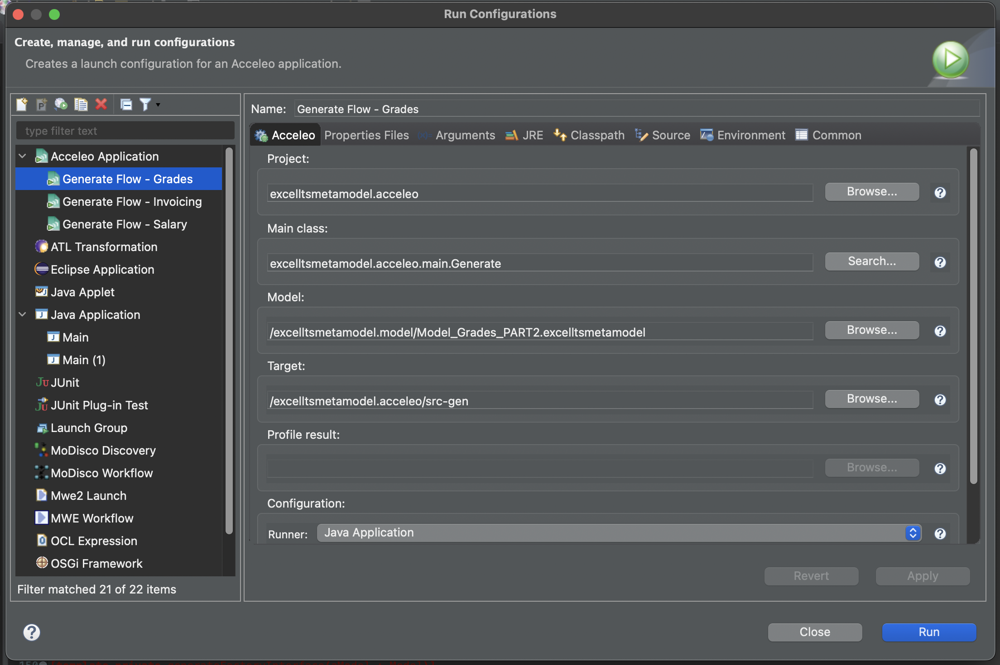

With that it's possible to obtain the following folder generation:

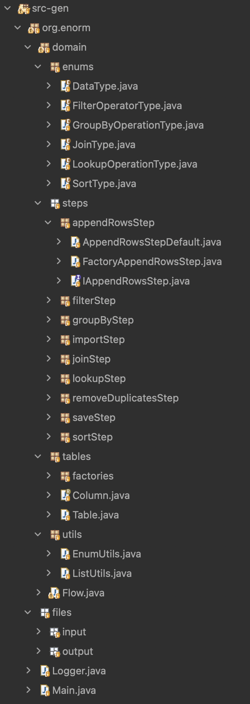

It's now shown the DSL input and respective generated code.

### Grading

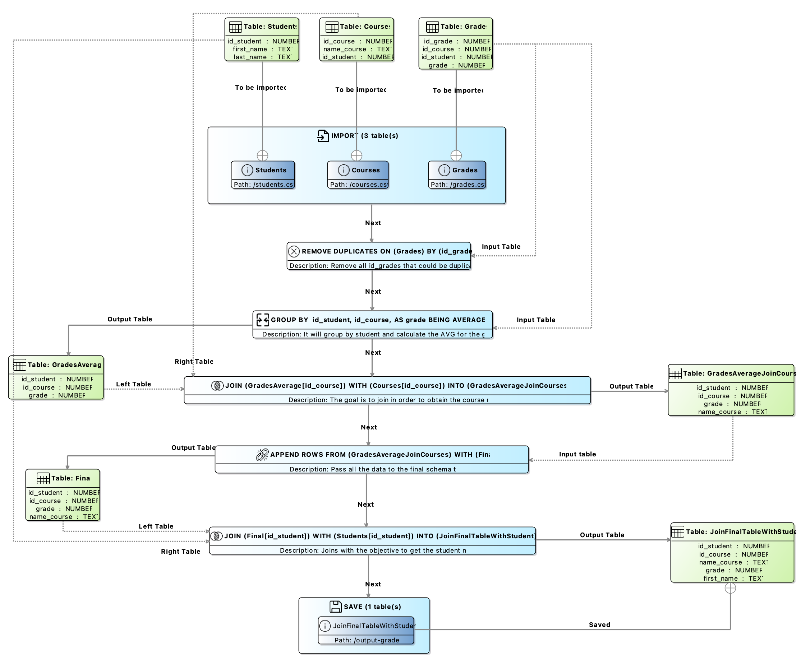


```java
package org.enorm.domain;

import org.enorm.domain.enums.*;
import org.enorm.domain.steps.appendRowsStep.*;
import org.enorm.domain.steps.filterStep.*;
import org.enorm.domain.steps.groupByStep.*;
import org.enorm.domain.steps.importStep.*;
import org.enorm.domain.steps.joinStep.*;
import org.enorm.domain.steps.lookupStep.*;
import org.enorm.domain.steps.removeDuplicatesStep.*;
import org.enorm.domain.steps.sortStep.*;
import org.enorm.domain.steps.saveStep.*;
import org.enorm.domain.tables.*;
import org.enorm.domain.tables.factories.*;

import java.util.ArrayList;
import java.util.HashMap;
import java.util.List;
import java.util.Map;

public class Flow {

    public static String initialInputPath = "./src-gen/org/enorm/files/input/";
    public static String initialOutputPath = "./src-gen/org/enorm/files/output/";

    public static void execute() {
		
		// Create factory tables 
		FactoryTable factoryStudents = new FactoryStudents();
		FactoryTable factoryCourses = new FactoryCourses();
		FactoryTable factoryGrades = new FactoryGrades();
		FactoryTable factoryGradesAverage = new FactoryGradesAverage();
		FactoryTable factoryGradesAverageJoinCourses = new FactoryGradesAverageJoinCourses();
		FactoryTable factoryFinal = new FactoryFinal();
		FactoryTable factoryJoinFinalTableWithStudent = new FactoryJoinFinalTableWithStudent();

        // Steps 
        
		// Instantiation of auxiliary variables
        // Group By 
        List<Column> groupByColumns;
        Column operandColumn;
        GroupByOperationType operation;

        // Append rows
        Map<Column, Column> mapping;

        // Join
     	List<Column> selectColumns;

		// Import (Import student, course and grades)
        Table Students = FactoryImportStep.getStep().apply(factoryStudents, initialInputPath + "//students.csv", ",", false);
        Table Courses = FactoryImportStep.getStep().apply(factoryCourses, initialInputPath + "//courses.csv", ",", false);
        Table Grades = FactoryImportStep.getStep().apply(factoryGrades, initialInputPath + "//grades.csv", ",", false);

		// Remove duplicates (Remove all id_grades that could be duplicated)
        Grades = FactoryRemoveDuplicatesStep.getStep().apply(Grades, Grades.getColumnByName("id_grade"), factoryGrades);

		// Group By (It will group by student and calculate the AVG for the grades)
        groupByColumns = new ArrayList<>();
        groupByColumns.add(Grades.getColumnByName("id_student"));
        groupByColumns.add(Grades.getColumnByName("id_course"));
        operandColumn = Grades.getColumnByName("grade");
        operation = GroupByOperationType.AVERAGE;
        Table GradesAverage = FactoryGroupByStep.getStep().apply(Grades,
                groupByColumns, operandColumn, operation, factoryGradesAverage);

		// Join (The goal is to join in order to obtain the course name)
        selectColumns = new ArrayList<>();
		selectColumns.add(GradesAverage.getColumnByName("id_course"));
		selectColumns.add(GradesAverage.getColumnByName("id_student"));
		selectColumns.add(Courses.getColumnByName("name_course"));
		selectColumns.add(GradesAverage.getColumnByName("grade"));
        Table GradesAverageJoinCourses = FactoryJoinStep.getStep().apply(GradesAverage, Courses,
                GradesAverage.getColumnByName("id_course"),
                Courses.getColumnByName("id_course"),
                JoinType.INNER, factoryGradesAverageJoinCourses, selectColumns);

		// Append Rows (Pass all the data to the final schema table)
        Table Final = factoryFinal.generateTable();
        mapping = new HashMap<>();
        mapping.put(GradesAverageJoinCourses.getColumnByName("id_student"), GradesAverageJoinCourses.getColumnByName("id_student"));
        mapping.put(GradesAverageJoinCourses.getColumnByName("id_course"), GradesAverageJoinCourses.getColumnByName("id_course"));
        mapping.put(GradesAverageJoinCourses.getColumnByName("grade"), GradesAverageJoinCourses.getColumnByName("grade"));
        mapping.put(GradesAverageJoinCourses.getColumnByName("name_course"), GradesAverageJoinCourses.getColumnByName("name_course"));
        FactoryAppendRowsStep.getStep().apply(GradesAverageJoinCourses, Final, mapping);

		// Join (Joins with the objective to get the student name)
        selectColumns = new ArrayList<>();
		selectColumns.add(Final.getColumnByName("id_student"));
		selectColumns.add(Students.getColumnByName("first_name"));
		selectColumns.add(Final.getColumnByName("id_course"));
		selectColumns.add(Final.getColumnByName("grade"));
		selectColumns.add(Final.getColumnByName("name_course"));
        Table JoinFinalTableWithStudent = FactoryJoinStep.getStep().apply(Final, Students,
                Final.getColumnByName("id_student"),
                Students.getColumnByName("id_student"),
                JoinType.INNER, factoryJoinFinalTableWithStudent, selectColumns);

		// Save
		FactorySaveStep.getStep().apply(JoinFinalTableWithStudent, "/output-grades");
	}
}
```

### Invoicing

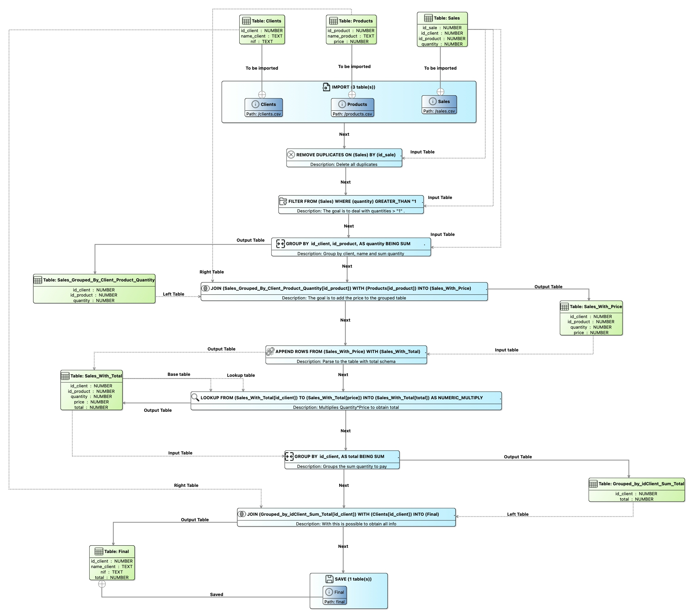

```java
package org.enorm.domain;

import org.enorm.domain.enums.*;
import org.enorm.domain.steps.appendRowsStep.*;
import org.enorm.domain.steps.filterStep.*;
import org.enorm.domain.steps.groupByStep.*;
import org.enorm.domain.steps.importStep.*;
import org.enorm.domain.steps.joinStep.*;
import org.enorm.domain.steps.lookupStep.*;
import org.enorm.domain.steps.removeDuplicatesStep.*;
import org.enorm.domain.steps.sortStep.*;
import org.enorm.domain.steps.saveStep.*;
import org.enorm.domain.tables.*;
import org.enorm.domain.tables.factories.*;

import java.util.ArrayList;
import java.util.HashMap;
import java.util.List;
import java.util.Map;

public class Flow {

    public static String initialInputPath = "./src-gen/org/enorm/files/input/";
    public static String initialOutputPath = "./src-gen/org/enorm/files/output/";

    public static void execute() {
		
		// Create factory tables
		FactoryTable factoryClients = new FactoryClients();
		FactoryTable factoryProducts = new FactoryProducts();
		FactoryTable factorySales = new FactorySales();
		FactoryTable factorySales_Grouped_By_Client_Product_Quantity = new FactorySales_Grouped_By_Client_Product_Quantity();
		FactoryTable factorySales_With_Price = new FactorySales_With_Price();
		FactoryTable factorySales_With_Total = new FactorySales_With_Total();
		FactoryTable factoryGrouped_by_idClient_Sum_Total = new FactoryGrouped_by_idClient_Sum_Total();
		FactoryTable factoryFinal = new FactoryFinal();

        // Steps

		// Instantiation of auxiliary variables
        // Group By 
        List<Column> groupByColumns;
        Column operandColumn;
        GroupByOperationType operation;

        // Append rows
        Map<Column, Column> mapping;

        // Join
     	List<Column> selectColumns;

		// Import
        Table Clients = FactoryImportStep.getStep().apply(factoryClients, initialInputPath + "//clients.csv", ",", false);
        Table Products = FactoryImportStep.getStep().apply(factoryProducts, initialInputPath + "//products.csv", ";", false);
        Table Sales = FactoryImportStep.getStep().apply(factorySales, initialInputPath + "//sales.csv", ",", false);

		// Remove duplicates (Delete all duplicates)
        Sales = FactoryRemoveDuplicatesStep.getStep().apply(Sales, Sales.getColumnByName("id_sale"), factorySales);

		// Filter (The goal is to deal with quantities > "1" .)
        Sales = FactoryFilterStep.getStep().apply(Sales, Sales.getColumnByName("quantity"), 1,
				FilterOperatorType.GREATER_THAN, factorySales);

		// Group By (Group by client, name and sum quantity)
        groupByColumns = new ArrayList<>();
        groupByColumns.add(Sales.getColumnByName("id_client"));
        groupByColumns.add(Sales.getColumnByName("id_product"));
        operandColumn = Sales.getColumnByName("quantity");
        operation = GroupByOperationType.SUM;
        Table Sales_Grouped_By_Client_Product_Quantity = FactoryGroupByStep.getStep().apply(Sales,
                groupByColumns, operandColumn, operation, factorySales_Grouped_By_Client_Product_Quantity);

		// Join (The goal is to add the price to the grouped table)
        selectColumns = new ArrayList<>();
		selectColumns.add(Sales_Grouped_By_Client_Product_Quantity.getColumnByName("id_client"));
		selectColumns.add(Sales_Grouped_By_Client_Product_Quantity.getColumnByName("id_product"));
		selectColumns.add(Sales_Grouped_By_Client_Product_Quantity.getColumnByName("quantity"));
		selectColumns.add(Products.getColumnByName("price"));
        Table Sales_With_Price = FactoryJoinStep.getStep().apply(Sales_Grouped_By_Client_Product_Quantity, Products,
                Sales_Grouped_By_Client_Product_Quantity.getColumnByName("id_product"),
                Products.getColumnByName("id_product"),
                JoinType.INNER, factorySales_With_Price, selectColumns);

		// Append Rows (Parse to the table with total schema)
        Table Sales_With_Total = factorySales_With_Total.generateTable();
        mapping = new HashMap<>();
        mapping.put(Sales_With_Price.getColumnByName("id_client"), Sales_With_Price.getColumnByName("id_client"));
        mapping.put(Sales_With_Price.getColumnByName("id_product"), Sales_With_Price.getColumnByName("id_product"));
        mapping.put(Sales_With_Price.getColumnByName("quantity"), Sales_With_Price.getColumnByName("quantity"));
        mapping.put(Sales_With_Price.getColumnByName("price"), Sales_With_Price.getColumnByName("price"));
        FactoryAppendRowsStep.getStep().apply(Sales_With_Price, Sales_With_Total, mapping);

		// Lookup Rows (Multiplies Quantity*Price to obtain total)
      	Sales_With_Total = FactoryLookupStep.getStep().apply(Sales_With_Total, Sales_With_Total.getColumnByName("id_client"),
                Sales_With_Total, Sales_With_Total.getColumnByName("id_client"),
                Sales_With_Total.getColumnByName("quantity"), Sales_With_Total.getColumnByName("price"),
                LookupOperationType.NUMERIC_MULTIPLY,
                "total", factorySales_With_Total);

		// Group By (Groups the sum quantity to pay)
        groupByColumns = new ArrayList<>();
        groupByColumns.add(Sales_With_Total.getColumnByName("id_client"));
        operandColumn = Sales_With_Total.getColumnByName("total");
        operation = GroupByOperationType.SUM;
        Table Grouped_by_idClient_Sum_Total = FactoryGroupByStep.getStep().apply(Sales_With_Total,
                groupByColumns, operandColumn, operation, factoryGrouped_by_idClient_Sum_Total);

		// Join (With this is possible to obtain all info)
        selectColumns = new ArrayList<>();
		selectColumns.add(Grouped_by_idClient_Sum_Total.getColumnByName("id_client"));
		selectColumns.add(Clients.getColumnByName("nif"));
		selectColumns.add(Grouped_by_idClient_Sum_Total.getColumnByName("total"));
		selectColumns.add(Clients.getColumnByName("name_client"));
        Table Final = FactoryJoinStep.getStep().apply(Grouped_by_idClient_Sum_Total, Clients,
                Grouped_by_idClient_Sum_Total.getColumnByName("id_client"),
                Clients.getColumnByName("id_client"),
                JoinType.INNER, factoryFinal, selectColumns);

		// Save
		FactorySaveStep.getStep().apply(Final, "final");
	}
}
```

### Salary

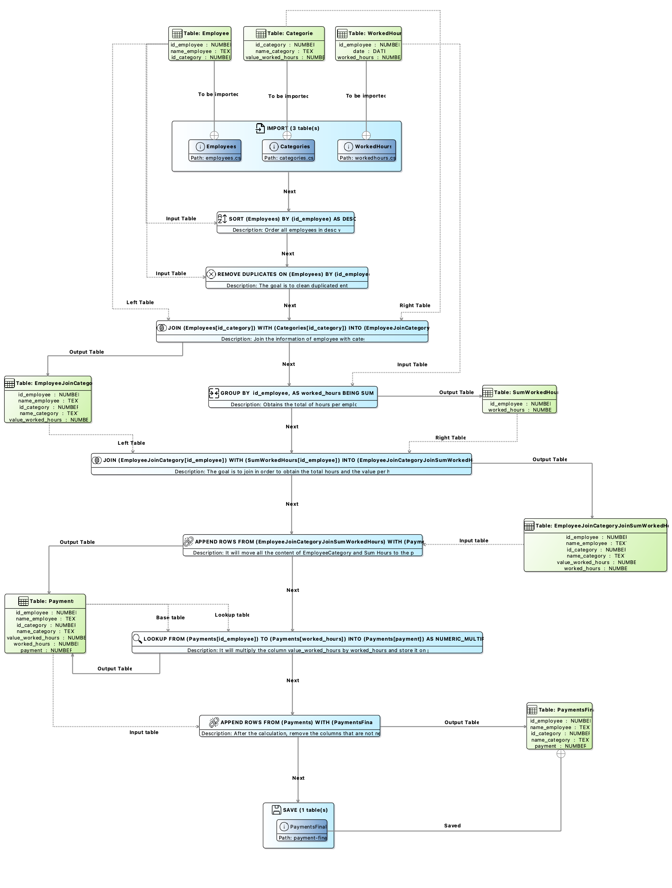

```java
package org.enorm.domain;

import org.enorm.domain.enums.*;
import org.enorm.domain.steps.appendRowsStep.*;
import org.enorm.domain.steps.filterStep.*;
import org.enorm.domain.steps.groupByStep.*;
import org.enorm.domain.steps.importStep.*;
import org.enorm.domain.steps.joinStep.*;
import org.enorm.domain.steps.lookupStep.*;
import org.enorm.domain.steps.removeDuplicatesStep.*;
import org.enorm.domain.steps.sortStep.*;
import org.enorm.domain.steps.saveStep.*;
import org.enorm.domain.tables.*;
import org.enorm.domain.tables.factories.*;

import java.util.ArrayList;
import java.util.HashMap;
import java.util.List;
import java.util.Map;

public class Flow {

    public static String initialInputPath = "./src-gen/org/enorm/files/input/";
    public static String initialOutputPath = "./src-gen/org/enorm/files/output/";

    public static void execute() {
		
		// Create factory tables 
		FactoryTable factoryEmployees = new FactoryEmployees();
		FactoryTable factoryWorkedHours = new FactoryWorkedHours();
		FactoryTable factoryCategories = new FactoryCategories();
		FactoryTable factoryPayments = new FactoryPayments();
		FactoryTable factoryEmployeeJoinCategory = new FactoryEmployeeJoinCategory();
		FactoryTable factorySumWorkedHours = new FactorySumWorkedHours();
		FactoryTable factoryEmployeeJoinCategoryJoinSumWorkedHours = new FactoryEmployeeJoinCategoryJoinSumWorkedHours();
		FactoryTable factoryPaymentsFinal = new FactoryPaymentsFinal();

        // Steps

		// Instantiation of auxiliary variables
        // Group By 
        List<Column> groupByColumns;
        Column operandColumn;
        GroupByOperationType operation;

        // Append rows
        Map<Column, Column> mapping;

        // Join
     	List<Column> selectColumns;

		// Import (Load all the tables needed for salary processing )
        Table Employees = FactoryImportStep.getStep().apply(factoryEmployees, initialInputPath + "/employees.csv", ",", false);
        Table Categories = FactoryImportStep.getStep().apply(factoryCategories, initialInputPath + "/categories.csv", ",", false);
        Table WorkedHours = FactoryImportStep.getStep().apply(factoryWorkedHours, initialInputPath + "/workedhours.csv", ",", false);

		// Remove duplicates (The goal is to clean duplicated entries)
        Employees = FactoryRemoveDuplicatesStep.getStep().apply(Employees, Employees.getColumnByName("id_employee"), factoryEmployees);

		// Join (Join the information of employee with category)
        selectColumns = new ArrayList<>();
		selectColumns.add(Employees.getColumnByName("id_category"));
		selectColumns.add(Employees.getColumnByName("id_employee"));
		selectColumns.add(Employees.getColumnByName("name_employee"));
		selectColumns.add(Categories.getColumnByName("value_worked_hours"));
		selectColumns.add(Categories.getColumnByName("name_category"));
        Table EmployeeJoinCategory = FactoryJoinStep.getStep().apply(Employees, Categories,
                Employees.getColumnByName("id_category"),
                Categories.getColumnByName("id_category"),
                JoinType.INNER, factoryEmployeeJoinCategory, selectColumns);

		// Group By (Obtains the total of hours per employee)
        groupByColumns = new ArrayList<>();
        groupByColumns.add(WorkedHours.getColumnByName("id_employee"));
        operandColumn = WorkedHours.getColumnByName("worked_hours");
        operation = GroupByOperationType.SUM;
        Table SumWorkedHours = FactoryGroupByStep.getStep().apply(WorkedHours,
                groupByColumns, operandColumn, operation, factorySumWorkedHours);

		// Join (The goal is to join in order to obtain the total hours and the value per hour)
        selectColumns = new ArrayList<>();
		selectColumns.add(EmployeeJoinCategory.getColumnByName("id_employee"));
		selectColumns.add(EmployeeJoinCategory.getColumnByName("id_category"));
		selectColumns.add(EmployeeJoinCategory.getColumnByName("name_employee"));
		selectColumns.add(EmployeeJoinCategory.getColumnByName("name_category"));
		selectColumns.add(EmployeeJoinCategory.getColumnByName("value_worked_hours"));
		selectColumns.add(SumWorkedHours.getColumnByName("worked_hours"));
        Table EmployeeJoinCategoryJoinSumWorkedHours = FactoryJoinStep.getStep().apply(EmployeeJoinCategory, SumWorkedHours,
                EmployeeJoinCategory.getColumnByName("id_employee"),
                SumWorkedHours.getColumnByName("id_employee"),
                JoinType.INNER, factoryEmployeeJoinCategoryJoinSumWorkedHours, selectColumns);

		// Append Rows (It will move all the content of EmployeeCategory and Sum Hours to the payment)
        Table Payments = factoryPayments.generateTable();
        mapping = new HashMap<>();
        mapping.put(EmployeeJoinCategoryJoinSumWorkedHours.getColumnByName("id_employee"), EmployeeJoinCategoryJoinSumWorkedHours.getColumnByName("id_employee"));
        mapping.put(EmployeeJoinCategoryJoinSumWorkedHours.getColumnByName("name_employee"), EmployeeJoinCategoryJoinSumWorkedHours.getColumnByName("name_employee"));
        mapping.put(EmployeeJoinCategoryJoinSumWorkedHours.getColumnByName("id_category"), EmployeeJoinCategoryJoinSumWorkedHours.getColumnByName("id_category"));
        mapping.put(EmployeeJoinCategoryJoinSumWorkedHours.getColumnByName("name_employee"), EmployeeJoinCategoryJoinSumWorkedHours.getColumnByName("name_category"));
        mapping.put(EmployeeJoinCategoryJoinSumWorkedHours.getColumnByName("value_worked_hours"), EmployeeJoinCategoryJoinSumWorkedHours.getColumnByName("value_worked_hours"));
        mapping.put(EmployeeJoinCategoryJoinSumWorkedHours.getColumnByName("worked_hours"), EmployeeJoinCategoryJoinSumWorkedHours.getColumnByName("worked_hours"));
        FactoryAppendRowsStep.getStep().apply(EmployeeJoinCategoryJoinSumWorkedHours, Payments, mapping);

		// Lookup Rows (It will multiply the column value_worked_hours by worked_hours and store it on payment)
      	Payments = FactoryLookupStep.getStep().apply(Payments, Payments.getColumnByName("id_employee"),
                Payments, Payments.getColumnByName("id_employee"),
                Payments.getColumnByName("value_worked_hours"), Payments.getColumnByName("worked_hours"),
                LookupOperationType.NUMERIC_MULTIPLY,
                "payment", factoryPayments);

		// Append Rows (After the calculation, remove the columns that are not needed)
        Table PaymentsFinal = factoryPaymentsFinal.generateTable();
        mapping = new HashMap<>();
        mapping.put(Payments.getColumnByName("id_employee"), Payments.getColumnByName("id_employee"));
        mapping.put(Payments.getColumnByName("name_employee"), Payments.getColumnByName("name_employee"));
        mapping.put(Payments.getColumnByName("id_category"), Payments.getColumnByName("id_category"));
        mapping.put(Payments.getColumnByName("name_employee"), Payments.getColumnByName("name_category"));
        mapping.put(Payments.getColumnByName("payment"), Payments.getColumnByName("payment"));
        FactoryAppendRowsStep.getStep().apply(Payments, PaymentsFinal, mapping);

		// Save
		FactorySaveStep.getStep().apply(PaymentsFinal, "payment-final");

	}
}
```